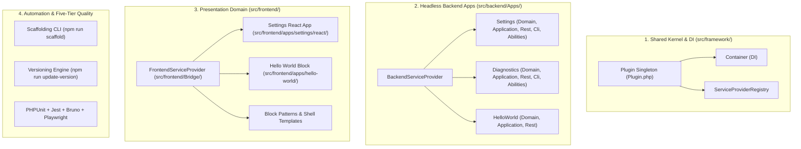
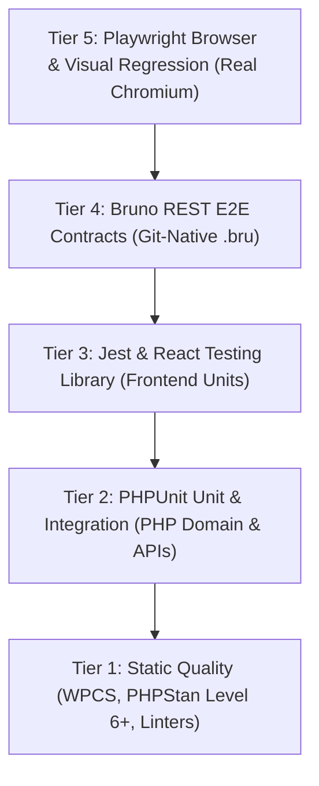

# WordPress AI Plugin Development Boilerplate

<p align="center">
  
</p>

<p align="center">
  <strong>The Enterprise-Grade WordPress Plugin Boilerplate Built for AI Coding Agents and Modern Engineering Teams.</strong>
</p>

<p align="center">
  <a href="#quick-start"></a>
  <a href="#quick-start"></a>
  <a href="#react-18-wpds-admin-application"></a>
  <a href="#coding-standards-and-static-analysis"></a>
  <a href="#coding-standards-and-static-analysis"></a>
  <a href="#5-tier-testing-pyramid"></a>
  <a href="#bundled-agent-skills-and-ai-instructions"></a>
  <a href="LICENSE"></a>
</p>

---

## Why This Boilerplate?

Building production-ready WordPress plugins in the modern era shouldn't mean legacy procedural spaghetti, loose arrays, or missing test suites. Nor should using AI coding assistants (Cursor, Claude Code, Codex, Windsurf) result in hallucinated code, broken file references, or inconsistent architectures.

**The WordPress AI Plugin Development Boilerplate** codifies modern software engineering craftsmanship, clean architecture, and agentic AI best practices into a single, fully-tested, zero-drift distribution.

It provides an instant foundation containing:

- **Tripartite Architecture (ADR-0009):** Decoupled into `src/framework/` (shared kernel/container/events/views), `src/backend/` (pure headless business logic by apps), and `src/frontend/` (React apps, Gutenberg blocks, Interactivity API, patterns, templates, and PHP bridge).
- **Strict REST API Boundary:** Frontend React components and interactive blocks communicate with the backend exclusively via `/ai-ready-wp/v1/*` REST endpoints.
- **Zero-Dependency DI Kernel:** Micro Dependency Injection `Container` with `ServiceProviderRegistry` avoiding heavy framework lock-in.
- **Modern Gutenberg Block (Block API v3 + Interactivity API):** Hello World block with client store (`view.ts`), directives (`data-wp-interactive`, `data-wp-on--click`), live editing, and block patterns.
- **Unified Multi-Channel Presentation (Shared Core):** REST API, custom WP-CLI commands (`wp ai-ready settings-get`, `doctor`), and official WordPress Abilities API endpoints for AI agents.
- **WordPress Design System (WPDS) React 18 Admin:** Card panels, vertical sidebar tab navigation with `@wordpress/icons`, dirty form tracking, and reusable shared modules (`src/frontend/shared/`).
- **Automated Project Scaffolding CLI (`npm run scaffold`):** One-click rebranding that atomically renames slugs, namespaces, constants, files, and text domains.
- **Automated Semantic Versioning (`npm run update-version`):** Coordinated SemVer bumps with changelog promotion and decision logging.
- **5-Tier Testing Pyramid:** PHPUnit 11 unit/integration tests, Jest + React Testing Library, Git-native Bruno REST tests, and Playwright visual regression.
- **WordPress Playground & Developer Sandbox:** Instant zero-install evaluation via `blueprint.json` and containerized WordPress (latest) / PHP 8.3 sandbox via `wp-env`.
- **Durable Architectural Memory (ADRs):** 9 accepted Architecture Decision Records under `docs/adr/` with dedicated ADR CLI tooling and pre-planning agent gates.
- **32 Bundled Agent Skills & Persistent Rules:** Equipping AI agents with deep WordPress APIs, core engineering craftsmanship domain knowledge (DDD, OOP, Design Patterns, TDD, Refactoring), and WordPress Architecture Decision Records (ADRs).

---

## Architectural Highlights



---

## Quick Start (Under 2 Minutes)

### 0. Verify Development Prerequisites

Before starting, verify that your local environment (Node.js >= 24.16, npm >= 11, Docker, Compose v2, and Git) meets all requirements:

```bash
npm run pre-check
```

If you encounter missing requirements or need installation instructions for macOS, Windows native, WSL2, or Linux, consult the [Development Prerequisites Guide](docs/developers/development-prerequisites.md).

### 1. Clone & Scaffold Your New Plugin

```bash
# Clone the boilerplate
git clone https://github.com/wordpress-ai/ai-ready-wp-plugin-boilerplate.git my-awesome-plugin
cd my-awesome-plugin

# Rebrand the plugin with your project name, slug, and PHP namespace
npm run scaffold -- \
  --name "My Awesome Plugin" \
  --slug "my-awesome-plugin" \
  --namespace "MyVendor\AwesomePlugin" \
  --prefix "MAP_" \
  --author "My Company"
```

### 2. Launch Local Environment (`wp-env`)

```bash
# Install dependencies
npm install
composer install

# Start containerized WordPress (latest + PHP 8.3)
npm run env:start

# Compile frontend assets
npm run build
```

Your plugin is instantly mounted and active at:

- **WordPress Admin:** [http://localhost:8888/wp-admin/](http://localhost:8888/wp-admin/) (`admin` / `password`)
- **Plugin Settings Page:** [http://localhost:8888/wp-admin/admin.php?page=map-settings](http://localhost:8888/wp-admin/admin.php?page=map-settings)
- **REST Endpoint:** [http://localhost:8888/wp-json/my-awesome-plugin/v1/hello](http://localhost:8888/wp-json/my-awesome-plugin/v1/hello)

---

## Automated Scaffolding & Rebranding CLI

Adapt the boilerplate to your plugin identity with zero manual find-and-replace errors.

### Interactive Mode

Run without arguments for guided interactive prompts:

```bash
npm run scaffold
# or
npm run rename
```

### CLI Flag Mode

```bash
npm run scaffold -- \
  --name "Diagram Flow" \
  --slug "diagram-flow" \
  --namespace "WebFalcon\DiagramFlow" \
  --prefix "DF_" \
  --author "WebFalcon" \
  --rest-namespace "df/v1" \
  --block-name "df/diagram"
```

#### Supported Scaffolding Options

| Flag | Description | Default |
| --- | --- | --- |
| `--name <string>` | Plugin display name | `"AI-Ready WP Plugin Boilerplate"` |
| `--slug <string>` | Plugin slug & directory name | Derived from name |
| `--namespace <string>` | PSR-4 PHP namespace | Derived from author + slug |
| `--prefix <string>` | PHP constant prefix (must end with `_`) | Derived from slug (e.g. `DF_`) |
| `--author <string>` | Plugin author / vendor | `"Plugin Developer"` |
| `--text-domain <string>` | Translation text domain | Defaults to slug |
| `--rest-namespace <string>` | REST API route namespace | `<slug>/v1` |
| `--block-name <string>` | Gutenberg block identifier | `<slug>/hello-world` |
| `--dry-run` | Preview all planned replacements without writing | `false` |

---

## 5-Tier Testing Pyramid

Every tier is pre-wired and tested out of the box:



| Tier | Category | Runner / Tool | Command |
| --- | --- | --- | --- |
| **Tier 1** | Static Quality | WPCS + PHPStan L6 + ESLint + Markdownlint | `composer lint && composer analyse && npm run lint` |
| **Tier 2** | PHP Unit & Integration | PHPUnit 11 | `composer test` |
| **Tier 3** | Frontend Unit | Jest + React Testing Library | `npm run test:unit` |
| **Tier 4** | REST Contract E2E | Bruno CLI (`@usebruno/cli`) | `npm run test:rest` |
| **Tier 5** | Browser & Visual E2E | Playwright with Screenshot Diffing | `npm run test:e2e` |

---

## Automated Semantic Versioning & Unreleased Changelog

Changing version numbers is **never a manual text edit**. The boilerplate provides atomic release management directly via CLI parameters—completely decoupled from `.env`:

```bash
# Automated SemVer bumps:
npm run update-version:patch    # 1.1.0 -> 1.1.0 (maintenance fixes & refactoring)
npm run update-version:minor    # 1.1.0 -> 1.1.0 (new features & phase completions)
npm run update-version:major    # 1.1.0 -> 2.0.0 (breaking changes & major baseline)

# Explicit target version with optional custom notes & decision rationale:
npm run update-version -- 1.2.0 -m "Release highlights" -d "Approved v1.2.0 release"

# Dry run preview (inspect planned changes without writing files):
npm run update-version:dry-run
npm run update-version -- patch --dry-run
```

### Continuous Unreleased Changelog & 95% Automated Packaging

1. **Continuous Staging (`npm run changelog:add`):**
   Record descriptive bullet points under `## [Unreleased]` in `CHANGELOG.md` on every feature or fix:

   ```bash
   npm run changelog:add -- -t Added "Added optimistic concurrency tokens to settings REST route"
   npm run changelog:add -- -t Fixed "Fixed CSS overflow issue on mobile admin sidebar"
   ```

2. **95% Automated Release Packaging:**
   When `npm run update-version` executes, it automatically extracts all items staged under `## [Unreleased]`, converts them into the new release header `## [X.Y.Z] - YYYY-MM-DD`, and inserts a fresh, clean `## [Unreleased]` section. In 95% of cases, no manual release notes writing is necessary.

### Manual Developer Preference vs AI Agent Workflow

- **Human Developers (Manual Preferred):** Developers can work iteratively, stage notes with `npm run changelog:add`, and manually trigger releases whenever ready.
- **AI Coding Agents (Prompt-Aware):** Agents inspect the user's initial prompt. If and only if the user explicitly requested a version bump (e.g. "bump version", "release v1.1.0"), the agent executes `npm run update-version`. Otherwise, the agent strictly logs changes under `## [Unreleased]` and leaves release execution to the developer.

### What `npm run update-version` coordinates atomically

1. Updates `package.json` and `package-lock.json` root versions without touching external dependencies.
2. Updates `composer.json` version.
3. Updates WordPress plugin header `Version: X.Y.Z` and `AIRWP_VERSION` constant.
4. Updates `readme.txt` `Stable tag: X.Y.Z`.
5. Promotes `CHANGELOG.md` `[Unreleased]` items into the formal release header (`## [X.Y.Z] - YYYY-MM-DD`).
6. Enforces PHP version comparison ordering (`version_compare`).

For deep-dive documentation, see [Versioning & Release Lifecycle](docs/developers/versioning-and-releases.md).

---

## Two-Pipeline CI/CD & Automated Release Packaging

The boilerplate implements a secure, reproducible two-pipeline CI/CD and release model governed by [ADR-0010](docs/adr/0010-two-pipeline-ci-cd-and-release-readiness-architecture.md):

1. **Continuous Delivery Readiness (`.github/workflows/ci.yml`):** Runs on every PR and push to `main`. Executes linters, PHP quality across PHP 8.3 and 8.5, compiles assets, builds the production distribution ZIP, validates the package contract, and runs official WordPress Plugin Check on the built archive.
2. **Manual Release Dispatch (`.github/workflows/release.yml`):** Manual-only workflow triggered via `workflow_dispatch` on `main`. Verifies version consistency, re-evaluates the shared release gate, generates Sigstore-backed build provenance attestations, tags `vX.Y.Z`, and creates an immutable GitHub Release.
3. **The Tested Artifact Is the Released Artifact:** The release workflow publishes the exact ZIP verified in CI, eliminating rebuild drift.

```bash
# Local CLI parity commands:
npm run ci                  # Runs full local lint and test suites
npm run release:check       # Validates version consistency and git readiness
npm run release:build       # Compiles assets and builds dist/{slug}-{version}.zip
npm run release:validate    # Validates ZIP against strict production package contract
npm run release:notes       # Extracts version markdown notes from CHANGELOG.md
npm run lint:actions        # Validates workflow YAML, syntax, and version tagging
```

For complete operational procedures and GitHub branch protection recommendations, see [Releasing & CI/CD Guide](docs/devops/releasing-and-distribution.md).

---

## Architecture Decision Records (ADRs)

Architectural decisions are captured under `docs/adr/` as immutable historical records with explicit invariants, trade-offs, and verification criteria. Ephemeral phase plans (`docs/specifications/plans/`) govern *how* to build features, while ADRs define the durable architectural boundaries.

| Command | Purpose | Example |
| --- | --- | --- |
| `npm run adr:new` | Scaffolds a new ADR with sequential numbering and auto-updates the index | `npm run adr:new -- -t "Cache REST Endpoints" --template simple` |
| `npm run adr:validate` | Validates markdown schema, YAML frontmatter, and cross-references | `npm run adr:validate -- --strict` |
| `npm run adr:status` | Updates the status of an existing ADR (`accepted`, `deprecated`, `superseded`) | `npm run adr:status -- --file docs/adr/0002-xyz.md --status superseded --by 0005` |
| `npm run adr:detect` | Detects WordPress project architecture, dependencies, and ADR conventions | `npm run adr:detect` |

For full lifecycle details and the pre-planning evaluation gate, see [Architecture Decision Records Guide](docs/developers/architecture-decision-records-guide.md) and the [ADR Index](docs/adr/README.md).

---

## Bundled Agent Skills and AI Instructions

The boilerplate includes full instruction sets for AI coding agents:

- **`.cursor/rules/`**:
  - `adr-evaluation.mdc`: Pre-planning and in-session ADR evaluation gate enforcing architectural invariants.
  - `wp-admin-ui-ux.mdc`: Persistent visual design standards, WPDS token enforcement, and visual regression loops.
  - `post-phase-documentation.mdc`: Phase completion checklists, implementation logs, and version bumps.
- **`.cursor/skills/`**: 32 bundled skills covering WordPress core APIs, block creation, REST design, OOP principles, Domain-Driven Design, GoF design patterns, TDD, Architecture Decision Records (ADRs), and test harnesses.
- **`AGENTS.md`**: Universal marching orders for AI agents across Cursor, Claude Code, Codex, and Windsurf.

---

## Complete Documentation Index

Browse the master documentation index in the **[Documentation Hub](docs/README.md)** or explore each category directly:

### 1. Framework Kernel & Architecture (`docs/framework/`)

- [Product Charter & Architectural Invariants](docs/framework/product-charter.md)
- [Architecture & Layer Boundaries](docs/framework/architecture-and-layers.md)
- [DI Container & Service Providers](docs/framework/container-and-service-providers.md)
- [Plugin Kernel & Lifecycle Management](docs/framework/kernel-and-lifecycle.md)
- [Domain Event Dispatcher](docs/framework/event-dispatcher.md)
- [Safe Template Renderer](docs/framework/template-renderer.md)
- [Domain & Application Services](docs/framework/domain-and-application-services.md)
- [Frontend Presentation Bridge](docs/framework/frontend-bridge.md)
- [Error Handling & Caching Utilities](docs/framework/error-handling-and-cache.md)
- [OpenAPI 3.1 Generator Engine](docs/framework/openapi-generator-engine.md)

### 2. Testing Hub & 5-Tier Pyramid (`docs/testing/`)

- [Testing Strategy & Quality Gate Pipeline](docs/testing/testing-strategy.md)
- [Tier 1: Static Quality Analysis](docs/testing/tier1-static-quality.md)
- [Tier 2: PHPUnit Unit & Integration Testing](docs/testing/tier2-phpunit-testing.md)
- [Tier 3: Frontend Unit Testing (Jest & RTL)](docs/testing/tier3-frontend-unit-testing.md)
- [Tier 4: Bruno REST API Contract Testing](docs/testing/tier4-bruno-rest-testing.md)
- [Tier 5: Playwright Browser & Visual Regression](docs/testing/tier5-playwright-e2e-testing.md)
- [Release Contract Testing](docs/testing/release-contract-testing.md)

### 3. Technical Specifications by App (`docs/apps/`)

- [Settings App Technical Documentation](docs/apps/settings/README.md)
- [HelloWorld App Technical Documentation](docs/apps/hello-world/README.md)
- [Diagnostics App Technical Documentation](docs/apps/diagnostics/README.md)
- [Developer Tools App Technical Documentation](docs/apps/developer/README.md)

### 4. Developer Manuals & Tooling (`docs/developers/`)

- [Development Prerequisites & Setup](docs/developers/development-prerequisites.md)
- [Environment & Containerized Toolchain](docs/developers/environment-and-toolchain.md)
- [Command Catalog](docs/developers/command-catalog.md)
- [Project Bootstrap Checklist](docs/developers/bootstrap-checklist.md)
- [Coding Standards & Static Analysis](docs/developers/coding-standards.md)
- [Project Scaffolding & Rebranding CLI](docs/developers/project-scaffolding-cli.md)
- [Versioning & Release Lifecycle](docs/developers/versioning-and-releases.md)
- [OpenAPI 3.1 Tooling & Developer Manual](docs/developers/openapi-tooling.md)
- [Agent Skills & Sync Script](docs/developers/agent-skills.md)
- [Configuration Templates Reference](docs/developers/configuration-reference.md)
- [Architecture Decision Records (ADRs) Guide](docs/developers/architecture-decision-records-guide.md)

### 5. Functional Specifications & Plans (`docs/specifications/`)

- [Phased Execution and Agent Workflow Guide](docs/specifications/phased-workflow-guide.md)
- [App Functional Specifications](docs/specifications/apps/README.md)
- [Phased Implementation Plans](docs/specifications/plans/README.md)

### 6. REST API & OpenAPI Specification (`docs/api/`)

- [REST API & OpenAPI 3.1 Specification Hub](docs/api/README.md)
- [OpenAPI 3.1 Specification File](docs/api/openapi.yaml)

### 7. DevOps & Release Architecture (`docs/devops/`)

- [DevOps, CI/CD & Release Architecture Hub](docs/devops/README.md)
- [GitHub Actions CI/CD Architecture](docs/devops/github-actions-ci-cd.md)
- [Releasing & Release Distribution Architecture](docs/devops/releasing-and-distribution.md)
- [Distribution Package Contract & .distignore](docs/devops/package-contract-and-distignore.md)
- [Local Release Tooling & CLI Parity](docs/devops/local-release-tooling.md)

### Preserved Registries & Historical Logs

- [Architecture Decision Records Index](docs/adr/README.md)
- [Implementation Audit Logs](docs/implementation-logs/)

---

## License

This project is licensed under the [GNU General Public License v2.0 or later](https://www.gnu.org/licenses/gpl-2.0.html).
