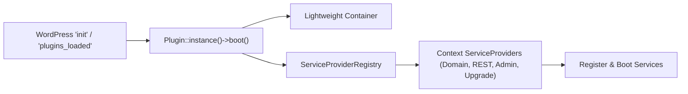

# 02 — Architecture and Directory Structure

This document outlines the complete repository structure and software architecture for the **Agentic WordPress Plugin Development Boilerplate**.

It follows **Domain-Driven Design (DDD)** and **Hexagonal (Ports & Adapters)** principles for PHP backend code, combined with modern **React 18** and the **WordPress Design System (WPDS)** for the frontend admin experience.

---

## 1. Complete Directory Layout

```text
my-plugin/
├── .cursor/                                 # Cursor IDE configuration & AI instructions
│   ├── rules/                               # Workspace-applied rules (*.mdc)
│   └── skills/                              # Active agent skills (WordPress, luckys, custom)
├── apps/                                    # Standalone micro-frontends / bundled SPAs (if applicable)
├── assets/                                  # Frontend source and compiled assets
│   ├── css/                                 # Static or legacy stylesheets
│   ├── images/                              # Plugin icons, SVGs, static graphics
│   └── src/                                 # Modern TypeScript/React source code
│       ├── apps/                            # Independent React admin applications
│       │   ├── entity-library/              # e.g., Primary listing/management app
│       │   │   ├── components/
│       │   │   ├── App.tsx
│       │   │   └── index.tsx                # Webpack entrypoint
│       │   └── settings/                    # e.g., Plugin settings & diagnostics app
│       │       ├── components/
│       │       ├── App.tsx
│       │       └── index.tsx                # Webpack entrypoint
│       └── shared/                          # Shared UI, hooks, API client, and contracts
│           ├── api/                         # REST client, TypeScript types, JSON schemas
│           ├── components/                  # WPDS UI primitives (Badge, EmptyState, etc.)
│           ├── hooks/                       # Custom React hooks (queries, state, URL sync)
│           ├── providers/                   # Context providers (Notices, ErrorBoundary)
│           ├── styles/                      # Scoped CSS (e.g., .<prefix>-app.css)
│           └── types/                       # Bootstrap data and global TS declarations
├── blocks/                                  # Gutenberg blocks (block.json, edit, save)
├── bruno/                                   # Git-native Bruno REST API test collection
│   ├── 00 Smoke/                            # Health check & REST index
│   ├── 01 Auth/                             # Authentication, authorization, least privilege
│   ├── 02 Entities/                         # CRUD, conflicts, revisions, trash/restore
│   ├── 03 Settings/                         # Settings schema endpoints
│   ├── 99 Cleanup/                          # Automated test fixture cleanup
│   ├── environments/Local.bru               # Environment variables (Base URL, App Password)
│   └── bruno.json                           # Bruno collection root metadata
├── build/                                   # Compiled Webpack output (JS/CSS/asset-manifests)
├── docs/                                    # Authoritative documentation & agent specs
│   ├── 00-product-charter-and-decisions.md  # Single authoritative truth for product behavior
│   ├── adr/                                 # Architectural Decision Records (0001-*.md & README.md)
│   ├── api/                                 # OpenAPI specifications (openapi.yaml)
│   ├── implementation-logs/                 # Pre- & post-phase audit logs (YYYY-MM-DD-*.md)
│   ├── plans/                               # Phased implementation plans (XX-<name>/)
│   └── 12-architecture-decision-records.md  # ADR lifecycle guide & pre-planning evaluation gate
├── packages/                                # Internal monorepo packages/libraries (if any)
├── scripts/                                 # Operational automation scripts
│   ├── increase-plugin-version.mjs          # Automated SemVer synchronization CLI
│   ├── record-unreleased-change.mjs         # CLI helper to stage unreleased changelog notes
│   ├── scaffold-plugin.mjs                  # Interactive plugin rebranding & scaffolding CLI
│   ├── sync-agent-skills.mjs                # Downloader & updater for external agent skills
│   └── lib/                                 # Helper libraries for versioning and scaffolding
├── src/                                     # Clean DDD PHP Backend (PSR-4 autoloaded)
│   ├── Admin/                               # Admin menu, asset enqueueing, bootstrap data
│   ├── Bootstrap/                           # Container, ServiceProvider, Plugin singleton
│   ├── <Context>/                           # Bounded Context (e.g., Item, Order, Diagram)
│   │   ├── Domain/                          # Aggregates, Value Objects, Domain Exceptions
│   │   ├── Application/                     # Commands, Queries, DTOs, Application Services
│   │   └── Infrastructure/                  # CPT, Post Meta, Taxonomies, WP Repositories
│   ├── Rest/                                # REST controllers & centralized error mappers
│   ├── Settings/                            # Option storage, settings schema & services
│   ├── Support/                             # Shared utilities, logging, type mappers
│   └── Upgrade/                             # dbDelta migrations & version upgrade runner
├── templates/                               # PHP root mounting templates for React apps
├── tests/                                   # Automated testing pyramid
│   ├── e2e/playwright/                      # Playwright E2E and visual regression suites
│   ├── js/                                  # Jest + RTL unit tests for TypeScript & React
│   ├── node/versioning/                     # Automated version sync integration tests
│   └── phpunit/                             # PHPUnit unit and integration suites
├── tools/                                   # Development scripts and CLI helpers
│   └── wp-env/after-start.mjs               # wp-env post-start automated setup script
├── .editorconfig                            # Shared formatting rules across editors
├── .env.example                             # Environment variable template
├── .markdownlint-cli2.jsonc                 # Markdown quality linter config
├── .wp-env.json                             # WordPress container environment definition
├── AGENTS.md                                # Root instructions for coding agents
├── composer.json                            # PHP dependencies, PSR-4 autoload, WPCS scripts
├── jest.config.js                           # Frontend unit test configuration
├── package.json                             # Node dependencies, scripts, engines constraint
├── phpcs.xml.dist                           # WordPress Coding Standards ruleset
├── phpstan.neon.dist                        # PHPStan Level 6+ static analysis ruleset
├── phpunit.xml.dist                         # PHPUnit testsuites definition
├── playwright.config.ts                     # Playwright runner and visual regression config
├── <plugin-slug>.php                        # Main WordPress plugin bootstrap file
├── tsconfig.json                            # TypeScript compilation configuration
├── uninstall.php                            # Safe de-provisioning & retention policy handler
└── webpack.config.js                        # Multi-entrypoint Webpack configuration
```

---

## 2. Clean DDD PHP Backend Architecture

All PHP source code lives under `src/` and maps to a clean, PSR-4 vendor namespace (e.g. `WebFalcon\MyPlugin\` or `Vendor\PluginName\`).

### 2.1 The Bootstrap Context (`src/Bootstrap/`)
Rather than dumping procedural hooks into the root plugin file, the plugin uses an object-oriented kernel with a zero-dependency Dependency Injection container:



- **`Plugin.php`:**
  - Implemented as a singleton.
  - Hooks `boot()` to WordPress `plugins_loaded` (runs compatibility checks).
  - Hooks `on_init()` to WordPress `init` to instantiate the container and boot service providers.
- **`Container.php`:**
  - A lightweight, PSR-11-style DI container.
  - Supports binding singletons (`set()`), factory callbacks (`share()`), and dependency resolution (`get()`).
  - Completely avoids heavy external Composer dependencies (e.g. Laravel Container or PHP-DI) that cause version conflicts in WordPress.
- **`ServiceProvider.php` (Interface) & `ServiceProviderRegistry.php`:**
  - Standard provider lifecycle:
    ```php
    interface ServiceProvider {
        public function register( Container $container ): void;
        public function boot( Container $container ): void;
    }
    ```
  - Providers isolate bounded contexts: `EntityServiceProvider`, `RestServiceProvider`, `AdminServiceProvider`, `UpgradeServiceProvider`.

### 2.2 Bounded Contexts: Domain Layer (`src/<Context>/Domain/`)
The domain layer encapsulates business rules, entity models, and domain invariants. **It must never depend on WordPress database functions (`wpdb`) or REST controllers.**

- **Immutable Value Objects:**
  - Domain primitives are represented by typed value objects rather than raw strings or ints (e.g., `EntityId`, `EntityTitle`, `EntityStatus`, `EntityVersion`).
  - Constructors validate invariants and normalize input (e.g., converting line endings to LF, trimming whitespace, checking length limits).
  - If an invariant is violated, throw a strongly typed Domain Exception (`InvalidEntityTitleException`).
- **Domain Aggregates:**
  - Aggregate roots (e.g., `Entity.php`) maintain internal state, enforce transition rules (e.g., transitioning from `draft` to `published`), and record domain events.
- **Repository Interfaces:**
  - The domain defines the storage contract as an interface (e.g., `EntityRepository.php`), describing methods like `find_by_id( EntityId $id ): ?Entity` and `save( Entity $entity ): void`.

### 2.3 Application Layer (`src/<Context>/Application/`)
The application layer orchestrates use cases. It coordinates domain objects and infrastructure services:

- **CQRS-Lite (Command / Query Separation):**
  - **Commands:** Represent state-mutating requests (e.g., `CreateEntityCommand`, `UpdateEntityCommand`, `TrashEntityCommand`).
  - **Queries:** Represent read-only data requests (e.g., `GetEntityQuery`, `SearchEntitiesQuery`).
- **Data Transfer Objects (DTOs):**
  - Strictly typed DTOs format data crossing application boundaries (e.g., `EntitySummaryDTO`, `EntityDetailDTO`, `BulkResultDTO`).
- **Application Services:**
  - `EntityApplicationService` executes commands, validates user capabilities (`current_user_can(...)`), checks optimistic concurrency tokens (`_version_token`), and delegates persistence to the repository.

### 2.4 Infrastructure Layer (`src/<Context>/Infrastructure/`)
The infrastructure layer implements the interfaces defined by the domain using WordPress-specific APIs:

- **Custom Post Types & Meta:**
  - `EntityPostType.php`: Registers CPT (`show_in_rest => true`, `rest_base => 'entities'`).
  - `EntityMeta.php`: Registers protected post meta fields (`_prefix_version_token`, `_prefix_status`, etc.) with `single => true` and `show_in_rest => true`.
- **WordPress Repositories:**
  - `WordPressEntityRepository.php`: Implements `EntityRepository`. Translates Domain Aggregates into `wp_insert_post`, `get_post`, and `update_post_meta`.
  - Preserves raw content without destructive KSES sanitization when exact input syntax must be preserved.

### 2.5 REST API Layer (`src/Rest/`)
Exposes HTTP endpoints conforming to standard WordPress REST conventions:

- **Namespace:** Standardized versioned namespace (e.g., `<prefix>/v1`).
- **Controllers:**
  - Classes extend `WP_REST_Controller` (`EntityCollectionController`, `EntityItemController`, `SettingsController`).
  - Implement standard methods: `register_routes()`, `get_items_permissions_check()`, `get_items()`, `create_item()`, `get_item()`, `update_item()`, `delete_item()`.
- **Centralized Error Mapping:**
  - `WordPressErrorMapper.php` intercepts Domain and Application exceptions (e.g. `EntityNotFoundException` → `404`, `EditConflictException` → `409`, `InvalidEntityException` → `400`) and converts them into standardized `WP_Error` objects.

### 2.6 Admin Layer (`src/Admin/`)
Bridges the WordPress admin dashboard to modern React applications:

- **`AdminMenu.php`:** Registers top-level and submenu pages via `add_menu_page()` and `add_submenu_page()`.
- **`AdminRoute.php`:** Checks `current_screen` ID to ensure plugin assets are loaded **only** on the plugin's own admin pages, preventing script conflicts.
- **`ScreenBootstrapData.php`:** Packages site URL, REST namespace, REST nonce, user capabilities, and initial settings into a single PHP array.
- **`AdminAssets.php`:** Enqueues Webpack-compiled scripts with `wp_enqueue_script()` and injects bootstrap data into the DOM via `wp_add_inline_script()` or `wp_localize_script()` as `window.<prefix>AdminBootstrap`.

---

## 3. Modern React 18 Admin Architecture

The admin frontend avoids monolithic single-page bundles. It provides isolated, focused React 18 applications for different administrative responsibilities.

### 3.1 Webpack Multi-Entrypoint Setup
Configured in `webpack.config.js` on top of `@wordpress/scripts`:

```javascript
module.exports = {
  ...defaultConfig,
  entry: {
    ...defaultConfig.entry(),
    'admin/library/index': './assets/src/apps/entity-library/index.tsx',
    'admin/settings/index': './assets/src/apps/settings/index.tsx',
  },
  output: {
    ...defaultConfig.output,
    path: path.resolve(__dirname, 'build'),
    filename: '[name].js',
  },
};
```

This compiles into:
- `build/admin/library/index.js` + `index.asset.php`
- `build/admin/settings/index.js` + `index.asset.php`

The `.asset.php` file automatically declares WordPress core dependencies (e.g. `wp-element`, `wp-components`, `wp-i18n`, `wp-api-fetch`) extracted by `DependencyExtractionWebpackPlugin`.

### 3.2 PHP Root Mount Templates (`templates/`)
PHP templates render a clean wrapper container and the primary WordPress page heading:

```php
<?php
// templates/admin-app-root.php
if ( ! defined( 'ABSPATH' ) ) exit;
?>
<div class="wrap mdm-admin-wrap">
    <h1 class="wp-heading-inline"><?php echo esc_html__( 'Entity Library', 'my-plugin' ); ?></h1>
    <hr class="wp-header-end">
    <div id="mdm-app-root" class="mdm-app-root"></div>
</div>
```

### 3.3 Scoped CSS & Isolation
All React component styles must be scoped under the root container class (e.g. `.mdm-app-root`):
- Prevents plugin styles from altering the WordPress admin sidebar, top admin bar, or core notices.
- Retains native WordPress admin design tokens:
  ```css
  .mdm-app-root {
      margin-top: 16px;
      font-family: -apple-system, BlinkMacSystemFont, "Segoe UI", Roboto, Oxygen-Sans, Ubuntu, Cantarell, "Helvetica Neue", sans-serif;
  }
  ```

### 3.4 Shared React Modules (`assets/src/shared/`)
Shared modules ensure consistent behavior and avoid code duplication across admin apps:

1. **`api/client.ts`:**
   - Wraps `@wordpress/api-fetch` with typed methods.
   - Automatically injects the REST root and nonce from `window.<prefix>AdminBootstrap`.
   - Handles optimistic concurrency headers (`If-Match` / `_version_token`) and parses structured error payloads.
2. **`components/`:**
   - Reusable WPDS-styled components: `MdmBadge`, `MdmPagination`, `MdmEmptyState`, `MdmErrorState`, `MdmLoadingSkeleton`.
3. **`hooks/`:**
   - Custom hooks for URL query string synchronization (`useSearchParams`), data fetching, and optimistic updates.
4. **`providers/AppProviders.tsx`:**
   - Top-level provider tree providing Notice/Toast state, error boundaries, and global modal contexts.
