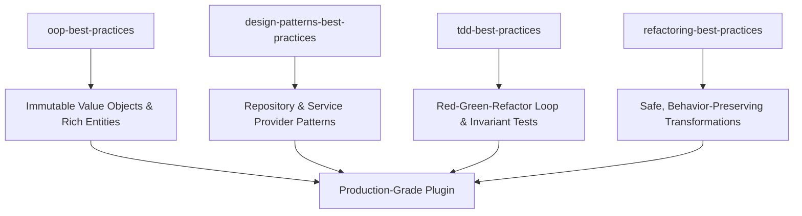

# 03 — Coding Standards and Engineering Practices

High software quality is non-negotiable in the **Agentic WordPress Plugin Development Boilerplate**.

This guide details the mandatory enforcement of **WordPress Coding Standards (WPCS)**, **PHPStan** static analysis at Level 6+, and the core software craftsmanship principles encoded in **`luckys/agent-skills`** (`oop-best-practices`, `design-patterns-best-practices`, `tdd-best-practices`, `refactoring-best-practices`).

---

## 1. Mandatory WordPress Coding Standards (WPCS)

All PHP code must strictly adhere to the official WordPress Coding Standards. Code formatting, naming, security escaping, and sanitization are verified automatically.

### 1.1 Composer Setup

Add the standard tools to `composer.json`:

```json
{
  "require-dev": {
    "dealerdirect/phpcodesniffer-composer-installer": "^1.0.0",
    "wp-coding-standards/wpcs": "^3.1.0",
    "phpstan/phpstan": "^2.1.0",
    "szepeviktor/phpstan-wordpress": "^2.0.0",
    "php-stubs/wordpress-stubs": "^6.7",
    "php-stubs/wp-cli-stubs": "^2.12"
  },
  "config": {
    "allow-plugins": {
      "dealerdirect/phpcodesniffer-composer-installer": true
    }
  },
  "scripts": {
    "lint": "vendor/bin/phpcs",
    "lint:fix": "vendor/bin/phpcbf",
    "analyse": "vendor/bin/phpstan analyse"
  }
}
```

The `dealerdirect/phpcodesniffer-composer-installer` plugin automatically registers WordPress coding standards into PHP_CodeSniffer upon `composer install`.

### 1.2 `phpcs.xml.dist` Configuration

WordPress has historically used a kebab-case file naming convention (e.g. `class-my-widget.php`). Modern enterprise plugins, however, require **PSR-4 autoloading** with PascalCase class filenames (e.g. `src/Domain/EntityTitle.php`).

The boilerplate resolves this cleanly by excluding `src/*` from the `WordPress.Files.FileName` rule while enforcing all other strict security and formatting rules:

```xml
<?xml version="1.0"?>
<ruleset name="PluginCodingStandards">
    <description>PHPCS ruleset for Agentic WordPress Plugin Boilerplate.</description>

    <!-- Paths to inspect -->
    <file>src/</file>
    <file>my-plugin.php</file>
    <file>uninstall.php</file>

    <!-- Exclude vendor, build, and node artifacts -->
    <exclude-pattern>/vendor/</exclude-pattern>
    <exclude-pattern>/node_modules/</exclude-pattern>
    <exclude-pattern>/build/</exclude-pattern>
    <exclude-pattern>/tests/</exclude-pattern>

    <arg name="colors"/>
    <arg value="sp"/>
    <arg name="extensions" value="php"/>

    <!-- Enforce Core and Extra rules -->
    <rule ref="WordPress-Core"/>
    <rule ref="WordPress-Extra"/>
    <rule ref="WordPress-Docs"/>

    <!-- Allow PSR-4 class filenames in modern src/ directory -->
    <rule ref="WordPress.Files.FileName">
        <exclude-pattern>src/*</exclude-pattern>
    </rule>

    <!-- Configuration parameters -->
    <config name="text_domain" value="my-plugin"/>
    <config name="minimum_supported_wp_version" value="7.0"/>
</ruleset>
```

### 1.3 Linting Commands
```bash
# Check code against WPCS
composer lint

# Automatically fix whitespace and standard violations
composer lint:fix
```

---

## 2. PHPStan Static Analysis (Level 6+)

Static typing is enforced to catch type errors, undefined method calls, and invalid parameter types before code is executed.

### 2.1 `phpstan.neon.dist` Configuration

Using `szepeviktor/phpstan-wordpress`, PHPStan understands WordPress core function return types, hooks, and global variables:

```neon
includes:
    - vendor/szepeviktor/phpstan-wordpress/extension.neon

parameters:
    level: 6
    paths:
        - src
        - my-plugin.php
    bootstrapFiles:
        - my-plugin.php
    scanFiles:
        - vendor/php-stubs/wordpress-stubs/wordpress-stubs.php
        - vendor/php-stubs/wp-cli-stubs/wp-cli-stubs.php
```

### 2.2 Analysis Command
```bash
# Run PHPStan static analysis
composer analyse
```

No pull request or phase implementation is complete with unresolved PHPStan Level 6 errors.

---

## 3. Engineering Best Practices (`luckys/agent-skills`)

To prevent AI coding agents from generating fragile, prototype-level code, the boilerplate mandates the four core engineering skills from **`luckys/agent-skills`**:



### 3.1 `oop-best-practices` — Object-Oriented Domain Design
AI agents default to procedural scripts or anemic objects with getters/setters. The `oop-best-practices` skill enforces robust object design:

1. **Avoid Primitive Obsession:**
   - Raw strings, IDs, and statuses must not be passed around naked.
   - Wrap them in dedicated Value Objects:
     ```php
     // BAD: Primitive obsession
     public function createDiagram( int $id, string $title, string $status ): void {}

     // GOOD: Strongly typed domain primitives
     public function createDiagram( DiagramId $id, DiagramTitle $title, DiagramStatus $status ): void {}
     ```
2. **Immutability by Default:**
   - Value objects cannot be modified after instantiation. Methods that change values return a new instance:
     ```php
     final class DiagramTitle {
         public function __construct( private readonly string $value ) {
             $trimmed = trim( $value );
             if ( empty( $trimmed ) ) {
                 throw new InvalidDiagramTitleException( 'Title cannot be empty.' );
             }
         }
         public function value(): string {
             return $this->value;
         }
     }
     ```
3. **Fail-Fast Invariant Protection:**
   - Constructors validate rules immediately. An invalid object cannot be constructed in memory.
4. **Rich Aggregates over Anemic Data Holders:**
   - Entities encapsulate both data and business logic. External code does not directly mutate entity fields.

### 3.2 `design-patterns-best-practices` — Tactical Patterns
Patterns are applied only when they solve concrete architectural problems:

1. **Repository Pattern (`src/<Context>/Domain/<Entity>Repository.php`):**
   - Completely decouples domain logic from WordPress storage.
   - Domain and Application services interact with the interface; `WordPress<Entity>Repository` interacts with `get_posts`, `wp_insert_post`, and `wpdb`.
2. **Service Provider Pattern (`src/Bootstrap/ServiceProvider.php`):**
   - Each bounded context provides a `register()` and `boot()` method to bind dependencies into the lightweight container.
3. **Command / Query Responsibility Segregation (CQRS-Lite):**
   - Segregates state-changing operations (`CreateEntityCommand`) from read queries (`GetEntityQuery`).
4. **Adapter Pattern:**
   - Used when integrating third-party tools, external APIs, or rendering engines (e.g. Mermaid, Monaco, OpenAI Connectors) to protect core domain logic from upstream API changes.

### 3.3 `tdd-best-practices` — Test-Driven Development
Testing is not an afterthought; it drives software design:

1. **The Red-Green-Refactor Loop:**
   - **Red:** Author a failing unit test asserting the expected behavior or invariant.
   - **Green:** Implement the minimal production code necessary to pass the test.
   - **Refactor:** Clean up the implementation, eliminate duplication, and verify tests remain green.
2. **Test Invariants First:**
   - Test edge cases, empty values, invalid formats, and boundary conditions in domain objects before implementing happy-path storage.
3. **Fast Unit Tests with Zero WordPress Dependencies:**
   - Domain unit tests (`tests/phpunit/unit/`) instantiate pure PHP classes without spinning up the WordPress database, executing hundreds of assertions in milliseconds.
4. **Integration Tests for WordPress Contracts:**
   - Integration tests (`tests/phpunit/integration/`) run inside the container and verify interactions with WordPress hooks, post types, meta, and capabilities.

### 3.4 `refactoring-best-practices` — Safe Code Evolution
When modifying existing codebase behaviors:

1. **Ensure Comprehensive Test Harness:**
   - Never refactor code without passing tests. If tests are missing, author characterization tests first.
2. **Small, Atomic Steps:**
   - Make one small transformation at a time (e.g., Extract Method, Rename Variable, Replace Conditional with Polymorphism).
   - Run tests after each step.
3. **Never Mix Refactoring with Features:**
   - Keep refactoring commits strictly separated from new feature development or bug fixes.
