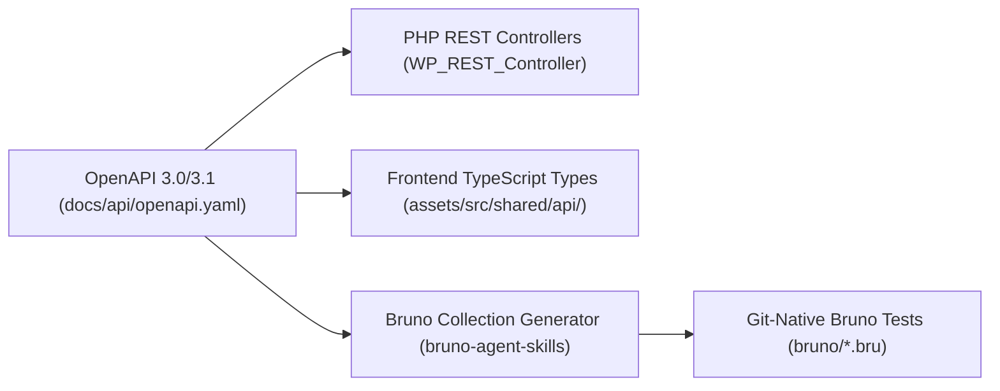

# 04 — OpenAPI Specification and Bruno API Testing

This guide explains how to design contract-first REST APIs using **OpenAPI 3.0/3.1** and validate them with **Bruno** (https://www.usebruno.com/) and **Bruno Agent Skills** (https://github.com/bruno-collections/bruno-agent-skills).

---

## 1. Contract-First REST API Design (OpenAPI 3.0/3.1)

Rather than writing PHP controllers ad-hoc, all plugin endpoints must be declared first in an authoritative OpenAPI contract: `docs/api/openapi.yaml`.



### 1.1 Why Contract-First?
1. **Single Source of Truth:** Prevents drift between PHP REST controller schemas, TypeScript frontend types, and test assertions.
2. **Deterministic Agent Context:** AI coding agents inspect `openapi.yaml` to understand endpoint parameters, request bodies, permissions, and error models before authoring code.
3. **Automated Test Scaffolding:** Bruno tests are generated directly from the specification using `bruno-collection-generator`.

### 1.2 Structure of `docs/api/openapi.yaml`

```yaml
openapi: 3.1.0
info:
  title: My Plugin REST API
  version: 1.0.0
  description: Authoritative REST specification for My Plugin WordPress endpoints.
servers:
  - url: http://localhost:8888/wp-json/my-plugin/v1
    description: Local development container
paths:
  /entities:
    get:
      summary: Search and list entities
      security:
        - basicAuth: []
      parameters:
        - name: search
          in: query
          schema: { type: string }
        - name: page
          in: query
          schema: { type: integer, default: 1 }
        - name: per_page
          in: query
          schema: { type: integer, default: 20, maximum: 100 }
      responses:
        '200':
          description: List of entity summaries
          content:
            application/json:
              schema:
                type: array
                items:
                  $ref: '#/components/schemas/EntitySummary'
    post:
      summary: Create an entity
      security:
        - basicAuth: []
      requestBody:
        required: true
        content:
          application/json:
            schema:
              $ref: '#/components/schemas/CreateEntityRequest'
      responses:
        '201':
          description: Entity created
          content:
            application/json:
              schema:
                $ref: '#/components/schemas/EntityDetail'
        '400':
          $ref: '#/components/responses/ValidationError'
        '401':
          $ref: '#/components/responses/Unauthorized'
        '403':
          $ref: '#/components/responses/Forbidden'
components:
  securitySchemes:
    basicAuth:
      type: http
      scheme: basic
      description: WordPress Application Password authentication
  schemas:
    EntitySummary:
      type: object
      required: [id, title, status]
      properties:
        id: { type: integer }
        title: { type: string }
        status: { type: string, enum: [publish, draft, trash] }
```

---

## 2. Bruno — The Git-Native API Client

[Bruno](https://www.usebruno.com/) is an open-source, fast, Git-friendly API client that replaces bloated cloud platforms like Postman or Insomnia.

### Key Advantages of Bruno:
- **Plain-Text Files on Disk:** Requests are stored as human-readable `.bru` files directly in your repository (`bruno/`).
- **Git-Native Collaboration:** Collections are versioned, branched, reviewed, and merged using standard Git PR workflows.
- **Zero Cloud Leakage & Zero Login:** Runs completely local; test data and secrets never leave your development machine.
- **Headless CLI Runner:** `@usebruno/cli` runs inside npm scripts and CI pipelines with JUnit and HTML reports.

---

## 3. Bruno Collection Directory Layout

The `bruno/` directory is structured in numbered lifecycle folders:

```text
bruno/
├── bruno.json                      # Collection metadata (version, name, type)
├── collection.bru                  # Global collection headers/auth
├── environments/
│   └── Local.bru                   # Target environment variables
├── 00 Smoke/                       # Health check and REST root
│   ├── folder.bru
│   └── rest-index.bru              # GET /wp-json/ (verifies namespace exists)
├── 01 Auth/                        # Authentication & privilege tests
│   ├── folder.bru
│   ├── current-user.bru            # GET /wp/v2/users/me with App Password
│   └── reject-unauthenticated.bru  # GET without auth -> asserts 401
├── 02 Entities/                    # Primary CRUD and business workflows
│   ├── folder.bru
│   ├── list-entities.bru           # Paginated listing with schema checks
│   ├── create-valid-entity.bru     # POST create entity (captures res.body.id)
│   ├── get-entity.bru              # GET by captured entity ID
│   ├── update-entity.bru           # PUT/PATCH update with _version_token
│   ├── conflict-update.bru         # Stale _version_token -> asserts 409
│   └── duplicate-entity.bru        # POST /entities/{id}/duplicate
├── 03 Settings/                    # Settings schema and permissions
│   ├── folder.bru
│   ├── get-settings.bru            # GET settings schema
│   └── patch-settings.bru          # PATCH section update
└── 99 Cleanup/                     # Deterministic teardown
    ├── folder.bru
    └── trash-created-entities.bru  # Deletes entities created during test run
```

---

## 4. Environment Configuration & Automated Authentication

WordPress REST API requires authentication for state-modifying actions. In local development and CI, Bruno authenticates using **WordPress Application Passwords** via HTTP Basic Authentication.

### 4.1 `bruno/environments/Local.bru`

```text
vars {
  baseUrl: http://localhost:8888
  username: mdm_api_test
}
vars:secret [
  appPassword
]
```

### 4.2 Automated Credential Synchronization
The `tools/wp-env/after-start.mjs` script (configured in [Chapter 01](./01-environment-and-toolchain.md)) guarantees zero-friction authentication:
1. It creates the dedicated user `mdm_api_test` on container boot.
2. It generates the application password `bruno-test`.
3. It updates `.env` with:
   ```dotenv
   BRUNO_APPLICATION_PASSWORD=xxxx xxxx xxxx xxxx
   ```
4. Bruno npm scripts pass the environment variables seamlessly:
   ```bash
   export $(cat .env | grep -v '^#' | xargs) && cd bruno && bru run --env Local
   ```

---

## 5. Sample Bruno Request File (`.bru`)

Here is an example request file demonstrating schema assertions, status checks, and variable chaining:

```text
meta {
  name: Create Valid Entity
  type: http
  seq: 2
}

post {
  url: {{baseUrl}}/wp-json/my-plugin/v1/entities
  body: json
  auth: basic
}

auth:basic {
  username: {{username}}
  password: {{appPassword}}
}

body:json {
  {
    "title": "Automated Test Entity",
    "status": "publish",
    "description": "Created by Bruno E2E test"
  }
}

assert {
  res.status: eq 201
  res.body.id: isNumber
  res.body.title: eq "Automated Test Entity"
  res.body.status: eq "publish"
  res.body._version_token: isDefined
}

script:post-response {
  if (res.getStatus() === 201) {
    // Save created entity ID to collection variable for downstream tests
    bru.setVar("createdEntityId", res.getBody().id);
    bru.setVar("entityVersionToken", res.getBody()._version_token);
  }
}
```

---

## 6. Bruno Agent Skills (`bruno-collections/bruno-agent-skills`)

When working with AI coding agents, leverage the three specialized skills from [`bruno-agent-skills`](https://github.com/bruno-collections/bruno-agent-skills):

### 1. `bruno-collection-generator`
- **When to Use:** When authoring new endpoints or updating schemas.
- **Workflow:** Give the agent your `docs/api/openapi.yaml` or PHP REST controller code and prompt: *"Use bruno-collection-generator to create `.bru` requests for our new settings routes under `bruno/03 Settings/`"*.
- **Output:** Scaffolds `.bru` files with correct method, URL, headers, and request body templates.

### 2. `bruno-test-writer`
- **When to Use:** Writing assertions, status codes, negative test cases, and test chaining.
- **Workflow:** Prompt: *"Use bruno-test-writer to add optimistic concurrency conflict assertions (409) and token verification to `conflict-update.bru`"*.
- **Best Practice:** Avoid brittle whole-response snapshots. Assert critical domain fields, status codes, and security invariants.

### 3. `bruno-ci-setup`
- **When to Use:** Configuring headless CLI execution in GitHub Actions or npm scripts.
- **Workflow:** Generates test runners, JUnit reporters, and artifact uploads.

---

## 7. Execution Commands and Reporting

Configure these scripts in `package.json`:

```json
{
  "scripts": {
    "test:rest": "set -a; . ./.env; set +a; cd bruno && npx bru run --env Local --reporter-skip-headers Authorization Cookie X-WP-Nonce",
    "test:rest:html": "export $(cat .env | grep -v '^#' | xargs) && cd bruno && npx bru run --env Local --reporter-html reports/test-results.html --reporter-skip-headers Authorization Cookie X-WP-Nonce",
    "test:rest:ci": "npx bru run bruno --env Local --reporter-json bruno/reports/results.json --reporter-junit bruno/reports/results.xml --reporter-skip-headers Authorization Cookie X-WP-Nonce"
  }
}
```

- **Sensitive Header Masking:** `--reporter-skip-headers Authorization Cookie X-WP-Nonce` ensures credentials never appear in console logs or CI artifacts.
- **Exit Codes:** If any assertion fails, Bruno CLI exits with code `1`, immediately blocking CI pipeline merges.
