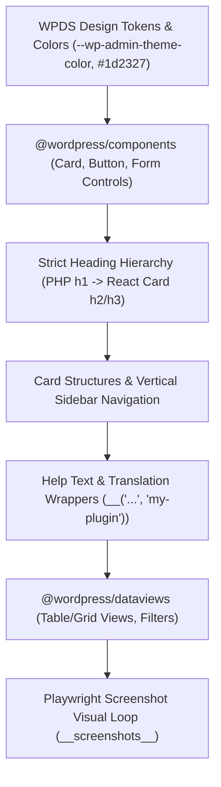

# 05 — WordPress Admin UI/UX and Visual Design Standards

Building a world-class WordPress plugin requires an admin interface that feels like an authentic, refined extension of WordPress core.

This guide details the **WordPress Design System (WPDS)** standards, layout architecture, micro-copy requirements, and visual verification loops codified in `.cursor/rules/wp-admin-ui-ux.mdc` and `.cursor/skills/wp-admin-ui-ux/`.

---

## 1. Core Visual Principles & Design Tokens



### 1.1 WordPress Native Feel
- Align with the **WordPress Design System (WPDS)** design tokens and `@wordpress/components`.
- Use standard WordPress admin colors:
  - Theme primary: `var(--wp-admin-theme-color, #2271b1)`
  - Primary text: `#1d2327`
  - Secondary text / muted help: `#646970`
  - Borders: `#dcdcde`
  - Card / Panel background: `#ffffff`
  - Admin body background: `#f0f0f1`
- Avoid arbitrary standalone custom dark modes or off-brand themes unless explicitly requested by the user.

### 1.2 Strict Heading Hierarchy
- **Single Primary `<h1>` in PHP:**
  - The PHP root template renders the one and only primary page title (`<h1 class="wp-heading-inline">Settings</h1>`).
  - **Never** render an `<h1>` inside React components.
- **React Subheadings:**
  - Inside React components, section titles must use `<h2>` or `<h3>` inside `CardHeader` to preserve semantic accessibility.

---

## 2. Card and Panel Layout Structures

All settings panels, form sections, and diagnostic status boxes must be structured with WPDS `Card` components:

```tsx
import { Card, CardHeader, CardBody, CardFooter, Button, Icon } from '@wordpress/components';
import { cog } from '@wordpress/icons';
import { __ } from '@wordpress/i18n';

export const SettingsSection = ({ isDirty, isSaving, onSave, children }) => (
  <Card className="mdm-settings-card">
    <CardHeader className="mdm-card-header">
      <div className="mdm-header-badge">
        <Icon icon={cog} size={20} />
      </div>
      <div>
        <h2 className="mdm-card-title">{__('General Settings', 'my-plugin')}</h2>
        <p className="mdm-card-subtitle">{__('Configure core plugin runtime behaviors.', 'my-plugin')}</p>
      </div>
    </CardHeader>

    <CardBody className="mdm-card-body">
      {children}
    </CardBody>

    <CardFooter className="mdm-card-footer">
      <span className={`mdm-save-status ${isDirty ? 'is-dirty' : ''}`}>
        {isDirty ? __('Unsaved changes', 'my-plugin') : __('All changes saved', 'my-plugin')}
      </span>
      <Button
        variant="primary"
        isBusy={isSaving}
        disabled={!isDirty || isSaving}
        onClick={onSave}
      >
        {__('Save Changes', 'my-plugin')}
      </Button>
    </CardFooter>
  </Card>
);
```

### Key Elements of Card Structures:
1. **`CardHeader`:** Features an icon badge from `@wordpress/icons`, a concise section title (`<h2>`), and a descriptive subtitle explaining the section's purpose.
2. **`CardBody`:** Houses cleanly spaced form fields with consistent vertical gaps (`gap: 16px` or `20px`).
3. **`CardFooter`:** A dedicated action bar displaying save status ("Unsaved changes" vs "All changes saved") and a primary action button.

---

## 3. Vertical Sidebar Navigation for Multi-Section Screens

When an admin interface contains multiple sections (e.g. Settings with General, Permissions, Notifications, Advanced), **do not** use flat unstyled buttons or cramped horizontal tabs.

Use a dedicated vertical sidebar layout:

```tsx
import { Button, Icon } from '@wordpress/components';
import { cog, shield, download, file } from '@wordpress/icons';

const SECTIONS = [
  { id: 'general', label: __('General', 'my-plugin'), icon: cog },
  { id: 'permissions', label: __('Permissions', 'my-plugin'), icon: shield },
  { id: 'downloads', label: __('Downloads', 'my-plugin'), icon: download },
  { id: 'advanced', label: __('Advanced', 'my-plugin'), icon: file },
];

export const SettingsSidebar = ({ activeSection, onSelect }) => (
  <nav className="mdm-settings-sidebar" aria-label={__('Settings Sections', 'my-plugin')}>
    <ul className="mdm-sidebar-nav-list">
      {SECTIONS.map((section) => (
        <li key={section.id}>
          <Button
            className={`mdm-sidebar-tab ${activeSection === section.id ? 'is-active' : ''}`}
            onClick={() => onSelect(section.id)}
          >
            <Icon icon={section.icon} size={18} />
            <span>{section.label}</span>
          </Button>
        </li>
      ))}
    </ul>
  </nav>
);
```

---

## 4. Form Controls, Micro-copy, and Internationalization

Every user-facing input must provide immediate clarity and context:

1. **Mandatory `help` Property:**
   - Every input (`TextControl`, `SelectControl`, `ToggleControl`, etc.) **MUST** include both a `label` and a descriptive `help` property explaining what the setting does and its runtime consequences.
2. **Translation Wrappers:**
   - Every user-visible string must be wrapped in `@wordpress/i18n` localization functions:
     ```tsx
     <ToggleControl
       label={__('Enable Public Export', 'my-plugin')}
       help={__('Allows visitors to download exported SVG and source files directly from published pages.', 'my-plugin')}
       checked={settings.enablePublicExport}
       onChange={(val) => updateSetting('enablePublicExport', val)}
     />
     ```

---

## 5. Status Badges and Indicators

Standardize entity status indicators using a dedicated badge component (`MdmBadge` / `<Prefix>Badge`):

```tsx
interface BadgeProps {
  status: 'publish' | 'draft' | 'private' | 'trash';
  label?: string;
}

export const MdmBadge: React.FC<BadgeProps> = ({ status, label }) => {
  const displayLabel = label ?? status.charAt(0).toUpperCase() + status.slice(1);
  return (
    <span className={`mdm-badge mdm-badge--${status}`}>
      <span className="mdm-badge__dot" />
      {displayLabel}
    </span>
  );
};
```

### Status Color Standards:
- **`publish` / `active`:** Light green background (`#e7f5ea`), dark green text (`#155724`), green dot (`#28a745`).
- **`draft` / `pending`:** Light gray background (`#f0f0f1`), dark gray text (`#3c434a`), gray dot (`#8c8f94`).
- **`trash` / `error`:** Light red background (`#fcf0f0`), dark red text (`#b32d2e`), red dot (`#d63638`).
- **`private`:** Light blue background (`#edf5fc`), dark blue text (`#10486c`), blue dot (`#2271b1`).

---

## 6. Table & DataViews Integration (`@wordpress/dataviews`)

For listing views (e.g. item library, logs, entries), integrate `@wordpress/dataviews`:

- **Layout Toggle:** Support both Table view (dense information) and Grid view (visual cards).
- **FilterBar & Search:** Provide debounced text search, status dropdowns, and category filters.
- **Pagination Summaries:** Pagination controls must always display the item count summary:
  ```text
  "Showing 1–20 of 45 items"
  ```
- **Modal Standardization:** Quick-create and edit modals must follow a structured layout with distinct Header (`title`), Body (`content`), and Footer (`Cancel` and `Submit` buttons).

---

## 7. Mandatory Visual Verification Loop with Playwright

Coding agents frequently generate functionally working code that suffers from visual defects (misalignments, missing borders, broken padding, or clipped text).

The boilerplate enforces a **Mandatory Visual Inspection Loop** codified in `.cursor/rules/wp-admin-ui-ux.mdc`:

### The 4-Step Verification Workflow:
1. **Trigger Screenshot Updates:**
   Whenever editing React components or CSS, run:
   ```bash
   npm run test:e2e -- --update-snapshots
   ```
2. **Inspect Generated Screenshots:**
   The test generates visual artifacts in `tests/e2e/playwright/__screenshots__/` (e.g. `library-populated.png`, `settings-rendering.png`). Use image inspection tools to view the PNG.
3. **Audit Against Standards:**
   - Is the PHP `h1` aligned with the admin body?
   - Do Card containers have consistent 1px borders (`#dcdcde`) and subtle elevation?
   - Is field help text readable and properly positioned below inputs?
   - Are status badges cleanly styled?
4. **Iterative Refinement Passes:**
   If visual flaws or misalignments are observed, execute at least 2–3 iterative refinement passes until the UI meets WordPress Design System standards.
