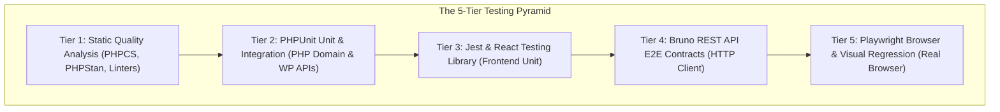

# 06 — Testing Strategy and Test Harnesses

A robust plugin demands a multi-layered testing pyramid. Tests serve as executable contracts, preventing regressions and giving coding agents immediate feedback.

This guide details the **5-Tier Testing Pyramid** implemented in the **Agentic WordPress Plugin Development Boilerplate**.

---

## 1. The 5-Tier Testing Pyramid



| Tier | Category | Focus Area | Runtime / Runner |
|---|---|---|---|
| **Tier 1** | Static Quality | Code formatting, type safety, Markdown syntax | PHPCS (WPCS), PHPStan, ESLint, Stylelint, Markdownlint |
| **Tier 2** | PHP Unit & Integration | Domain invariants, CPT/meta storage, capability gates | PHPUnit 11 inside WSL / wp-env container |
| **Tier 3** | Frontend Unit | React components, API client, hooks, reducers | Jest + `@testing-library/react` via `@wordpress/scripts` |
| **Tier 4** | REST Contract E2E | Black-box HTTP validation, error codes, auth | Bruno CLI (`@usebruno/cli`) with Application Passwords |
| **Tier 5** | Browser & Visual E2E | User journeys, modals, keyboard accessibility, snapshots | Playwright Test with Chromium & visual diffing |

---

## 2. Tier 1: Static Quality Analysis

Static quality gates run before any code is executed or built:

```bash
# PHP Coding Standards (WordPress-Core, Extra, Docs)
composer lint
composer lint:fix    # auto-fixes formatting

# PHPStan Static Analysis (Level 6+)
composer analyse

# JavaScript, CSS, and Markdown linting
npm run lint:js      # wp-scripts lint-js
npm run lint:css     # wp-scripts lint-style
npm run lint:md      # markdownlint-cli2
```

---

## 3. Tier 2: PHPUnit Unit and Integration Testing

Test suites are separated in `phpunit.xml.dist` into two distinct directories:

### 3.1 PHPUnit Unit Tests (`tests/phpunit/unit/`)
- **Characteristics:** Fast, in-memory, pure PHP execution.
- **Scope:** Value objects (`EntityTitleTest`), aggregate roots, domain exceptions, download policies, calculation services.
- **Rule:** **Zero** WordPress functions or database access. Must run in milliseconds without `wp-env`.

```php
// tests/phpunit/unit/Entity/EntityTitleTest.php
use PHPUnit\Framework\TestCase;
use WebFalcon\MyPlugin\Domain\EntityTitle;
use WebFalcon\MyPlugin\Domain\Exception\InvalidEntityTitleException;

final class EntityTitleTest extends TestCase {
    public function test_accepts_valid_trimmed_title(): void {
        $title = new EntityTitle( '  Quarterly Report  ' );
        $this->assertSame( 'Quarterly Report', $title->value() );
    }

    public function test_throws_exception_on_empty_title(): void {
        $this->expectException( InvalidEntityTitleException::class );
        new EntityTitle( '   ' );
    }
}
```

### 3.2 PHPUnit Integration Tests (`tests/phpunit/integration/`)
- **Characteristics:** Runs with WordPress core loaded (`WP_UnitTestCase`).
- **Scope:** Custom post type registration, post meta persistence, capability checks, taxonomy terms, database migrations.
- **Execution:** Run inside the container using `wp-env`:
  ```bash
  npx wp-env run cli --env-cwd=wp-content/plugins/my-plugin vendor/bin/phpunit
  ```

---

## 4. Tier 3: JavaScript and React Unit Testing

Frontend unit tests verify isolated UI components, custom hooks, and API client interactions using **Jest** and **React Testing Library**:

- **Configuration:** `jest.config.js` extends `@wordpress/scripts/config/jest-unit.config`.
- **Environment:** Node with JSDOM and `@testing-library/jest-dom`.
- **Execution:**
  ```bash
  npm run test:unit
  ```

```tsx
// tests/js/admin/useSettingsSection.test.ts
import { renderHook, act } from '@testing-library/react';
import { useSettingsSection } from '../../../assets/src/shared/hooks/useSettingsSection';

test('marks section dirty when setting is modified', () => {
  const { result } = renderHook(() => useSettingsSection('general'));
  expect(result.current.isDirty).toBe(false);

  act(() => {
    result.current.updateField('enableNotifications', true);
  });

  expect(result.current.isDirty).toBe(true);
});
```

---

## 5. Tier 4: Bruno REST API E2E Testing

Black-box contract testing treats the running WordPress instance as an external API server:

- **Runner:** `@usebruno/cli` executing Git-native `.bru` requests in `bruno/`.
- **Authentication:** Automated WordPress Application Passwords auto-provisioned by `tools/wp-env/after-start.mjs`.
- **Execution:**
  ```bash
  npm run test:rest
  ```
- **Assertions:**
  - Status codes (`200 OK`, `201 Created`, `400 Bad Request`, `401 Unauthorized`, `403 Forbidden`, `409 Conflict`).
  - Strict JSON schema matching.
  - Idempotency and variable chaining across requests (e.g. creating an item, reading its ID, modifying it, and cleaning it up).

---

## 6. Tier 5: Playwright Browser & Visual Regression Testing

Playwright tests the complete user journey inside headless Chromium:

### 6.1 Authentication Setup (`auth.setup.ts`)
Playwright logs into WordPress once via `tests/e2e/playwright/setup/auth.setup.ts`, saving browser cookies and local storage to `.auth/admin.json`. All subsequent specs reuse this session, avoiding repeated login page overhead.

### 6.2 Deterministic Readiness Markers
Never use arbitrary delays (`await page.waitForTimeout(3000)`). The React apps must render explicit DOM state attributes:

```tsx
<div
  id="mdm-app-root"
  className="mdm-app-root"
  data-mdm-app-state={isLoading ? 'loading' : 'ready'}
/>
```

Playwright specs wait deterministically:
```typescript
await page.waitForSelector('[data-mdm-app-state="ready"]');
```

### 6.3 Visual Regression Snapshots
Playwright captures pixel-level screenshots of key application views, comparing them against approved baseline images in `tests/e2e/playwright/__screenshots__/`:

```typescript
test('renders diagram library shell correctly', async ({ page }) => {
  await page.goto('/wp-admin/admin.php?page=mdm-diagrams');
  await page.waitForSelector('[data-mdm-app-state="ready"]');

  await expect(page.locator('.mdm-app-root')).toHaveScreenshot('library-populated.png', {
    maxDiffPixelRatio: 0.01,
  });
});
```

### 6.4 Playwright Execution Commands
```bash
# Run headless browser test suite
npm run test:e2e

# Run with interactive Playwright UI for debugging
npm run test:e2e:ui

# Update visual baseline snapshots after intentional UI changes
npm run test:e2e:update
```

---

## 7. The Full Quality Gate Pipeline

Before merging code or closing an implementation phase, execute the full pipeline:

```bash
# 1. Static Checks
composer lint && composer analyse && npm run lint

# 2. Unit Suites
npm run test:unit && composer test

# 3. Integration & Contract Suites
npm run test:rest

# 4. End-to-End & Visual Suites
npm run test:e2e

# 5. Versioning Verification Suite
npm run test:versioning
```
