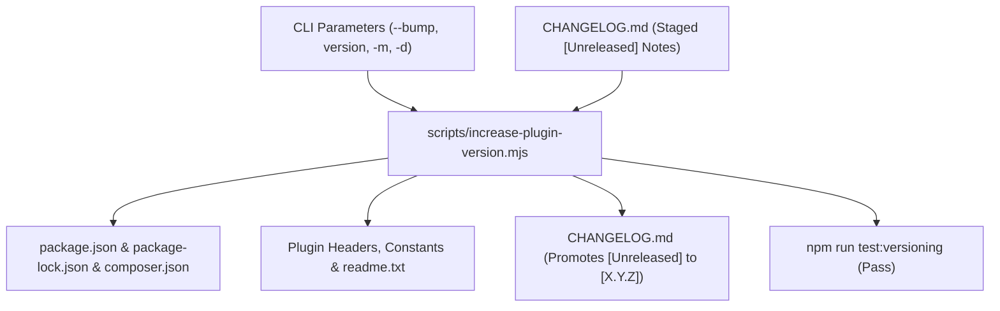

# 07 — Versioning and Release Lifecycle

In modern plugin engineering, changing a version number is **never a manual text edit**.

This guide details the automated semantic versioning, continuous unreleased changelogging, and release logging system implemented in `scripts/increase-plugin-version.mjs`, tested by `tests/node/versioning/`, and governed by `.cursor/skills/versioning/` and `.cursor/skills/changelog/`.

---

## 1. The Single Coordinated Release Operation

Manually searching and replacing version strings across a repository leads to stale headers in `plugin.php`, broken `readme.txt` stable tags, missed constants, and fragmented changelogs.

The boilerplate treats a release as **one atomic, automated operation** driven directly via CLI parameters:



---

## 2. Semantic Versioning Calculation Logic

The engineer or AI agent reads the current version from `package.json` and calculates the target version using strict SemVer (`MAJOR.MINOR.PATCH`):

1. **Minor Bump (`minor`, e.g. `1.0.1` → `1.1.0`):**
   - Finalization of a planned implementation phase.
   - Addition of substantial new features, blocks, or REST endpoints.
2. **Patch Bump (`patch`, e.g. `1.0.1` → `1.0.1`):**
   - Bug fixes, security patches, styling polish, or internal refactoring within a phase.
3. **Major Bump (`major`, e.g. `1.x.x` → `2.0.0`):**
   - Breaking architectural shift, minimum PHP/WP requirement increase, or major product baseline release.

---

## 3. Direct CLI Parameter Execution (No `.env` Required)

Version synchronization does **not** require modifying `.env`. All target versioning parameters and release metadata are provided directly to the CLI command:

### 3.1 Convenience npm Scripts
```bash
# Automated patch bump (1.0.1 -> 1.0.1)
npm run update-version:patch

# Automated minor bump (1.0.1 -> 1.1.0)
npm run update-version:minor

# Automated major bump (1.0.1 -> 2.0.0)
npm run update-version:major
```

### 3.2 Positional & Flag-Based Commands
```bash
# Positional bump keyword
npm run update-version -- patch
npm run update-version -- minor

# Explicit target version
npm run update-version -- 1.2.0

# Explicit target version with custom notes and decision rationale
npm run update-version -- 1.2.0 -m "Highlights for 1.2.0" -d "Phase 02 completed with 100% test pass"

# Dry run preview (no files written)
npm run update-version -- patch --dry-run
```

### Supported CLI Flags:
| Flag | Short | Description | Default |
|---|---|---|---|
| `--bump <type>` | `-b` | Bump type: `patch`, `minor`, or `major`. | `undefined` |
| `--target-version <X.Y.Z>` | `-v` | Explicit target semantic version. | `undefined` |
| `--changelog <text>` | `-m` | Optional release highlights (prepended to unreleased notes). | Inferred from `[Unreleased]` |
| `--decision <text>` | `-d` | Optional release notes highlight summary (alias for `-m`). | Standard adoption notice |
| `--date <YYYY-MM-DD>` | | Override release date. | Today's ISO date |
| `--dry-run` | | Preview planned file modifications without writing. | `false` |
| `--allow-downgrade` | | Permit a lower target version for recovery only. | `false` |
| `--root <path>` | | Specify project root directory. | Current working directory |
| `--env <path>` | | Optional fallback environment file. | `.env` |

---

## 4. Continuous Unreleased Changelogging & 95% Automated Packaging

A high-velocity release workflow depends on continuous changelogging rather than frantic release-day retrospectives.

### 4.1 Staging Unreleased Changes
On **every** task, feature, or bug fix, changes are immediately recorded under `## [Unreleased]` in `CHANGELOG.md` using the `changelog` skill or the CLI helper:

```bash
# Add feature note
npm run changelog:add -- -t Added "Added optimistic concurrency tokens to settings REST route"

# Add bug fix note
npm run changelog:add -- -t Fixed "Fixed CSS overflow issue on mobile admin viewport"
```

### 4.2 The 95% Automated Release Packaging
In 95% of cases, developers do **not** need to type custom release notes when releasing. When `npm run update-version` executes:
1. It automatically extracts all bullets currently under `## [Unreleased]`.
2. Converts them into the new version header: `## [1.2.0] - 2026-09-08`.
3. If an optional `--changelog` message is provided, it is prepended as a highlight lead paragraph.
4. It inserts a fresh, clean `## [Unreleased]` section at the top of `CHANGELOG.md`.

---

## 5. Intelligent Coordination Model

The boilerplate coordinates three core release and history artifacts with distinct responsibilities:

| Artifact | File | Primary Responsibility | When Updated |
|---|---|---|---|
| **Versioning** | `scripts/increase-plugin-version.mjs` | Atomic synchronization of SemVer across manifests (`package.json`, `composer.json`), headers (`plugin.php`), constants, and `readme.txt`. | On-demand upon release. Preferred manually or when explicitly requested in agent prompt. |
| **Changelog** | `CHANGELOG.md` | Chronological, user- and developer-facing log of WHAT changed. | **100% of tasks** under `## [Unreleased]`; promoted to version header upon release. |
| **Architecture Decision Records (ADRs)** | `docs/adr/` | Durable, immutable records capturing WHY architectural choices were made and binding invariants for future code. | Evaluated before planning/coding; created when architecturally significant forks occur. |

---

## 6. Manual Preference vs AI Agent Prompt-Aware Workflow

### Human Developers
Manual execution of version bumps is preferred:
- Work iteratively on features and bug fixes.
- Run `npm run changelog:add -- -t ...` to stage notes.
- When ready to publish, run `npm run update-version:patch` or `npm run update-version:minor`.

### AI Coding Agents
AI agents follow strict **prompt-awareness** governed by `.cursor/rules/post-phase-documentation.mdc` and `AGENTS.md`:
1. **Default Mode (No version bump in prompt):** The agent implements code, runs tests, and stages changes under `## [Unreleased]` in `CHANGELOG.md`. The agent does **not** bump the version.
2. **Explicit Mode (Version bump requested in prompt):** If the user's initial prompt explicitly requests a version bump (e.g. "bump version", "release v1.1.0", "finish phase with minor bump"), the agent executes `npm run update-version -- [bump|version]` after all tests pass.

---

## 7. Safety Model and Invariants

1. **Idempotency:**
   - If the target version is already equal to the current version, the script exits cleanly with message: `Target version X.Y.Z is already implemented... No version changes needed.`
   - It will not create duplicate changelog or decision log entries.
2. **Downgrade Protection:**
   - Accidental downgrades (e.g. requesting `1.1.0` when on `1.2.0`) are immediately rejected.
   - To force a rollback, `--allow-downgrade` must be passed explicitly.
3. **PHP Version Ordering:**
   - When PHP CLI is available, the script executes PHP's `version_compare()` to verify that WordPress update managers will recognize the target version as newer.
4. **Dry-Run Preview:**
   - Allows previewing all planned modifications without writing to disk:
     ```bash
     npm run update-version:dry-run
     ```
5. **Dependency Protection:**
   - Third-party dependency version strings in `package.json`, `package-lock.json`, and `composer.json` are strictly preserved, even if they match the plugin's version number.

---

## 8. Versioning Verification Test Suite

The boilerplate includes integration tests in `tests/node/versioning/version-sync.test.mjs` executed by Node's native test runner:

```bash
npm run test:versioning
```

The test runner creates a temporary mock WordPress plugin repository, executes the synchronization CLI, and asserts that:
- Package manifests, headers, constants, and `readme.txt` are updated.
- CLI arguments (`--bump`, positional version, `-m`, `-d`) work without `.env`.
- Unrelated dependencies with matching version strings are untouched.
- `CHANGELOG.md` promotes `[Unreleased]` notes cleanly.
- Dry-run preserves file contents.
- Idempotent runs and illegal downgrades exit with correct status codes.

---

## 9. Execution Workflow Checklist

Whenever preparing a release:

1. [ ] Verify all planned changes are recorded under `## [Unreleased]` in `CHANGELOG.md`.
2. [ ] Preview planned version bump:
   ```bash
   npm run update-version -- patch --dry-run
   ```
3. [ ] Apply version synchronization:
   ```bash
   npm run update-version:patch
   ```
4. [ ] Run automated verification tests:
   ```bash
   npm run test:versioning
   ```
5. [ ] Inspect `git diff` to confirm clean updates across manifests and source files.
