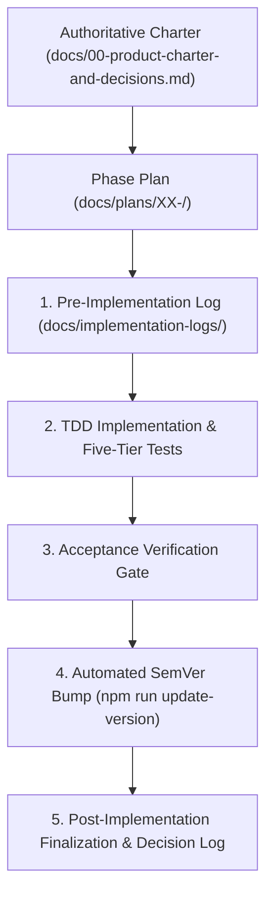

# 08 — Phased Execution and Agent Workflow

AI coding agents are most effective when guided by tight constraints, clear boundaries, and deterministic verification gates.

This guide outlines the **Phased Implementation Methodology**, the **4-Document Phase Anatomy**, and the **Implementation Logging Lifecycle** defined in `AGENTS.md` and `.cursor/rules/post-phase-documentation.mdc`.

---

## 1. Why Phased Execution?

When given large, ambiguous prompts (e.g., *"Build an e-commerce plugin with settings, cart, and stripe payments"*), AI agents frequently:
- Attempt to generate hundreds of files at once, exceeding context limits.
- Invent inconsistent architecture patterns between frontend and backend.
- Omit test harnesses, documentation, or security capabilities.
- Silently break existing code.

The **Phased Execution Model** solves this by decomposing plugin development into sequential, vertical slices:



---

## 2. The Authoritative Product Charter

Before any code or plan is authored, the team or agent creates:  
`docs/00-product-charter-and-decisions.md`

### Core Charter Rules:
1. **Single Source of Truth:** Resolves all architectural disputes and open product questions.
2. **Conflict Invariant:** If any document, specification, or prompt conflicts with the charter, **the charter wins**, and the conflicting document must be corrected immediately.
3. **Core Identity Declarations:**
   - Product name and technical prefixes (e.g., `mdm`, `my_plugin`).
   - Minimum supported versions: WordPress 7.0, PHP 8.3.
   - Core design boundaries: storage model, editor strategy, permissions, and security policies.

---

## 3. The 4-Document Phase Anatomy (`docs/plans/XX-<name>/`)

Every implementation phase lives in its own directory under `docs/plans/` and consists of exactly **four structured documents**:

```text
docs/plans/02-rest-api-settings-and-contracts/
├── README.md               # Scope, dependencies, deliverables, exclusions
├── technical-spec.md       # Implementation boundaries, schemas, classes, DTOs
├── tests-and-acceptance.md # Unit/integration/Bruno/Playwright acceptance criteria
└── master-prompt.md        # Standalone prompt for the executing AI agent
```

### 3.1 `README.md`
- **Functional Scope:** Exactly what features are in scope for this phase.
- **Dependencies:** Which prior phases must be finalized before this phase begins.
- **Explicit Exclusions:** Explicitly lists what is **NOT** to be implemented yet (prevents agents from implementing future phases prematurely).

### 3.2 `technical-spec.md`
- Concrete technical blueprint: namespaces, class names, file paths, database schemas, REST endpoints, and DTO contracts.
- Boundaries between domain logic, persistence, and presentation.

### 3.3 `tests-and-acceptance.md`
- Explicit test requirements across the pyramid:
  - Which PHPUnit unit tests and integration tests must pass.
  - Which Bruno REST `.bru` requests must be added and passing.
  - Which Jest unit tests and Playwright browser specs must pass.
  - Specific exit criteria that define phase completion.

### 3.4 `master-prompt.md`
- A self-contained prompt written specifically for an AI coding agent.
- Includes context pointers, relevant skills to load, instructions, and verification checklists.

---

## 4. Phase Implementation Logging (`docs/implementation-logs/`)

For every phase, the agent manages an audit log under `docs/implementation-logs/YYYY-MM-DD-phase-XX-<short-name>.md`:

### Step 1: Pre-Implementation (Phase Start)
At the start of a phase, create the file with the pre-implementation checklist extracted from `technical-spec.md` and `tests-and-acceptance.md`:

```markdown
# Implementation Report — Phase 02: REST API, Settings, and Contracts

**Date:** 2026-08-01  
**Phase ID:** Phase 02  
**Status:** In Progress  

## 1. Pre-Implementation Checklist
- [ ] Review `docs/plans/02-rest-api-settings-and-contracts/` spec
- [ ] Implement Commands and Queries under `src/Entity/Application/`
- [ ] Implement REST Controllers under `src/Rest/Controller/`
- [ ] Add Bruno test requests under `bruno/02 Entities/`
- [ ] Ensure all PHPUnit and Bruno tests pass
```

### Step 2: Post-Implementation (Phase Finalization)
Once code and tests are complete, finalize the report:
1. Mark all checklist items as completed: `- [x]`.
2. Record **Key Decisions & Architecture Outcomes** (and references to new ADRs).
3. Record all **Files Created & Modified**.
4. Record **Verification Results & Test Artifacts** (test counts, pass rates).
5. Complete the **Post-Implementation Summary vs Initial Spec** table:

```markdown
## 5. Post-Implementation Summary vs Initial Spec

| Area | Planned Spec | Implemented Result | Notes / Deviations |
|---|---|---|---|
| REST Endpoints | `my-plugin/v1` routes | Registered via `RestServiceProvider` | 100% matched spec |
| Concurrency | `_version_token` 409 check | Implemented in `UpdateEntityCommand` | Returns 409 Conflict |
| Bruno Tests | 16 test requests | 16 requests passing in `bruno/` | Verified against wp-env |
```

---

## 5. The Post-Phase Documentation & Automated Closeout Rule

Codified in `.cursor/rules/post-phase-documentation.mdc`, this rule triggers **only after** all phase code and tests pass:

1. **Mandatory Version Increment:**
   - Agent determines version increment (e.g. `1.1.0` → `1.2.0`).
   - Updates `.env` with release metadata.
   - Executes:
     ```bash
     npm run update-version:dry-run
     npm run update-version
     npm run test:versioning
     ```
2. **Synchronize Historical Records:**
   - Confirms `CHANGELOG.md` promoted `[Unreleased]` to `[1.2.0]`.
   - Confirms `docs/decision-log.md` received `REL-1.2.0` entry.
3. **Synchronize Documentation Manifest:**
   - If files were added or modified under `docs/`, updates `docs/MANIFEST.md`.
4. **Output Closeout Summary:**
   - Produces a concise summary confirming phase completion, version bump, test status, and remaining notes for the next phase.

---

## 6. The `AGENTS.md` Protocol

At the repository root, `AGENTS.md` provides global instructions that every coding agent must follow before making changes:

```markdown
# Agent Instructions — My Plugin

Before any change:
1. Read `docs/00-product-charter-and-decisions.md`.
2. Read the active folder under `docs/plans/` and its `master-prompt.md`.
3. Run WordPress router/project triage skills.
4. Load every skill named by the phase.
5. Do not implement later phases early.

Never bypass WordPress capabilities. Never save unvalidated input.
Always use REST for browser mutations. Follow WPDS for admin UI.

After a plan phase is finalized:
6. Run the post-phase documentation and automated versioning closeout:
   increment version via `npm run update-version`, write implementation report
   to `docs/implementation-logs/`, and update `docs/decision-log.md` and `CHANGELOG.md`.
```
