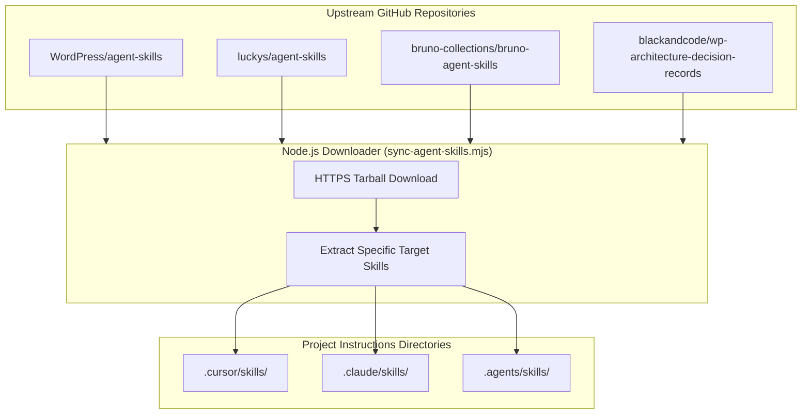

# 09 — Agent Skills and Synchronization Script

Agent Skills are portable bundles of instructions, procedural checklists, and reference guides that equip AI coding assistants with deep, domain-specific engineering knowledge.

This guide details the complete Agent Skills catalog for WordPress plugin engineering and provides the automated **Node.js Skill Synchronization Script** (`scripts/sync-agent-skills.mjs`).

---

## 1. The Agent Skills Architecture



Skills follow the **Progressive Disclosure** principle:
- **`SKILL.md`:** The entrypoint (under 500 lines) containing metadata, triggers, and high-level procedures.
- **`references/`:** Flat subdirectories containing deep-dive technical rules, schemas, and anti-patterns loaded just-in-time.
- **`scripts/`:** Deterministic helper scripts that the agent can execute.

---

## 2. Complete Skills Catalog for WordPress Plugin Development

### 2.1 WordPress Core Skills (`WordPress/agent-skills`)
Repository: [https://github.com/WordPress/agent-skills](https://github.com/WordPress/agent-skills)

| Skill Name | Purpose & Trigger |
|---|---|
| `wordpress-router` | Analyzes project files and routes the agent to the appropriate WordPress development workflow. |
| `wp-project-triage` | Detects project type (plugin/theme), tooling, versions, and active configurations deterministically. |
| `wp-plugin-development` | Core plugin lifecycle: hooks, activation, deactivation, uninstall, settings API, security. |
| `wp-rest-api` | Authoring REST API endpoints via `register_rest_route`, permission callbacks, schema definitions. |
| `wp-admin-ui-ux` | Admin interface patterns, layout guidelines, accessibility, and WPDS design tokens. |
| `wp-phpstan` | PHPStan static analysis configuration, baselines, and WordPress-specific typing. |
| `wp-wpcli-and-ops` | WP-CLI commands, automated diagnostics, database search-replace, and operations. |
| `wp-plugin-directory-guidelines` | Evaluates GPL compliance, licensing, naming rules, and WordPress.org repository guidelines. |
| `wp-playground` & `blueprint` | Generates declarative WordPress Playground Blueprints for instant browser testing. |

### 2.2 Engineering Craftsmanship Skills (`luckys/agent-skills`)
Repository: [https://github.com/luckys/agent-skills](https://github.com/luckys/agent-skills)

| Skill Name | Purpose & Trigger |
|---|---|
| `ddd-best-practices` | Domain-Driven Design: Bounded Contexts, Aggregates, Value Objects, Domain Events, Repositories, Hexagonal architecture. |
| `oop-best-practices` | Value Objects, immutability by default, eliminating primitive obsession, rich domain models, fail-fast constructors. |
| `design-patterns-best-practices` | Targeted GoF and enterprise patterns: Repository, Service Provider, Factory, Adapter; anti-pattern prevention. |
| `tdd-best-practices` | Test-Driven Development Red-Green-Refactor cycle, invariant-first testing, test fixture isolation. |
| `refactoring-best-practices` | Behavior-preserving incremental refactorings, regression safety, small atomic changes. |

### 2.3 API Testing Skills (`bruno-collections/bruno-agent-skills`)
Repository: [https://github.com/bruno-collections/bruno-agent-skills](https://github.com/bruno-collections/bruno-agent-skills)

| Skill Name | Purpose & Trigger |
|---|---|
| `bruno-collection-generator` | Automatically scaffolds Git-native `.bru` requests from OpenAPI specs or PHP REST controllers. |
| `bruno-test-writer` | Crafts robust assertions, pre/post scripts, schema validation, and variable chaining across requests. |
| `bruno-ci-setup` | Automates headless `@usebruno/cli` execution in npm scripts and CI pipelines with JUnit/HTML reports. |

### 2.4 WordPress Architecture Decision Records (`blackandcode/wp-architecture-decision-records`)
Repository: [https://github.com/blackandcode/wp-architecture-decision-records](https://github.com/blackandcode/wp-architecture-decision-records)

| Skill Name | Purpose & Trigger |
|---|---|
| `wp-architecture-decision-records` | Record, evaluate, and maintain Architecture Decision Records (ADRs) tailored for WordPress plugin engineering. Use when evaluating architecturally significant decisions (custom database tables vs post meta, Action Scheduler vs WP-Cron, REST routes, WooCommerce HPOS integration, Gutenberg rendering models) or consulting accepted ADRs. |

### 2.5 Bundled In-Tree Custom Skills
Maintained directly in-tree under `.cursor/skills/` and permanently protected against upstream overwrites:
- **`wp-admin-ui-ux`:** Complete WordPress Admin React UI/UX design skill with WPDS layout templates and Playwright visual loop references.
- **`versioning`:** Automated plugin version synchronization skill executing `scripts/increase-plugin-version.mjs`.
- **`changelog`:** Keep a Changelog compliant unreleased change logging skill using `scripts/record-unreleased-change.mjs`.

---

## 3. Automated Skill Synchronization Script (`sync-agent-skills.mjs`)

To ensure a new plugin repository can fetch and update all external skills in one command without manual cloning, the boilerplate provides a standalone Node.js downloader script.

### Features of the Script:
- **Zero External Dependencies:** Built with native Node.js APIs (`node:https`, `node:fs`, `node:child_process`, `node:stream`).
- **Targeted Extraction:** Downloads GitHub repositories and extracts only the specified skills into target folders (`.cursor/skills/`, `.agents/skills/`).
- **In-Tree Skill Protection:** Automatically protects in-tree custom skills (`PROTECTED_IN_TREE_SKILLS`) so they are never overwritten or deleted by remote synchronization.
- **Post-Sync Integrity Verification:** Verifies all protected skills exist and are intact before exiting.
- **Deterministic & Repeatable:** Can be run at any time to update skills to the latest upstream releases.

### Script Source Code (`scripts/sync-agent-skills.mjs`):

```javascript
#!/usr/bin/env node
import { execSync } from 'node:child_process';
import { existsSync, mkdirSync, realpathSync, rmSync } from 'node:fs';
import { resolve, join } from 'node:path';
import { tmpdir } from 'node:os';

const PROTECTED_IN_TREE_SKILLS = new Set([
  'versioning',
  'changelog',
  'wp-admin-ui-ux',
]);

const SOURCES = [
  {
    repo: 'https://github.com/WordPress/agent-skills.git',
    branch: 'trunk',
    skillsDir: 'skills',
    skills: [
      'wordpress-router',
      'wp-project-triage',
      'wp-plugin-development',
      'wp-rest-api',
      'wp-phpstan',
      'wp-wpcli-and-ops',
      'wp-plugin-directory-guidelines',
      'wp-playground',
      'blueprint',
      'wp-block-development',
      'wp-block-themes',
      'wp-interactivity-api',
      'wpds',
    ],
  },
  {
    repo: 'https://github.com/luckys/agent-skills.git',
    branch: 'main',
    skillsDir: 'skills',
    skills: [
      'ddd-best-practices',
      'oop-best-practices',
      'design-patterns-best-practices',
      'tdd-best-practices',
      'refactoring-best-practices',
    ],
  },
  {
    repo: 'https://github.com/bruno-collections/bruno-agent-skills.git',
    branch: 'main',
    skillsDir: '',
    skills: [
      'bruno-collection-generator',
      'bruno-test-writer',
      'bruno-ci-setup',
    ],
  },
  {
    repo: 'https://github.com/blackandcode/wp-architecture-decision-records.git',
    branch: 'main',
    skillsDir: '',
    skills: [
      'wp-architecture-decision-records',
    ],
  },
];

const RAW_TARGETS = [
  resolve(process.cwd(), '.cursor/skills'),
  resolve(process.cwd(), '.agents/skills'),
];

// Deduplicate targets if symlinked (e.g. .agents -> .cursor)
const seenPaths = new Set();
const TARGET_DIRECTORIES = RAW_TARGETS.filter((targetPath) => {
  const real = existsSync(targetPath) ? realpathSync(targetPath) : targetPath;
  if (seenPaths.has(real)) {
    return false;
  }
  seenPaths.add(real);
  return true;
});

for (const targetDir of TARGET_DIRECTORIES) {
  mkdirSync(targetDir, { recursive: true });
}

console.log('Synchronizing external agent skills...');

for (const source of SOURCES) {
  const tempCloneDir = join(tmpdir(), `skills-${Date.now()}-${Math.random().toString(36).slice(2)}`);
  try {
    console.log(`Fetching from ${source.repo}...`);
    execSync(`git clone --depth 1 --branch ${source.branch} ${source.repo} "${tempCloneDir}"`, {
      stdio: ['ignore', 'ignore', 'inherit'],
    });

    for (const skillName of source.skills) {
      if (PROTECTED_IN_TREE_SKILLS.has(skillName)) {
        console.warn(`  [Protected] Skipping '${skillName}' because it is a protected in-tree skill.`);
        continue;
      }

      let isRootSkill = false;
      let sourceSkillPath = source.skillsDir
        ? join(tempCloneDir, source.skillsDir, skillName)
        : join(tempCloneDir, skillName);

      if (!existsSync(sourceSkillPath) && existsSync(join(tempCloneDir, 'SKILL.md'))) {
        sourceSkillPath = tempCloneDir;
        isRootSkill = true;
      } else if (!existsSync(sourceSkillPath)) {
        console.warn(`Warning: skill '${skillName}' not found in ${source.repo}`);
        continue;
      }

      for (const targetDir of TARGET_DIRECTORIES) {
        const dest = join(targetDir, skillName);
        rmSync(dest, { recursive: true, force: true });
        if (isRootSkill) {
          mkdirSync(dest, { recursive: true });
          execSync(`cp -r "${sourceSkillPath}/." "${dest}/"`);
          rmSync(join(dest, '.git'), { recursive: true, force: true });
        } else {
          execSync(`cp -r "${sourceSkillPath}" "${dest}"`);
        }
      }
      console.log(`  - Synced: ${skillName}`);
    }
  } catch (err) {
    console.error(`Failed to sync from ${source.repo}:`, err.message);
  } finally {
    rmSync(tempCloneDir, { recursive: true, force: true });
  }
}

console.log('Verifying in-tree protected skills integrity...');
for (const targetDir of TARGET_DIRECTORIES) {
  for (const protectedSkill of PROTECTED_IN_TREE_SKILLS) {
    const protectedSkillFile = join(targetDir, protectedSkill, 'SKILL.md');
    if (!existsSync(protectedSkillFile)) {
      throw new Error(`Integrity check failed: Protected in-tree skill '${protectedSkill}' missing at ${protectedSkillFile}`);
    }
  }
}
console.log('All protected in-tree skills verified successfully.');

console.log('Skill synchronization completed successfully.');
```

---

## 4. How to Run the Sync Script

Add the script to your project under `scripts/sync-agent-skills.mjs` and register it in `package.json`:

```json
{
  "scripts": {
    "skills:sync": "node scripts/sync-agent-skills.mjs"
  }
}
```

Run:
```bash
npm run skills:sync
```

All selected skills will be downloaded and placed into `.cursor/skills/` ready for immediate use by coding agents.
