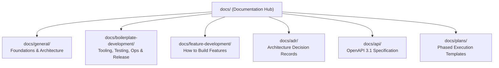

# Documentation Hub

Welcome to the documentation for the **WordPress AI Plugin Development Boilerplate**.

This documentation is structured into three primary domains, alongside preserved architectural decision records and API contracts:

---

## 1. General Foundations & Architecture (`docs/general/`)

Authoritative architectural principles, project identity, and governance.

- [docs/general/product-charter.md](general/product-charter.md): The non-negotiable **Single Source of Truth** for the plugin. Core identity, invariants (Hexagonal DDD, WPCS, 5-tier testing, WPDS, SemVer).
- [docs/general/architecture-and-layers.md](general/architecture-and-layers.md): Complete Hexagonal architecture specification covering Domain, Application, Infrastructure, Presentation, and DI container kernel.
- [docs/general/architecture-decision-records-guide.md](general/architecture-decision-records-guide.md): Guide to ADR evaluation gates, decision lifecycle, authoring workflow, and validation CLI tooling.

---

## 2. Boilerplate Development & Operations (`docs/boilerplate-development/`)

Setup, toolchain, testing strategy, linters, scaffolding, and release lifecycles.

- [docs/boilerplate-development/environment-and-toolchain.md](boilerplate-development/environment-and-toolchain.md): WSL2/Linux host constraints, Docker Desktop, `@wordpress/env` container orchestration, and automated setup lifecycles (`after-start.mjs`).
- [docs/boilerplate-development/development-prerequisites.md](boilerplate-development/development-prerequisites.md): Cross-platform setup instructions across macOS, Linux, WSL2, and native Windows.
- [docs/boilerplate-development/coding-standards.md](boilerplate-development/coding-standards.md): Mandatory WordPress Coding Standards (WPCS), PHPStan Level 6+ static analysis, ESLint, Stylelint, and Markdownlint rules.
- [docs/boilerplate-development/testing-strategy.md](boilerplate-development/testing-strategy.md): The Five-Tier Testing Pyramid (Static, PHPUnit, Jest/RTL, Bruno REST contracts, Playwright browser/visual).
- [docs/boilerplate-development/project-scaffolding-cli.md](boilerplate-development/project-scaffolding-cli.md): Automated plugin rebranding CLI (`scripts/scaffold-plugin.mjs`), token replacement engine, and `--dry-run` usage.
- [docs/boilerplate-development/versioning-and-releases.md](boilerplate-development/versioning-and-releases.md): Atomic SemVer synchronization CLI (`scripts/increase-plugin-version.mjs`), unreleased changelogging, and release packaging.
- [docs/boilerplate-development/agent-skills.md](boilerplate-development/agent-skills.md): Bundled agent skills catalog, synchronization script (`scripts/sync-agent-skills.mjs`), and `PROTECTED_IN_TREE_SKILLS` safeguards.
- [docs/boilerplate-development/configuration-reference.md](boilerplate-development/configuration-reference.md): Annotated configuration templates (`.wp-env.json`, `phpunit.xml.dist`, `phpstan.neon.dist`, `playwright.config.ts`, `blueprint.json`, `wp-cli.yml`).
- [docs/boilerplate-development/command-catalog.md](boilerplate-development/command-catalog.md): Complete directory of verified npm scripts, Composer commands, wp-env tasks, and test runners.
- [docs/boilerplate-development/bootstrap-checklist.md](boilerplate-development/bootstrap-checklist.md): Pre-flight verification checklist for local development environments.
- [docs/boilerplate-development/cursor-playwright-mcp.md](boilerplate-development/cursor-playwright-mcp.md): Playwright CLI vs Cursor Playwright MCP integration guide for WSL2.

---

## 3. Feature Development Guides (`docs/feature-development/`)

Step-by-step developer and agent guides for building new plugin features.

- [docs/feature-development/phased-workflow-and-agents.md](feature-development/phased-workflow-and-agents.md): Vertical slice decomposition, 4-document phase anatomy, and pre/post-implementation logging.
- [docs/feature-development/domain-and-application-services.md](feature-development/domain-and-application-services.md): Authoring pure PHP 8.3 Domain models (Value Objects, Aggregate Roots, Domain Events, Exceptions, Repository Interfaces) and CQRS-Lite Application Services.
- [docs/feature-development/rest-api-and-contracts.md](feature-development/rest-api-and-contracts.md): Contract-first REST API development with OpenAPI 3.1, `WP_REST_Controller` delegation to Application Services, and Bruno `.bru` contract tests.
- [docs/feature-development/admin-ui-ux-standards.md](feature-development/admin-ui-ux-standards.md): WordPress Design System (WPDS) React 18 standards, Card panels, vertical sidebar tab navigation, dirty form tracking, and shared UI primitives.
- [docs/feature-development/blocks-and-interactivity.md](feature-development/blocks-and-interactivity.md): Modern block development using Block API v3, Gutenberg Inspector controls, Interactivity API client store (`view.ts`), directives (`data-wp-*`), and block patterns.
- [docs/feature-development/wp-cli-commands.md](feature-development/wp-cli-commands.md): Registering custom WP-CLI commands (`PluginCliCommand`), argument parsing, output formatters (`table`, `json`), and application service delegation.
- [docs/feature-development/abilities-api.md](feature-development/abilities-api.md): Exposing plugin operations to autonomous AI agents via the WordPress Abilities API (`wp_register_ability_category`, `wp_register_ability`, input schemas, permission callbacks).

---

## 4. Preserved Reference Directories

- **[docs/adr/](adr/):** Architecture Decision Records (ADRs) capturing durable architectural memory, invariants, and trade-offs. See [docs/adr/README.md](adr/README.md).
- **[docs/api/](api/):** OpenAPI 3.1 specification (`openapi.yaml`) defining all REST API contracts.
- **[docs/plans/](plans/):** Phased implementation plan templates and active sprint blueprints.
- **[docs/implementation-logs/](implementation-logs/):** Historical audit logs from completed implementation phases.

---

## 5. Recommended Reading Paths

- **New Developer Onboarding:** Start with [docs/general/product-charter.md](general/product-charter.md) → [docs/boilerplate-development/development-prerequisites.md](boilerplate-development/development-prerequisites.md) → [docs/boilerplate-development/environment-and-toolchain.md](boilerplate-development/environment-and-toolchain.md) → [docs/boilerplate-development/command-catalog.md](boilerplate-development/command-catalog.md).
- **Building a New Feature:** Read [docs/feature-development/phased-workflow-and-agents.md](feature-development/phased-workflow-and-agents.md) → [docs/feature-development/domain-and-application-services.md](feature-development/domain-and-application-services.md) → [docs/feature-development/rest-api-and-contracts.md](feature-development/rest-api-and-contracts.md) / [docs/feature-development/blocks-and-interactivity.md](feature-development/blocks-and-interactivity.md).
- **AI Coding Agent:** Consult [docs/general/product-charter.md](general/product-charter.md) and active records in [docs/adr/](adr/) before reading the active phase prompt in [docs/plans/](plans/).
