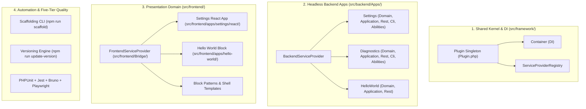
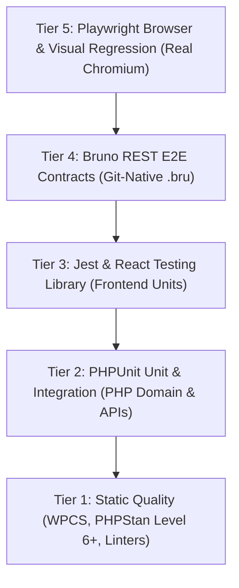
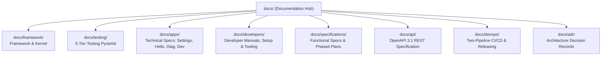

# Documentation Hub & Technical Architecture Guide

Welcome to the comprehensive documentation hub for the **WordPress AI Plugin Development Boilerplate**.

> **Note on Documentation Site:** This `docs/` directory serves as the single source of truth for the project's technical documentation. It is designed to be browsed directly on GitHub or published to an external documentation website (e.g. via GitHub Pages using a Markdown static site generator).
>
> - **Live Documentation Site (Preview):** `https://example.github.io/wordpress-ai-plugin-docs/` *(Placeholder)*
> - **Product Marketing Website (Preview):** `https://example.github.io/wordpress-ai-plugin-boilerplate/` *(Placeholder)*
> - **Main Project Landing Page:** [README.md](../README.md)

---

## Architectural Highlights (ADR-0009)

The boilerplate enforces a **Tripartite App-Centric Architecture** governed by [ADR-0009](adr/0009-tripartite-app-centric-architecture.md). It strictly separates reusable infrastructure, pure business domain logic, and presentation delivery mechanisms.



### Architectural Pillars

1. **Shared Kernel & DI (`src/framework/`):**
   A micro-DI container (`Container`) and two-pass `ServiceProviderRegistry` that manages service lifecycles without heavy external framework bloat. Includes a domain event dispatcher bridging to WordPress `do_action()` hooks, a template renderer, and the code-driven OpenAPI 3.1 generator engine.
2. **Headless Backend Apps (`src/backend/Apps/`):**
   Autonomous, domain-driven business applications (e.g. `Settings`, `Diagnostics`, `HelloWorld`). Each app contains its own Domain model, Application services, REST controllers (`WP_REST_Controller`), WP-CLI commands, and official WordPress Abilities API registrations.
3. **Frontend Presentation Domain (`src/frontend/`):**
   Decoupled user interfaces including Gutenberg blocks built with Block API v3 and the WordPress Interactivity API (`data-wp-*`), WordPress Design System (WPDS) React 18 administrative dashboards, block patterns, and the PHP presentation bridge (`src/frontend/Bridge/`).
4. **Strict REST Boundary:**
   Frontend React apps and interactive blocks never invoke PHP domain logic directly; they communicate exclusively through authenticated REST API contracts (`/ai-ready-wp/v1/*`).

---

## 5-Tier Testing Pyramid

Every tier is pre-wired, automated, and ready to execute out of the box:



| Tier | Category | Runner / Tool | Primary Command | Deep-Dive Documentation |
| --- | --- | --- | --- | --- |
| **Tier 1** | Static Quality | WPCS + PHPStan L6+ + ESLint + Markdownlint | `composer lint && composer analyse && npm run lint` | [Tier 1 Guide](testing/tier1-static-quality.md) |
| **Tier 2** | PHP Unit & Integration | PHPUnit 11 | `composer test` | [Tier 2 Guide](testing/tier2-phpunit-testing.md) |
| **Tier 3** | Frontend Unit | Jest + React Testing Library | `npm run test:unit` | [Tier 3 Guide](testing/tier3-frontend-unit-testing.md) |
| **Tier 4** | REST Contract E2E | Bruno CLI (`@usebruno/cli`) | `npm run test:rest` | [Tier 4 Guide](testing/tier4-bruno-rest-testing.md) |
| **Tier 5** | Browser & Visual E2E | Playwright with Screenshot Diffing | `npm run test:e2e` | [Tier 5 Guide](testing/tier5-playwright-e2e-testing.md) |

For overarching quality policies, see the [Testing Strategy Guide](testing/testing-strategy.md).

---

## Automated Semantic Versioning & Unreleased Changelog

Changing version numbers is **never a manual text edit**. The boilerplate provides atomic release management directly via CLI parameters—completely decoupled from `.env`:

```bash
# Automated SemVer bumps:
npm run update-version:patch    # e.g. 1.0.0 -> 1.0.1 (maintenance fixes & refactoring)
npm run update-version:minor    # e.g. 1.0.0 -> 1.2.0 (new features & phase completions)
npm run update-version:major    # e.g. 1.0.0 -> 2.0.0 (breaking changes & major baseline)

# Explicit target version with custom notes & decision rationale:
npm run update-version -- 1.2.0 -m "Release highlights" -d "Approved v1.2.0 release"

# Dry-run preview (inspect planned replacements without writing files):
npm run update-version:dry-run
npm run update-version -- patch --dry-run
```

### Continuous Unreleased Changelog & 95% Automated Packaging

1. **Continuous Staging (`npm run changelog:add`):**
   Record descriptive bullet points under `## [Unreleased]` in `CHANGELOG.md` upon completing any feature or fix:

   ```bash
   npm run changelog:add -- -t Added "Added optimistic concurrency tokens to settings REST route"
   npm run changelog:add -- -t Fixed "Fixed CSS overflow issue on mobile admin sidebar"
   ```

2. **95% Automated Release Packaging:**
   When `npm run update-version` executes, it automatically extracts all items staged under `## [Unreleased]`, converts them into the new release header `## [X.Y.Z] - YYYY-MM-DD`, and inserts a fresh, clean `## [Unreleased]` section. In 95% of cases, manual release note compilation is eliminated.

### Human Developer vs AI Agent Workflow

- **Human Developers (Manual Preferred):** Developers work iteratively, stage notes with `npm run changelog:add`, and manually trigger releases when ready.
- **AI Coding Agents (Prompt-Aware):** Agents inspect the user's initial prompt. If and only if the user explicitly requested a version bump (e.g. "bump version", "release v1.2.0"), the agent executes `npm run update-version`. Otherwise, the agent strictly logs changes under `## [Unreleased]` and leaves release execution to the developer.

### What `npm run update-version` Coordinates Atomically

1. Updates `package.json` and `package-lock.json` root versions without touching external dependencies.
2. Updates `composer.json` version.
3. Updates WordPress plugin header `Version: X.Y.Z` and `AIRWP_VERSION` constant.
4. Updates `readme.txt` `Stable tag: X.Y.Z`.
5. Promotes `CHANGELOG.md` `[Unreleased]` items into the formal release header (`## [X.Y.Z] - YYYY-MM-DD`).
6. Enforces PHP version comparison ordering (`version_compare`).

For deep-dive documentation, see [Versioning & Release Lifecycle](developers/versioning-and-releases.md).

---

## Two-Pipeline CI/CD & Automated Release Packaging

The boilerplate implements a secure, reproducible two-pipeline CI/CD and release model governed by [ADR-0010](adr/0010-two-pipeline-ci-cd-and-release-readiness-architecture.md):

1. **Continuous Delivery Readiness (`.github/workflows/ci.yml`):**
   Runs on every pull request and push to `main`. Executes linters, PHP quality checks across PHP 8.3 and 8.5, compiles assets, builds the production distribution ZIP, validates the package contract, and executes the official WordPress Plugin Check on the built archive.
2. **Manual Release Dispatch (`.github/workflows/release.yml`):**
   Manual-only workflow triggered via `workflow_dispatch` on `main`. Verifies version consistency, re-evaluates the shared release gate, generates Sigstore-backed build provenance attestations, tags `vX.Y.Z`, and creates an immutable GitHub Release.
3. **The Tested Artifact Is the Released Artifact:**
   The release workflow publishes the exact ZIP verified in CI, eliminating rebuild drift.

```bash
# Local CLI parity commands:
npm run ci                  # Runs full local lint and test suites
npm run release:check       # Validates version consistency and git readiness
npm run release:build       # Compiles assets and builds dist/{slug}-{version}.zip
npm run release:validate    # Validates ZIP against strict production package contract
npm run release:notes       # Extracts version markdown notes from CHANGELOG.md
npm run lint:actions        # Validates workflow YAML, syntax, and version tagging
```

For complete operational procedures and GitHub branch protection recommendations, see the [Releasing & CI/CD Guide](devops/releasing-and-distribution.md).

---

## Architecture Decision Records (ADRs)

Architectural decisions are captured under `docs/adr/` as immutable historical records with explicit invariants, trade-offs, and verification criteria. Ephemeral phase plans (`docs/specifications/plans/`) govern *how* to build features, while ADRs define the durable architectural boundaries.

| Command | Purpose | Example |
| --- | --- | --- |
| `npm run adr:new` | Scaffolds a new ADR with sequential numbering and auto-updates the index | `npm run adr:new -- -t "Cache REST Endpoints" --template simple` |
| `npm run adr:validate` | Validates markdown schema, YAML frontmatter, and cross-references | `npm run adr:validate -- --strict` |
| `npm run adr:status` | Updates the status of an existing ADR (`accepted`, `deprecated`, `superseded`) | `npm run adr:status -- --file docs/adr/0002-xyz.md --status superseded --by 0005` |
| `npm run adr:detect` | Detects WordPress project architecture, dependencies, and ADR conventions | `npm run adr:detect` |

For full lifecycle details and the pre-planning evaluation gate, see the [Architecture Decision Records Guide](developers/architecture-decision-records-guide.md) and the [ADR Index](adr/README.md).

---

## Bundled Agent Skills and AI Instructions

The boilerplate includes full instruction sets for AI coding agents:

- **`.cursor/rules/`**:
  - `adr-evaluation.mdc`: Pre-planning and in-session ADR evaluation gate enforcing architectural invariants.
  - `wp-admin-ui-ux.mdc`: Persistent visual design standards, WPDS token enforcement, and visual regression loops.
  - `post-phase-documentation.mdc`: Phase completion checklists, implementation logs, and prompt-aware version bumps.
  - `changelog-unreleased.mdc`: Mandatory unreleased changelog recording invariant.
  - `windows-coreutils-shell.mdc`: Coreutils cross-platform shell compatibility.
- **`.cursor/skills/`**: 32 bundled skills covering WordPress core APIs, block creation, REST design, OOP principles, Domain-Driven Design, GoF design patterns, TDD, Architecture Decision Records (ADRs), and test harnesses.
- **`AGENTS.md`**: Universal marching orders for AI agents across Cursor, Claude Code, Codex, and Windsurf.

---

## Master Documentation Directory

The complete technical documentation is organized into seven core pillars:



### 1. Framework Kernel & Architecture (`docs/framework/`)

The shared domain-agnostic foundation, DI container, event bus, template engine, presentation bridge, and OpenAPI generation engine:

- [Product Charter & Architectural Invariants](framework/product-charter.md): The non-negotiable **Single Source of Truth** for the plugin. Core identity, invariants (Hexagonal DDD, WPCS, 5-tier testing, WPDS, SemVer, Two-Pipeline CI/CD, Generated OpenAPI).
- [Architecture & Layer Boundaries](framework/architecture-and-layers.md): Complete Tripartite Hexagonal architecture specification covering Framework, Backend Apps, Frontend Presentation, and autoloader mappings.
- [DI Container & Service Providers](framework/container-and-service-providers.md): In-tree micro-DI container (`Container`), `ServiceProviderInterface`, and two-pass `ServiceProviderRegistry`.
- [Plugin Kernel & Lifecycle Management](framework/kernel-and-lifecycle.md): Plugin singleton orchestrator (`Plugin`), runtime requirements check (`Compatibility`), activation (`Activation`), and deactivation (`Deactivation`).
- [Domain Event Dispatcher](framework/event-dispatcher.md): Domain Event Dispatcher (`EventDispatcher`), publishing domain events, and bridging to WordPress `do_action()` hooks.
- [Safe Template Renderer](framework/template-renderer.md): Safe PHP template evaluation (`TemplateRenderer`), directory traversal defense, and scoped variables.
- [Domain & Application Services](framework/domain-and-application-services.md): Clean Hexagonal domain modeling (Aggregates, Value Objects, Domain Events, Repositories, Commands, Queries, Application Services, DTOs).
- [Frontend Presentation Bridge](framework/frontend-bridge.md): Consolidated presentation bridge (`src/frontend/Bridge/`): `FrontendServiceProvider`, `BlockRegistry`, `PatternRegistry`, asset enqueueing, and bootstrap data.
- [Error Handling & Caching Utilities](framework/error-handling-and-cache.md): `WordPressErrorMapper` (domain exceptions to `WP_Error`) and `TransientCache` with TTL clamping.
- [OpenAPI 3.1 Generator Engine](framework/openapi-generator-engine.md): Deep dive into `src/framework/Rest/OpenApi/`: `OpenApiGenerator` facade, route inspection, path normalization, and deterministic YAML output.

---

### 2. Testing Hub & 5-Tier Pyramid (`docs/testing/`)

Complete testing strategies, execution commands, and test authoring guides:

- [Testing Strategy & Quality Gate Pipeline](testing/testing-strategy.md): Overarching philosophy and complete 5-tier quality gate pipeline.
- [Tier 1: Static Quality Analysis](testing/tier1-static-quality.md): PHPCS (WPCS rulesets), PHPStan Level 6+ static analysis, ESLint, Stylelint, Markdownlint, and GitHub Actions workflow linting (`lint:actions`).
- [Tier 2: PHPUnit Unit & Integration Testing](testing/tier2-phpunit-testing.md): Fast in-memory unit tests (`tests/phpunit/unit/`) with sub-millisecond execution and WordPress integration tests (`tests/phpunit/integration/`).
- [Tier 3: Frontend Unit Testing (Jest & RTL)](testing/tier3-frontend-unit-testing.md): Frontend unit testing with Jest and React Testing Library (`tests/js/`), testing state reducers, UI components, and Gutenberg block edit/save.
- [Tier 4: Bruno REST API Contract Testing](testing/tier4-bruno-rest-testing.md): Black-box REST API contract testing with Bruno (`tests/bruno/`), `.bru` syntax, Chai assertions, and CLI test runner.
- [Tier 5: Playwright Browser & Visual Regression](testing/tier5-playwright-e2e-testing.md): Playwright E2E browser automation, Page Object Model, authentication fixture, visual regression snapshots, and WSL2 integration.
- [Release Contract Testing](testing/release-contract-testing.md): Distribution package verification tests in `tests/node/release/` enforcing `.distignore` and production package contracts.

---

### 3. Technical Specifications by App (`docs/apps/`)

Technical specifications, class architectures, and REST contracts for each app module:

- [Settings App Technical Documentation](apps/settings/README.md): WPDS React 18 admin interface, vertical sidebar navigation, dirty form tracking, options API persistence (`autoload=false`), `/settings` REST endpoints, WP-CLI commands, and Abilities API registration.
  - [Technical Specification](apps/settings/technical-spec.md)
  - [REST API Contracts](apps/settings/rest-api-contracts.md)
- [HelloWorld App Technical Documentation](apps/hello-world/README.md): Gutenberg block authoring conforming to Block API v3, Inspector controls, and the WordPress Interactivity API client store (`data-wp-*` directives).
  - [Technical Specification](apps/hello-world/technical-spec.md)
- [Diagnostics App Technical Documentation](apps/diagnostics/README.md): Headless system health and runtime telemetry app exposing `/diagnostics` REST endpoints, WP-CLI `doctor` command, and agent diagnostic abilities.
  - [Technical Specification](apps/diagnostics/technical-spec.md)
- [Developer Tools App Technical Documentation](apps/developer/README.md): Development-only backend services, including `DevOpenApiController` serving live OpenAPI 3.1 contract JSON for in-admin API exploration.
  - [Technical Specification](apps/developer/technical-spec.md)

---

### 4. Developer Manuals & Tooling (`docs/developers/`)

User manuals, setup instructions, CLI tooling, and operational guides for developers:

- [Development Prerequisites & Setup](developers/development-prerequisites.md): Host system requirements across macOS, Linux, WSL2, and Windows native.
- [Environment & Containerized Toolchain](developers/environment-and-toolchain.md): Docker orchestration via `@wordpress/env`, port mapping, automated lifecycle hooks (`after-start.mjs`), and database connectivity.
- [Command Catalog](developers/command-catalog.md): Complete directory of npm scripts, Composer commands, wp-env tasks, test runners, release scripts, and openapi tools.
- [Project Bootstrap Checklist](developers/bootstrap-checklist.md): Step-by-step pre-flight checklist for local development environments.
- [Coding Standards & Static Analysis](developers/coding-standards.md): WordPress Coding Standards (WPCS), PHPStan Level 6+, ESLint, Stylelint, and Markdownlint rules.
- [Project Scaffolding & Rebranding CLI](developers/project-scaffolding-cli.md): Automated plugin rebranding CLI (`tools/scaffolding/scaffold-plugin.mjs`), token replacement engine, and `--dry-run` usage.
- [Versioning & Release Lifecycle](developers/versioning-and-releases.md): Atomic SemVer release tool (`npm run update-version`), changelog staging under `[Unreleased]`, and release procedures.
- [OpenAPI 3.1 Tooling & Developer Manual](developers/openapi-tooling.md): Developer guide for OpenAPI generation (`npm run openapi:generate`), drift checks (`npm run openapi:check`), and Redocly linting (`npm run openapi:lint`).
- [Agent Skills & Sync Script](developers/agent-skills.md): Bundled agent skills catalog, synchronization script (`npm run skills:sync`), and `PROTECTED_IN_TREE_SKILLS` safeguards.
- [Configuration Templates Reference](developers/configuration-reference.md): Annotated configuration file templates (`.wp-env.json`, `phpunit.xml.dist`, `phpstan.neon.dist`, `playwright.config.ts`, `blueprint.json`, `wp-cli.yml`, `redocly.yaml`, `.github/dependabot.yml`).
- [Architecture Decision Records (ADRs) Guide](developers/architecture-decision-records-guide.md): Developer manual for evaluating, creating, and validating ADRs with CLI tooling.

---

### 5. Functional Specifications & Plans (`docs/specifications/`)

User stories, interaction design, and phased execution plans:

- [Phased Execution and Agent Workflow Guide](specifications/phased-workflow-guide.md): Vertical slice decomposition, unified feature plan anatomy, pre/post-implementation logging, and acceptance verification gates.
- [App Functional Specifications](specifications/apps/README.md): Functional specifications for each app:
  - [Settings App Functional Spec](specifications/apps/settings/functional-spec.md)
  - [HelloWorld Block Functional Spec](specifications/apps/hello-world/functional-spec.md)
  - [Diagnostics Subsystem Functional Spec](specifications/apps/diagnostics/functional-spec.md)
  - [Developer Tools Functional Spec](specifications/apps/developer/functional-spec.md)
- [Phased Implementation Plans](specifications/plans/README.md): Directory of phased sprint blueprints and starter templates:
  - [Feature Implementation Plan Template](specifications/plans/feature-plan-template.md): Single-document template for planning new features.

---

### 6. REST API & OpenAPI Specification (`docs/api/`)

- [REST API & OpenAPI 3.1 Specification Hub](api/README.md): Architecture of the Code-Driven Generated OpenAPI 3.1 Model (ADR-0011), generator CLI, drift checks, and Redocly linting.
- [OpenAPI 3.1 Specification File](api/openapi.yaml): The committed, authoritative OpenAPI 3.1 specification for all plugin REST endpoints.

---

### 7. DevOps & Release Architecture (`docs/devops/`)

CI/CD automation, supply-chain security, and immutable releases governed by **ADR-0010**:

- [GitHub Actions CI/CD Architecture](devops/github-actions-ci-cd.md): Detailed documentation of `.github/workflows/_release-readiness.yml`, `ci.yml`, `release.yml`, Dependabot SHA-pinning automation, and the multi-PHP testing matrix.
- [Releasing & Release Distribution Architecture](devops/releasing-and-distribution.md): Complete release guide covering decoupled versioning, step-by-step releasing procedures, Sigstore provenance attestations, and GitHub branch protection rulesets.
- [Distribution Package Contract & .distignore](devops/package-contract-and-distignore.md): Specification of the distribution package contract (mandatory production files vs forbidden development leaks) and `.distignore` matching rules.
- [Local Release Tooling & CLI Parity](devops/local-release-tooling.md): Developer and agent manual for in-tree release CLI commands (`npm run release:build`, `npm run release:validate`, `npm run release:check`, `npm run release:notes`, `npm run lint:actions`).

---

### Preserved Registries & Historical Logs

- **[Architecture Decision Records Index](adr/README.md):** Architecture Decision Records (ADRs) capturing durable architectural memory, invariants, and trade-offs.
- **[Implementation Audit Logs](implementation-logs/):** Historical audit logs from completed implementation phases.

---

## Recommended Reading Paths

- **New Developer Onboarding:** Start with [Product Charter](framework/product-charter.md) &rarr; [Development Prerequisites](developers/development-prerequisites.md) &rarr; [Environment & Toolchain](developers/environment-and-toolchain.md) &rarr; [Command Catalog](developers/command-catalog.md).
- **Building a New Feature:** Read [Phased Workflow Guide](specifications/phased-workflow-guide.md) &rarr; [Domain & Application Services](framework/domain-and-application-services.md) &rarr; [App Specifications](apps/README.md) / [OpenAPI Engine](framework/openapi-generator-engine.md).
- **AI Coding Agent:** Consult [Product Charter](framework/product-charter.md) and active records in [ADR Index](adr/README.md) before reading the active phase prompt in [Phased Plans](specifications/plans/README.md).
- **Preparing a Release:** Read [Releasing & Distribution](devops/releasing-and-distribution.md) &rarr; [Versioning & Releases](developers/versioning-and-releases.md) &rarr; [Local Release Tooling](devops/local-release-tooling.md).
