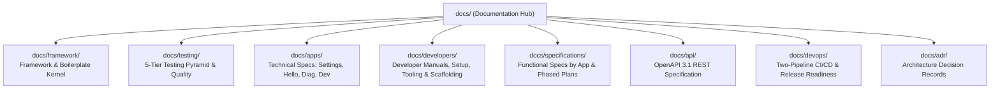

# Documentation Hub

Welcome to the documentation for the **WordPress AI Plugin Development Boilerplate**.

This documentation hub is structured into seven distinct architectural pillars, aligned with the **Tripartite App-Centric Architecture (ADR-0009)**, alongside durable architectural decision records and implementation audit logs:

---

## 1. Framework Kernel & Architecture (`docs/framework/`)

The shared domain-agnostic foundation, DI container, event bus, template engine, presentation bridge, and OpenAPI generation engine.

- [docs/framework/product-charter.md](framework/product-charter.md): The non-negotiable **Single Source of Truth** for the plugin. Core identity, invariants (Hexagonal DDD, WPCS, 5-tier testing, WPDS, SemVer, Two-Pipeline CI/CD, Generated OpenAPI).
- [docs/framework/architecture-and-layers.md](framework/architecture-and-layers.md): Complete Tripartite Hexagonal architecture specification covering Framework, Backend Apps, Frontend Presentation, and autoloader mappings.
- [docs/framework/container-and-service-providers.md](framework/container-and-service-providers.md): In-tree micro-DI container (`Container`), `ServiceProviderInterface`, and two-pass `ServiceProviderRegistry`.
- [docs/framework/kernel-and-lifecycle.md](framework/kernel-and-lifecycle.md): Plugin singleton orchestrator (`Plugin`), runtime requirements check (`Compatibility`), activation (`Activation`), and deactivation (`Deactivation`).
- [docs/framework/event-dispatcher.md](framework/event-dispatcher.md): Domain Event Dispatcher (`EventDispatcher`), publishing domain events, and bridging to WordPress `do_action()` hooks.
- [docs/framework/template-renderer.md](framework/template-renderer.md): Safe PHP template evaluation (`TemplateRenderer`), directory traversal defense, and scoped variables.
- [docs/framework/domain-and-application-services.md](framework/domain-and-application-services.md): Clean Hexagonal domain modeling (Aggregates, Value Objects, Domain Events, Repositories, Commands, Queries, Application Services, DTOs).
- [docs/framework/frontend-bridge.md](framework/frontend-bridge.md): Consolidated presentation bridge (`src/frontend/Bridge/`): `FrontendServiceProvider`, `BlockRegistry`, `PatternRegistry`, asset enqueueing, and bootstrap data.
- [docs/framework/error-handling-and-cache.md](framework/error-handling-and-cache.md): `WordPressErrorMapper` (domain exceptions to `WP_Error`) and `TransientCache` with TTL clamping.
- [docs/framework/openapi-generator-engine.md](framework/openapi-generator-engine.md): Deep dive into `src/framework/Rest/OpenApi/`: `OpenApiGenerator` facade, route inspection, path normalization, and deterministic YAML output.

---

## 2. Testing Hub & 5-Tier Pyramid (`docs/testing/`)

Complete testing strategies, execution commands, and test authoring guides.

- [docs/testing/testing-strategy.md](testing/testing-strategy.md): Overarching philosophy and complete 5-tier quality gate pipeline.
- [docs/testing/tier1-static-quality.md](testing/tier1-static-quality.md): PHPCS (WPCS rulesets), PHPStan Level 6+ static analysis, ESLint, Stylelint, Markdownlint, and GitHub Actions workflow linting (`lint:actions`).
- [docs/testing/tier2-phpunit-testing.md](testing/tier2-phpunit-testing.md): Fast in-memory unit tests (`tests/phpunit/unit/`) with sub-millisecond execution and WordPress integration tests (`tests/phpunit/integration/`).
- [docs/testing/tier3-frontend-unit-testing.md](testing/tier3-frontend-unit-testing.md): Frontend unit testing with Jest and React Testing Library (`tests/js/`), testing state reducers, UI components, and Gutenberg block edit/save.
- [docs/testing/tier4-bruno-rest-testing.md](testing/tier4-bruno-rest-testing.md): Black-box REST API contract testing with Bruno (`tests/bruno/`), `.bru` syntax, Chai assertions, and CLI test runner.
- [docs/testing/tier5-playwright-e2e-testing.md](testing/tier5-playwright-e2e-testing.md): Playwright E2E browser automation, Page Object Model, authentication fixture, visual regression snapshots, and WSL2 integration.
- [docs/testing/release-contract-testing.md](testing/release-contract-testing.md): Distribution package verification tests in `tests/node/release/` enforcing `.distignore` and production package contracts.

---

## 3. Technical Specifications by App (`docs/apps/`)

Technical specifications, class architectures, and REST contracts for each app module.

- [docs/apps/settings/](apps/settings/README.md): **Settings App** — WPDS React 18 admin interface, vertical sidebar navigation, dirty form tracking, options API persistence (`autoload=false`), `/settings` REST endpoints, WP-CLI commands, and Abilities API registration.
  - [Technical Specification](apps/settings/technical-spec.md)
  - [REST API Contracts](apps/settings/rest-api-contracts.md)
- [docs/apps/hello-world/](apps/hello-world/README.md): **HelloWorld App** — Gutenberg block authoring conforming to Block API v3, Inspector controls, and the WordPress Interactivity API client store (`data-wp-*` directives).
  - [Technical Specification](apps/hello-world/technical-spec.md)
- [docs/apps/diagnostics/](apps/diagnostics/README.md): **Diagnostics App** — Headless system health and runtime telemetry app exposing `/diagnostics` REST endpoints, WP-CLI `doctor` command, and agent diagnostic abilities.
  - [Technical Specification](apps/diagnostics/technical-spec.md)
- [docs/apps/developer/](apps/developer/README.md): **Developer Tools App** — Development-only backend services, including `DevOpenApiController` serving live OpenAPI 3.1 contract JSON for in-admin API exploration.
  - [Technical Specification](apps/developer/technical-spec.md)

---

## 4. Developer Manuals & Tooling (`docs/developers/`)

User manuals, setup instructions, CLI tooling, and operational guides for developers.

- [docs/developers/development-prerequisites.md](developers/development-prerequisites.md): Host system requirements across macOS, Linux, WSL2, and Windows native.
- [docs/developers/environment-and-toolchain.md](developers/environment-and-toolchain.md): Docker orchestration via `@wordpress/env`, port mapping, automated lifecycle hooks (`after-start.mjs`), and database connectivity.
- [docs/developers/command-catalog.md](developers/command-catalog.md): Complete directory of npm scripts, Composer commands, wp-env tasks, test runners, release scripts, and openapi tools.
- [docs/developers/bootstrap-checklist.md](developers/bootstrap-checklist.md): Step-by-step pre-flight checklist for local development environments.
- [docs/developers/coding-standards.md](developers/coding-standards.md): WordPress Coding Standards (WPCS), PHPStan Level 6+, ESLint, Stylelint, and Markdownlint rules.
- [docs/developers/project-scaffolding-cli.md](developers/project-scaffolding-cli.md): Automated plugin rebranding CLI (`tools/scaffolding/scaffold-plugin.mjs`), token replacement engine, and `--dry-run` usage.
- [docs/developers/versioning-and-releases.md](developers/versioning-and-releases.md): Atomic SemVer release tool (`npm run update-version`), changelog staging under `[Unreleased]`, and release procedures.
- [docs/developers/openapi-tooling.md](developers/openapi-tooling.md): Developer guide for OpenAPI generation (`npm run openapi:generate`), drift checks (`npm run openapi:check`), and Redocly linting (`npm run openapi:lint`).
- [docs/developers/agent-skills.md](developers/agent-skills.md): Bundled agent skills catalog, synchronization script (`npm run skills:sync`), and `PROTECTED_IN_TREE_SKILLS` safeguards.
- [docs/developers/configuration-reference.md](developers/configuration-reference.md): Annotated configuration file templates (`.wp-env.json`, `phpunit.xml.dist`, `phpstan.neon.dist`, `playwright.config.ts`, `blueprint.json`, `wp-cli.yml`, `redocly.yaml`, `.github/dependabot.yml`).
- [docs/developers/architecture-decision-records-guide.md](developers/architecture-decision-records-guide.md): Developer manual for evaluating, creating, and validating ADRs with CLI tooling.

---

## 5. Functional Specifications & Plans (`docs/specifications/`)

User stories, interaction design, and phased execution plans.

- [docs/specifications/phased-workflow-guide.md](specifications/phased-workflow-guide.md): Vertical slice decomposition, 4-document phase anatomy, pre/post-implementation logging, and acceptance verification gates.
- [docs/specifications/apps/](specifications/apps/README.md): Functional specifications for each app:
  - [Settings App Functional Spec](specifications/apps/settings/functional-spec.md)
  - [HelloWorld Block Functional Spec](specifications/apps/hello-world/functional-spec.md)
  - [Diagnostics Subsystem Functional Spec](specifications/apps/diagnostics/functional-spec.md)
  - [Developer Tools Functional Spec](specifications/apps/developer/functional-spec.md)
- [docs/specifications/plans/](specifications/plans/README.md): Directory of phased sprint blueprints and starter templates:
  - [Starter Phase Template](specifications/plans/01-starter-phase-template/README.md)

---

## 6. REST API & OpenAPI Specification (`docs/api/`)

- [docs/api/README.md](api/README.md): Architecture of the Code-Driven Generated OpenAPI 3.1 Model (ADR-0011), generator CLI, drift checks, and Redocly linting.
- [docs/api/openapi.yaml](api/openapi.yaml): The committed, authoritative OpenAPI 3.1 specification for all plugin REST endpoints.

---

## 7. DevOps & Release Architecture (`docs/devops/`)

CI/CD automation, supply-chain security, and immutable releases governed by **ADR-0010**.

- [docs/devops/github-actions-ci-cd.md](devops/github-actions-ci-cd.md): Detailed documentation of `.github/workflows/_release-readiness.yml`, `ci.yml`, `release.yml`, Dependabot SHA-pinning automation, and the multi-PHP testing matrix.
- [docs/devops/releasing-and-distribution.md](devops/releasing-and-distribution.md): Complete release guide covering decoupled versioning, step-by-step releasing procedures, Sigstore provenance attestations, and GitHub branch protection rulesets.
- [docs/devops/package-contract-and-distignore.md](devops/package-contract-and-distignore.md): Specification of the distribution package contract (mandatory production files vs forbidden development leaks) and `.distignore` matching rules.
- [docs/devops/local-release-tooling.md](devops/local-release-tooling.md): Developer and agent manual for in-tree release CLI commands (`npm run release:build`, `npm run release:validate`, `npm run release:check`, `npm run release:notes`, `npm run lint:actions`).

---

## 8. Preserved Architectural Memory & Audit Logs

- **[docs/adr/](adr/):** Architecture Decision Records (ADRs) capturing durable architectural memory, invariants, and trade-offs. See [docs/adr/README.md](adr/README.md).
- **[docs/implementation-logs/](implementation-logs/):** Historical audit logs from completed implementation phases.
- **[docs/plans/](plans/):** Backward-compatible pointer to `docs/specifications/plans/`.

---

## 9. Recommended Reading Paths

- **New Developer Onboarding:** Start with [docs/framework/product-charter.md](framework/product-charter.md) → [docs/developers/development-prerequisites.md](developers/development-prerequisites.md) → [docs/developers/environment-and-toolchain.md](developers/environment-and-toolchain.md) → [docs/developers/command-catalog.md](developers/command-catalog.md).
- **Building a New Feature:** Read [docs/specifications/phased-workflow-guide.md](specifications/phased-workflow-guide.md) → [docs/framework/domain-and-application-services.md](framework/domain-and-application-services.md) → [docs/apps/](apps/README.md) / [docs/framework/openapi-generator-engine.md](framework/openapi-generator-engine.md).
- **AI Coding Agent:** Consult [docs/framework/product-charter.md](framework/product-charter.md) and active records in [docs/adr/](adr/) before reading the active phase prompt in [docs/specifications/plans/](specifications/plans/).
- **Preparing a Release:** Read [docs/devops/releasing-and-distribution.md](devops/releasing-and-distribution.md) → [docs/developers/versioning-and-releases.md](developers/versioning-and-releases.md) → [docs/devops/local-release-tooling.md](devops/local-release-tooling.md).
