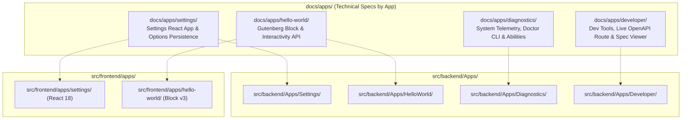

# App-Centric Architecture & Technical Specs Hub

Welcome to the **Apps Documentation Hub** for the **WordPress AI Plugin Development Boilerplate**.

Governed by **ADR-0009: Tripartite App-Centric Architecture**, business capabilities and user interfaces are organized into discrete, cohesive **Apps**.

---

## 1. The App-Centric Paradigm

Rather than scattering code across global folders, each feature or business capability is organized as a cohesive App. An App consists of:

- **Headless Backend App (`src/backend/Apps/<AppName>/`):** Pure domain logic, Value Objects, Aggregate Roots, CQRS Application Services, REST controllers, WP-CLI commands, and Abilities API definitions.
- **Frontend App (`src/frontend/apps/<app-name>/`):** React admin applications, Gutenberg blocks, Interactivity API stores, styles, and templates.
- **Frontend Bridge Integration (`src/frontend/Bridge/`):** Presentation lifecycle hooks and admin menu entries.



---

## 2. Inventory of Apps

- [settings/](settings/README.md): **Settings App** — Full-stack configuration application featuring a WPDS React 18 admin interface, vertical sidebar navigation, dirty form tracking, options API persistence (`autoload=false`), `/settings` REST endpoints, WP-CLI commands, and Abilities API registration.
- [hello-world/](hello-world/README.md): **HelloWorld App** — Demonstrates modern Gutenberg block authoring conforming to Block API v3, Inspector controls, and the WordPress Interactivity API client store (`data-wp-*` directives).
- [diagnostics/](diagnostics/README.md): **Diagnostics App** — Headless system health and runtime telemetry app exposing `/diagnostics` REST endpoints, WP-CLI `doctor` command, and agent diagnostic abilities.
- [developer/](developer/README.md): **Developer Tools App** — Development-only backend services, including `DevOpenApiController` serving live OpenAPI 3.1 contract JSON for in-admin API exploration.

---

## 3. Communication Boundary Invariant

Frontend applications must **never** call backend application services or database tables directly. All communication between `src/frontend/` and `src/backend/` flows strictly over HTTP through the WordPress REST API (`/ai-ready-wp/v1/*`):

```text
React Admin App / Block Store
          │
          ▼
SettingsApiClient (@wordpress/api-fetch)
          │
          ▼ [HTTP REST JSON Boundary]
WP_REST_Controller (src/backend/Apps/<App>/Rest/)
          │
          ▼
Application Service -> Domain Model -> WordPress Repository Adapter
```

---

## 4. Coding Agent Guidance

When authoring or modifying an App:

1. **Keep Backend Headless:** Never place presentation calls (`wp_enqueue_script`, `add_menu_page`, HTML templates) in `src/backend/Apps/<App>/`.
2. **Strict REST Boundary:** React components and Gutenberg block stores must fetch and mutate state exclusively via REST endpoints using `SettingsApiClient`.
3. **Dedicated Service Provider:** Every backend app must provide a dedicated provider (e.g. `SettingsBackendServiceProvider`) implementing `ServiceProviderInterface`, registered within `BackendServiceProvider`.
4. **Follow DDD Principles:** Encapsulate primitive values in Value Objects and business state in Aggregate Roots.
