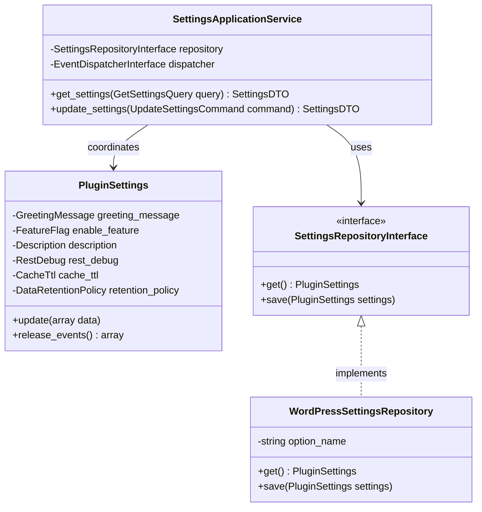
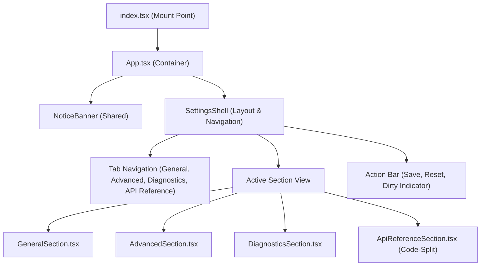

# Settings App Technical Specification

This document details the software design, domain models, application services, persistence adapters, and React architecture of the Settings App.

---

## 1. Backend Architecture (`src/backend/Apps/Settings/`)



### 1.1 Value Objects & Invariants

- **`GreetingMessage`:** String trimmed and clamped between 1 and 255 characters. Throws `InvalidGreetingMessageException` on empty or over-length strings.
- **`FeatureFlag`:** Encapsulates a boolean toggle.
- **`Description`:** Sanitized text up to 500 characters.
- **`RestDebug`:** Boolean flag for detailed REST error logging.
- **`CacheTtl`:** Integer clamped between 60 seconds (1 minute) and 86400 seconds (24 hours).
- **`DataRetentionPolicy`:** Backed enum with cases `KEEP_ALL = 'keep_all'` and `DELETE_ALL = 'delete_all'`.

### 1.2 Application Service & CQRS

- **`GetSettingsQuery`:** Carries read context.
- **`UpdateSettingsCommand`:** Carries partial or complete update associative arrays.
- **`SettingsDTO`:** Immutable DTO representing serialized settings.

### 1.3 Infrastructure Adapter (`WordPressSettingsRepository`)

- Persists settings as a serialized associative array in `wp_options` under option key `airwp_settings`.
- Enforces WordPress performance policy: `update_option( 'airwp_settings', $data, false )` (`autoload = false`).

### 1.4 REST Controller (`SettingsController`)

- Extends `WP_REST_Controller`.
- Routes:
  - `GET /ai-ready-wp/v1/settings`: Retrieves settings DTO.
  - `POST /ai-ready-wp/v1/settings`: Mutates settings.
- Enforces capability check: `current_user_can('manage_options')`.
- Translates exceptions to `WP_Error` via `WordPressErrorMapper`.

---

## 2. Frontend React Architecture (`src/frontend/apps/settings/react/`)



### 2.1 State Management (`useSettingsForm`)

- Uses a **State Reducer** custom hook (`useSettingsForm.ts`) to manage form state immutably.
- Tracks `isDirty` state comparing current inputs against the pristine baseline.
- Warns users upon accidental navigation when unsaved changes exist (`beforeunload`).

### 2.2 API Client Adapter (`SettingsApiClient`)

- Wraps `@wordpress/api-fetch` with typed methods:
  - `getSettings(): Promise<SettingsData>`
  - `updateSettings(data: Partial<SettingsData>): Promise<SettingsData>`
  - `getDiagnostics(): Promise<DiagnosticsData>`
- Normalizes server errors into typed error structures with localized fallback messages.

---

## 3. Presentation Bridge Integration (`src/frontend/Bridge/Settings/`)

- `SettingsAdminMenu`: Registers the admin menu item under `admin.php?page=ai-ready-wp-settings`.
- `SettingsAssets`: Enqueues Webpack scripts from `build/admin/settings/` and injects localized inline bootstrap data via `SettingsBootstrapData`:

  ```javascript
  window.airwpSettingsBootstrap = {
    apiUrl: '/wp-json/ai-ready-wp/v1/',
    nonce: '...',
    initialSettings: { ... },
    isDevMode: true
  };
  ```
