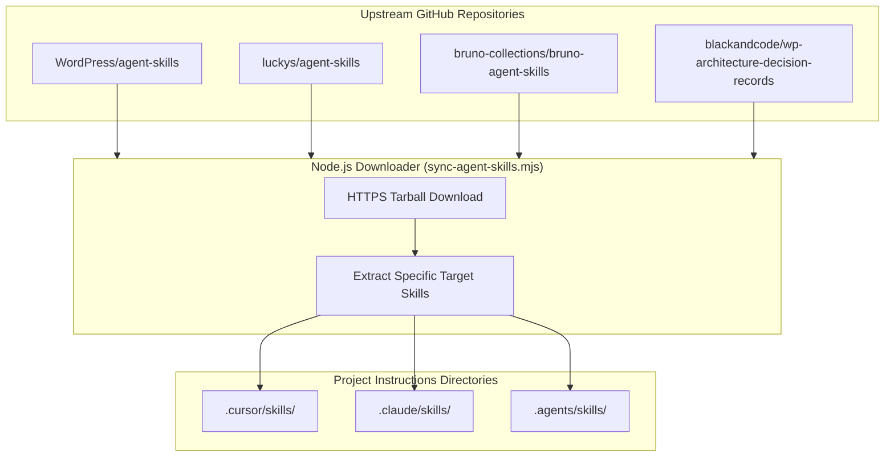

# Agent Skills and Synchronization Script

Agent Skills are portable bundles of instructions, procedural checklists, and reference guides that equip AI coding assistants with deep, domain-specific engineering knowledge.

This guide details the complete Agent Skills catalog for WordPress plugin engineering and provides the automated **Node.js Skill Synchronization Script** (`tools/agent-skills/sync-agent-skills.mjs`).

---

## 1. The Agent Skills Architecture



Skills follow the **Progressive Disclosure** principle:

- **`SKILL.md`:** The entrypoint (under 500 lines) containing metadata, triggers, and high-level procedures.
- **`references/`:** Flat subdirectories containing deep-dive technical rules, schemas, and anti-patterns loaded just-in-time.
- **`scripts/`:** Deterministic helper scripts that the agent can execute.

---

## 2. Complete Skills Catalog for WordPress Plugin Development

### 2.1 WordPress Core Skills (`WordPress/agent-skills`)

Repository: [WordPress/agent-skills](https://github.com/WordPress/agent-skills)

| Skill Name | Purpose & Trigger |
| --- | --- |
| `wordpress-router` | Analyzes project files and routes the agent to the appropriate WordPress development workflow. |
| `wp-project-triage` | Detects project type (plugin/theme), tooling, versions, and active configurations deterministically. |
| `wp-plugin-development` | Core plugin lifecycle: hooks, activation, deactivation, uninstall, settings API, security. |
| `wp-rest-api` | Authoring REST API endpoints via `register_rest_route`, permission callbacks, schema definitions. |
| `wp-admin-ui-ux` | Admin interface patterns, layout guidelines, accessibility, and WPDS design tokens. |
| `wp-phpstan` | PHPStan static analysis configuration, baselines, and WordPress-specific typing. |
| `wp-wpcli-and-ops` | WP-CLI commands, automated diagnostics, database search-replace, and operations. |
| `wp-plugin-directory-guidelines` | Evaluates GPL compliance, licensing, naming rules, and WordPress.org repository guidelines. |
| `wp-playground` & `blueprint` | Generates declarative WordPress Playground Blueprints for instant browser testing. |

### 2.2 Engineering Craftsmanship Skills (`luckys/agent-skills`)

Repository: [luckys/agent-skills](https://github.com/luckys/agent-skills)

| Skill Name | Purpose & Trigger |
| --- | --- |
| `ddd-best-practices` | Domain-Driven Design: Bounded Contexts, Aggregates, Value Objects, Domain Events, Repositories, Hexagonal architecture. |
| `oop-best-practices` | Value Objects, immutability by default, eliminating primitive obsession, rich domain models, fail-fast constructors. |
| `design-patterns-best-practices` | Targeted GoF and enterprise patterns: Repository, Service Provider, Factory, Adapter; anti-pattern prevention. |
| `tdd-best-practices` | Test-Driven Development Red-Green-Refactor cycle, invariant-first testing, test fixture isolation. |
| `refactoring-best-practices` | Behavior-preserving incremental refactorings, regression safety, small atomic changes. |

### 2.3 API Testing Skills (`bruno-collections/bruno-agent-skills`)

Repository: [bruno-collections/bruno-agent-skills](https://github.com/bruno-collections/bruno-agent-skills)

| Skill Name | Purpose & Trigger |
| --- | --- |
| `bruno-collection-generator` | Automatically scaffolds Git-native `.bru` requests from OpenAPI specs or PHP REST controllers. |
| `bruno-test-writer` | Crafts robust assertions, pre/post scripts, schema validation, and variable chaining across requests. |
| `bruno-ci-setup` | Automates headless `@usebruno/cli` execution in npm scripts and CI pipelines with JUnit/HTML reports. |

### 2.4 WordPress Architecture Decision Records (`blackandcode/wp-architecture-decision-records`)

Repository: [blackandcode/wp-architecture-decision-records](https://github.com/blackandcode/wp-architecture-decision-records)

| Skill Name | Purpose & Trigger |
|---|---|
| `wp-architecture-decision-records` | Record, evaluate, and maintain Architecture Decision Records (ADRs) tailored for WordPress plugin engineering. Use when evaluating architecturally significant decisions (custom database tables vs post meta, Action Scheduler vs WP-Cron, REST routes, WooCommerce HPOS integration, Gutenberg rendering models) or consulting accepted ADRs. |

### 2.5 Bundled In-Tree Custom Skills

Maintained directly in-tree under `.cursor/skills/` and permanently protected against upstream overwrites:

- **`wp-admin-ui-ux`:** Complete WordPress Admin React UI/UX design skill with WPDS layout templates and Playwright visual loop references.
- **`versioning`:** Automated plugin version synchronization skill executing `tools/versioning/increase-plugin-version.mjs`.
- **`changelog`:** Keep a Changelog compliant unreleased change logging skill using `tools/changelog/record-unreleased-change.mjs`.

---

## 3. Skill Synchronization Script (`tools/agent-skills/sync-agent-skills.mjs`)

To ensure a new plugin repository can fetch and update all external skills in one command without manual cloning, the boilerplate provides a standalone Node.js downloader script:

```bash
npm run skills:sync
```

### Protection Invariants (`PROTECTED_IN_TREE_SKILLS`)

In-tree skills developed specifically for this boilerplate are protected by `tools/agent-skills/sync-agent-skills.mjs`:

```javascript
const PROTECTED_IN_TREE_SKILLS = new Set([
  'versioning',
  'changelog',
  'wp-admin-ui-ux',
]);
```

The script skips these during remote downloads to ensure custom project rules are never overwritten or deleted.
