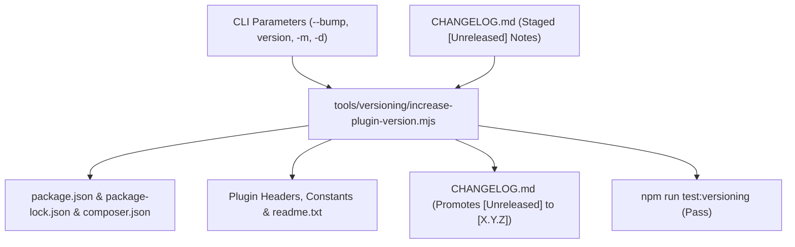

# Versioning and Release Lifecycle

In modern plugin engineering, changing a version number is **never a manual text edit**.

This guide details the automated semantic versioning, continuous unreleased changelogging, and release logging system implemented in `tools/versioning/increase-plugin-version.mjs`, tested by `tests/node/versioning/`, and governed by `.cursor/skills/versioning/` and `.cursor/skills/changelog/`.

---

## 1. The Single Coordinated Release Operation

Manually searching and replacing version strings across a repository leads to stale headers in `plugin.php`, broken `readme.txt` stable tags, missed constants, and fragmented changelogs.

The boilerplate treats a release as **one atomic, automated operation** driven directly via CLI parameters:



---

## 2. Semantic Versioning Calculation Logic

The engineer or AI agent reads the current version from `package.json` and calculates the target version using strict SemVer (`MAJOR.MINOR.PATCH`):

1. **Minor Bump (`minor`, e.g. `1.0.0` → `1.1.0`):**
   - Finalization of a planned implementation phase.
   - Addition of substantial new features, blocks, or REST endpoints.
2. **Patch Bump (`patch`, e.g. `1.0.0` → `1.0.1`):**
   - Bug fixes, security patches, styling polish, or internal refactoring within a phase.
3. **Major Bump (`major`, e.g. `1.x.x` → `2.0.0`):**
   - Breaking architectural shift, minimum PHP/WP requirement increase, or major product baseline release.

---

## 3. Direct CLI Parameter Execution (No `.env` Required)

Version synchronization does **not** require modifying `.env`. All target versioning parameters and release metadata are provided directly to the CLI command:

### 3.1 Convenience npm Scripts

```bash
# Automated patch bump (1.0.0 -> 1.0.1)
npm run update-version:patch

# Automated minor bump (1.0.0 -> 1.1.0)
npm run update-version:minor

# Automated major bump (1.0.0 -> 2.0.0)
npm run update-version:major
```

### 3.2 Positional & Flag-Based Commands

```bash
# Positional bump keyword
npm run update-version -- patch
npm run update-version -- minor

# Explicit target version
npm run update-version -- 1.2.0

# Explicit target version with custom notes and decision rationale
npm run update-version -- 1.2.0 -m "Highlights for 1.2.0" -d "Phase completed with 100% test pass"

# Dry run preview (no files written)
npm run update-version -- patch --dry-run
```

### Supported CLI Flags

| Flag | Short | Description | Default |
| --- | --- | --- | --- |
| `--bump <type>` | `-b` | Bump type: `patch`, `minor`, or `major`. | `undefined` |
| `--target-version <X.Y.Z>` | `-v` | Explicit target semantic version. | `undefined` |
| `--changelog <text>` | `-m` | Optional release highlights (prepended to unreleased notes). | Inferred from `[Unreleased]` |
| `--decision <text>` | `-d` | Optional release notes highlight summary (alias for `-m`). | Standard adoption notice |
| `--date <YYYY-MM-DD>` | | Override release date. | Today's ISO date |
| `--dry-run` | | Preview planned file modifications without writing. | `false` |
| `--allow-downgrade` | | Permit a lower target version for recovery only. | `false` |
| `--root <path>` | | Specify project root directory. | Current working directory |
| `--env <path>` | | Optional fallback environment file. | `.env` |

---

## 4. Continuous Unreleased Changelogging & Automated Packaging

A high-velocity release workflow depends on continuous changelogging rather than frantic release-day retrospectives.

### 4.1 Staging Unreleased Changes

On **every** task, feature, or bug fix, changes are immediately recorded under `## [Unreleased]` in `CHANGELOG.md` using the `changelog` skill or the CLI helper:

```bash
# Add feature note
npm run changelog:add -- -t Added "Added optimistic concurrency tokens to settings REST route"

# Add bug fix note
npm run changelog:add -- -t Fixed "Fixed CSS overflow issue on mobile admin viewport"
```

### 4.2 Automated Release Packaging

In most cases, developers do **not** need to type custom release notes when releasing. When `npm run update-version` executes:

1. It automatically extracts all bullets currently under `## [Unreleased]`.
2. Converts them into the new version header: `## [1.1.0] - YYYY-MM-DD`.
3. If an optional `--changelog` message is provided, it is prepended as a highlight lead paragraph.
4. It inserts a fresh, clean `## [Unreleased]` section at the top of `CHANGELOG.md`.

---

## 5. Automated Files Updated During Release

The version bump CLI automatically updates:

- `package.json` (`version`)
- `package-lock.json` (`version`)
- `composer.json` (`version`)
- Root PHP plugin file header (`Version: X.Y.Z`)
- PHP version constant (`define( 'AIRWP_VERSION', 'X.Y.Z' )`)
- `readme.txt` (`Stable tag: X.Y.Z`)
- `CHANGELOG.md` (`## [X.Y.Z] - YYYY-MM-DD`)
