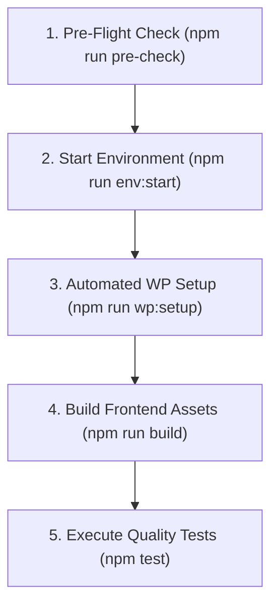

# Developer Manuals & Operational Instructions Hub

Welcome to the **Developer Hub** for the **WordPress AI Plugin Development Boilerplate**.

This directory houses all operational guides, setup procedures, developer tooling instructions, and day-to-day command manuals required to develop, run, test, scaffold, and release the plugin.

---

## 1. Quickstart Onboarding



```bash
# 1. Verify your system meet all engine and Docker requirements
npm run pre-check

# 2. Boot containerized WordPress 7.1 & MariaDB (PHP 8.3)
npm run env:start

# 3. Provision admin users, app passwords, and default options
npm run wp:setup

# 4. Compile React admin apps and Gutenberg blocks
npm run build

# 5. Run full test suite
npm test
```

---

## 2. Directory Contents & Guides

- [development-prerequisites.md](development-prerequisites.md): Host system requirements across macOS, Linux, WSL2, and Windows native.
- [environment-and-toolchain.md](environment-and-toolchain.md): Docker orchestration via `@wordpress/env`, port mapping, automated lifecycle hooks (`after-start.mjs`), and database connectivity.
- [command-catalog.md](command-catalog.md): Complete index of npm scripts, Composer commands, wp-env tasks, test runners, release scripts, and openapi tools.
- [bootstrap-checklist.md](bootstrap-checklist.md): Step-by-step pre-flight checklist for local development environments.
- [coding-standards.md](coding-standards.md): WordPress Coding Standards (WPCS), PHPStan Level 6+ static analysis, ESLint, Stylelint, and Markdownlint rules.
- [project-scaffolding-cli.md](project-scaffolding-cli.md): Automated plugin rebranding CLI (`tools/scaffolding/scaffold-plugin.mjs`), token replacement engine, and `--dry-run` usage.
- [versioning-and-releases.md](versioning-and-releases.md): Atomic SemVer release tool (`npm run update-version`), changelog staging under `[Unreleased]`, and release procedures.
- [openapi-tooling.md](openapi-tooling.md): Developer guide for OpenAPI generation (`npm run openapi:generate`), drift checks (`npm run openapi:check`), and Redocly linting (`npm run openapi:lint`).
- [dependabot-tooling.md](dependabot-tooling.md): Local Dependabot CLI runner (`npm run dependabot`), prerequisites, token resolution, and ecosystem triage guide.
- [git-hooks.md](git-hooks.md): In-tree Git pre-commit hooks, CI-parity quality checks (`npm run check`), and agent self-healing loops.
- [agent-skills.md](agent-skills.md): Bundled agent skills catalog, synchronization script (`npm run skills:sync`), and `PROTECTED_IN_TREE_SKILLS` safeguards.
- [configuration-reference.md](configuration-reference.md): Annotated configuration file templates (`.wp-env.json`, `phpunit.xml.dist`, `phpstan.neon.dist`, `playwright.config.ts`, `blueprint.json`, `wp-cli.yml`, `redocly.yaml`, `.github/dependabot.yml`).
- [architecture-decision-records-guide.md](architecture-decision-records-guide.md): Developer manual for evaluating, creating, and validating ADRs with CLI tooling.

---

## 3. Coding Agent Guidance

When assisting developers with daily workflow and operational commands:

1. **Use `tools/environment/check-environment.mjs` (`npm run pre-check`):** Run the environment checker when diagnosing environment or Docker startup issues.
2. **Never Edit Files for Versioning:** Version increments must use `npm run update-version`.
3. **Never Edit `docs/api/openapi.yaml` Manually:** When REST controller routes are modified, regenerate the specification using `npm run openapi:generate`.
4. **Preserve In-Tree Skills:** Running `npm run skills:sync` will update external skills while protecting in-tree custom skills (`versioning`, `changelog`, `wp-admin-ui-ux`).
