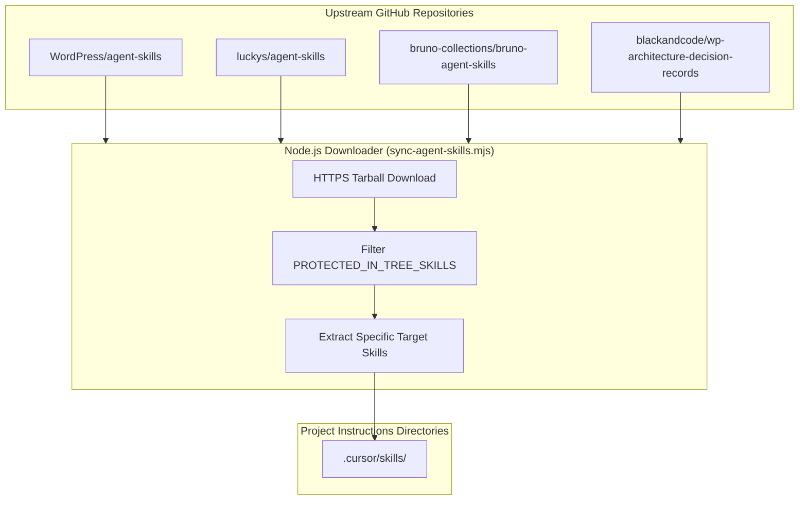

# Agent Skills & Synchronization Script

Agent Skills are portable bundles of instructions, procedural checklists, and reference guides that equip AI coding assistants with deep, domain-specific engineering knowledge.

This guide details the complete Agent Skills catalog for WordPress plugin engineering and provides the automated **Node.js Skill Synchronization Script** (`tools/agent-skills/sync-agent-skills.mjs`).

---

## 1. The Agent Skills Architecture



Skills follow the **Progressive Disclosure** principle:

- **`SKILL.md`:** The entrypoint (under 500 lines) containing metadata, triggers, and high-level procedures.
- **`references/`:** Flat subdirectories containing deep-dive technical rules, schemas, and anti-patterns loaded just-in-time.
- **`scripts/`:** Deterministic helper scripts that the agent can execute.

---

## 2. In-Tree Protected Skills

The boilerplate contains custom skills authored specifically for this repository:

- `versioning`: Automated SemVer calculations and file synchronization.
- `changelog`: Deterministic unreleased changelog recording under `## [Unreleased]`.
- `wp-admin-ui-ux`: Local customizations for React 18 and WPDS admin interfaces.

The sync script enforces `PROTECTED_IN_TREE_SKILLS`: upstream updates will **never** overwrite or delete these custom in-tree skills.

---

## 3. Upstream Skills Catalog

### 3.1 WordPress Core Skills (`WordPress/agent-skills`)

- `wordpress-router`: Directs agents to appropriate WordPress workflows.
- `wp-project-triage`: Detects project structure, tooling, and version constraints.
- `wp-plugin-development`: Core plugin lifecycle, hooks, activation, and security.
- `wp-rest-api`: REST route registration, permission callbacks, and schemas.
- `wp-phpstan`: PHPStan static analysis configuration.
- `wp-wpcli-and-ops`: WP-CLI commands and database operations.
- `wp-playground` & `blueprint`: WordPress Playground Blueprints.

### 3.2 Engineering Craftsmanship Skills (`luckys/agent-skills`)

- `oop-best-practices`: Object-oriented design, encapsulation, and cohesion.
- `design-patterns-best-practices`: Strategy, Factory, Adapter, and Decorator patterns.
- `ddd-best-practices`: Value objects, aggregate roots, domain events, and ports/adapters.
- `tdd-best-practices`: Test-Driven Development and invariant assertions.
- `refactoring-best-practices`: Safe refactoring techniques.

### 3.3 REST API & Contract Testing Skills (`bruno-agent-skills`)

- `bruno-test-writer`: Writing and reviewing `.bru` test files.
- `bruno-collection-generator`: Generating collections and environment variables.
- `bruno-ci-setup`: Continuous integration setup for API testing.

### 3.4 Architecture Decision Records (`wp-architecture-decision-records`)

- `wp-architecture-decision-records`: Authoring, status updating, and validating ADRs in `docs/adr/`.

---

## 4. Synchronization Command

To update external skills to the latest upstream versions while protecting in-tree skills:

```bash
npm run skills:sync
```
