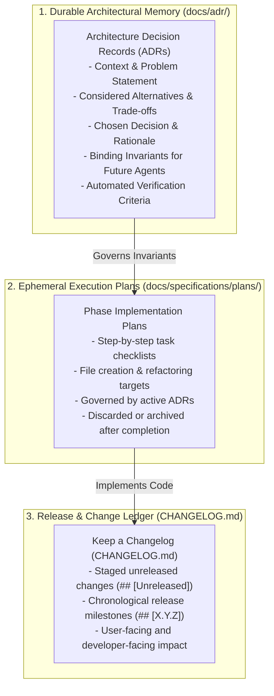

# Architecture Decision Records (ADRs) & Agentic Governance

Architecture Decision Records (ADRs) serve as the **durable architectural memory** of this plugin boilerplate. They provide autonomous AI coding agents and human engineers with explicit, machine-verifiable constraints, preventing context drift, tribal knowledge fragmentation, and accidental architectural regression.

---

## 1. Core Philosophy: Durable Memory vs. Ephemeral Execution

To eliminate duplication, ambiguity, and dual-source drift, this boilerplate enforces a strict three-tier division of responsibility:



---

## 2. The ADR-Worthiness Gate

Before creating or executing any phase plan, classify the proposed architectural impact into one of five discrete states:

- **`ADR_REQUIRED`**: The feature introduces custom tables, new dependencies, background job architectures, public REST changes, or high reversal costs. Author and accept the ADR in `docs/adr/` before drafting implementation tasks.
- **`ADR_RECOMMENDED`**: The feature involves competing design trade-offs with multiple viable patterns. Propose the ADR to the user and draft before planning.
- **`ADR_NOT_NEEDED`**: Routine feature code, standard WordPress API usage, or UI components adhering to existing ADRs. Proceed directly to phase planning.
- **`EXISTING_ADR_GOVERNS`**: A prior accepted ADR already dictates this exact pattern. Cite the ADR in the phase plan and obey its invariants.
- **`EXISTING_ADR_MAY_REQUIRE_SUPERSESSION`**: The planned feature contradicts an accepted ADR. Draft a new ADR that supersedes the prior one before proceeding.

---

## 3. ADR Tooling & CLI Commands

```bash
# Author a new ADR using the MADR template
npm run adr:new -- -t "Title of Decision"

# Validate all ADRs for formatting, cross-links, and status rules
npm run adr:validate -- --strict

# Update status of an existing ADR when superseded
npm run adr:status -- --file docs/adr/0004-xyz.md --status superseded --by 0011
```

---

## 4. Coding Agent Rules

1. **Check Accepted ADRs First:** Read `docs/adr/README.md` before planning or writing code.
2. **Never Violate Accepted Invariants:** Accepted ADR invariants are binding. If an architectural requirement changes, author an ADR superseding the previous one.
3. **Validate Referential Integrity:** Run `npm run adr:validate -- --strict` after adding or editing ADRs.
