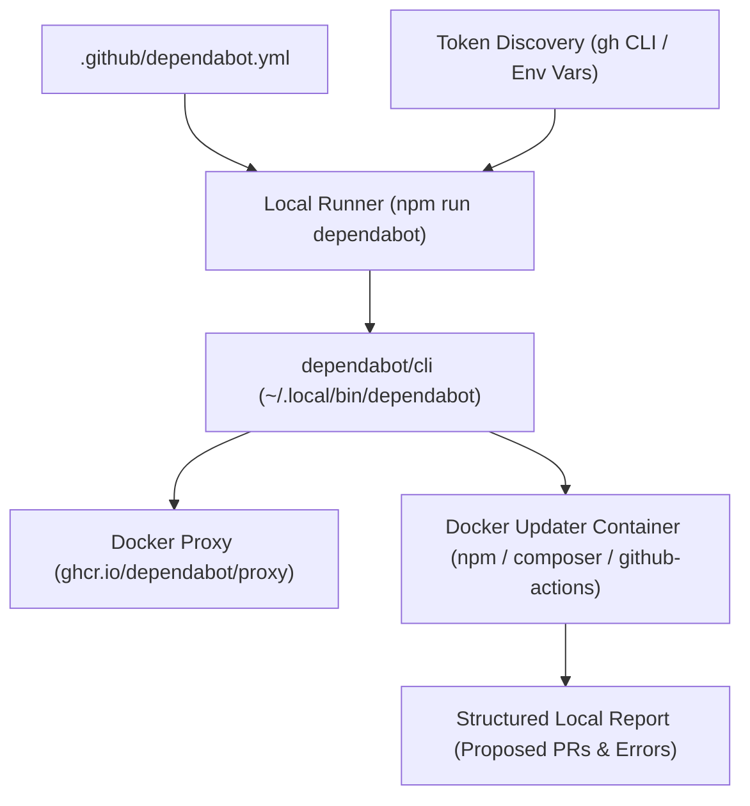

# Local Dependabot Tooling & Developer Manual

This guide documents the local Dependabot runner, CLI installation, execution workflows, and triage strategies for managing dependencies across **GitHub Actions**, **npm**, and **Composer** without relying on GitHub-hosted Dependabot services.

---

## 1. Overview & Architecture

The **Local Dependabot Runner** (`tools/dependabot/run-dependabot.mjs`) provides a self-contained, reproducible mechanism to run GitHub Dependabot scans directly on your local workstation or WSL2 environment.

It reads the repository's configuration from `.github/dependabot.yml`, coordinates with the official `dependabot/cli` executable and container images, executes updates in isolated Docker containers, and presents proposed dependency bumps directly in the terminal—**without creating remote pull requests or modifying external repository state**.



### Key Architectural Invariants

1. **Local-Only Execution:** All dependency evaluations take place locally in disposable Docker containers. No PRs are pushed or opened on GitHub.
2. **Secure Token Resolution:** API credentials for GitHub metadata queries are retrieved automatically from local environment variables or the authenticated `gh` CLI.
3. **Respects Configuration:** The runner maps `allow` and `ignore` constraints from `.github/dependabot.yml` into native Dependabot job definitions, preventing unwanted major bumps or slow transitive crawls.

---

## 2. Prerequisites & Installation

To run Dependabot locally, your system must have **Docker** and the **`dependabot` CLI** binary installed.

### 2.1 System Requirements

- **Linux / WSL2 (Ubuntu):** Docker Engine or Docker Desktop with WSL2 backend.
- **Docker Daemon:** Must be running and accessible (`docker info` exits with code 0).
- **Node.js:** v20+ with npm v10+.

### 2.2 Installing `dependabot/cli` on Linux / WSL2

You can install the official `dependabot` binary into `~/.local/bin` using the `gh` CLI or `curl`:

```bash
# Ensure ~/.local/bin exists and is on your PATH
mkdir -p ~/.local/bin
export PATH="$HOME/.local/bin:$PATH"

# Download and install the latest Linux amd64 release via gh CLI
gh release download --repo dependabot/cli \
  --pattern '*linux-amd64.tar.gz' \
  --dir /tmp

# Extract the binary into ~/.local/bin
tar -xzf /tmp/dependabot*linux-amd64.tar.gz -C ~/.local/bin dependabot
chmod +x ~/.local/bin/dependabot

# Verify installation
dependabot --version
```

### 2.3 Binary Discovery Path

The local runner searches the following locations for the `dependabot` binary:

1. `~/.local/bin/dependabot`
2. `/usr/local/bin/dependabot`
3. `/usr/bin/dependabot`
4. Any directory listed in the system `$PATH`

---

## 3. GitHub Token Resolution

While Dependabot runs locally without creating remote PRs, it requires read access to the GitHub API to query repository commit history, release metadata, and action tags. Without a token, unauthenticated requests are subject to GitHub's 60 requests/hour rate limit.

The runner automatically resolves authentication using the following priority order:

1. **`LOCAL_GITHUB_ACCESS_TOKEN`**: Dedicated environment variable for local Dependabot execution.
2. **`GITHUB_TOKEN`**: Standard GitHub API token environment variable.
3. **`GH_TOKEN`**: GitHub CLI token environment variable.
4. **`gh auth token`**: Automatically retrieved from the locally authenticated GitHub CLI (`gh`).

If you are already logged into the GitHub CLI (`gh auth login`), **no additional configuration is required**.

---

## 4. CLI Commands Reference

### 4.1 Running All Ecosystems

Executes dependency checks across all ecosystems declared in `.github/dependabot.yml` (`github-actions`, `npm`, and `composer`):

```bash
npm run dependabot
```

### 4.2 Targeting a Specific Ecosystem

Use `--ecosystem` (`-e`) to run checks for a single ecosystem:

```bash
# GitHub Actions workflows (.github/workflows/)
npm run dependabot -- --ecosystem github-actions

# npm runtime & development packages (package.json)
npm run dependabot -- --ecosystem npm

# Composer PHP dependencies (composer.json)
npm run dependabot -- --ecosystem composer
```

### 4.3 Targeting a Single Dependency

Use `--dep` (`-d`) in conjunction with `--ecosystem` to test updates for a specific package:

```bash
# Test updating yoast/phpunit-polyfills only
npm run dependabot -- -e composer -d yoast/phpunit-polyfills

# Test updating @playwright/test only
npm run dependabot -- -e npm -d @playwright/test
```

### 4.4 Dry Run & Validation

Validates system prerequisites, binary availability, and `.github/dependabot.yml` syntax without launching Docker containers:

```bash
npm run dependabot -- --dry-run
```

### 4.5 Runner Test Suite

Executes the automated unit test suite for the runner:

```bash
npm run test:dependabot
```

---

## 5. Configuration & Optimization (`.github/dependabot.yml`)

The repository configuration controls how Dependabot evaluates dependencies:

```yaml
version: 2
updates:
  # Maintain GitHub Actions dependencies with semantic version tags
  - package-ecosystem: "github-actions"
    directory: "/"
    schedule:
      interval: "weekly"
    commit-message:
      prefix: "ci"
      include: "scope"
    allow:
      - dependency-type: "direct"

  # Maintain npm runtime and development dependencies
  - package-ecosystem: "npm"
    directory: "/"
    schedule:
      interval: "weekly"
    commit-message:
      prefix: "deps"
      include: "scope"
    open-pull-requests-limit: 10
    allow:
      - dependency-type: "direct"
    ignore:
      - dependency-name: "react"
        versions: ["19.x", ">= 19"]
      - dependency-name: "react-dom"
        versions: ["19.x", ">= 19"]
      - dependency-name: "typescript"
        versions: ["7.x", ">= 7"]
      - dependency-name: "@wordpress/components"
        versions: ["40.x", ">= 40"]
      - dependency-name: "@wordpress/block-editor"
        versions: ["17.x", ">= 17"]

  # Maintain Composer PHP runtime and dev dependencies
  - package-ecosystem: "composer"
    directory: "/"
    schedule:
      interval: "weekly"
    commit-message:
      prefix: "deps(php)"
      include: "scope"
    open-pull-requests-limit: 10
    allow:
      - dependency-type: "direct"
    ignore:
      - dependency-name: "phpunit/phpunit"
        versions: ["12.x", "13.x", ">= 12"]
      - dependency-name: "php-stubs/wordpress-stubs"
        versions: ["7.x", ">= 7"]
      - dependency-name: "symfony/yaml"
        versions: ["8.x", ">= 8"]
```

### 5.1 Performance Optimization: `dependency-type: "direct"`

By default, package managers like npm evaluate every transitive subdependency in `package-lock.json` (over 1,200 packages), which can take 15+ minutes per run.

Adding `allow: [ { dependency-type: "direct" } ]` instructs Dependabot to evaluate only the direct dependencies declared in `package.json` and `composer.json`. This reduces execution time from 15 minutes down to under 2 minutes.

### 5.2 Suppressing Breaking Major Bumps: `ignore`

Dependencies that are tightly coupled to the host WordPress runtime or toolchain must be pinned to compatible major versions:

| Ecosystem | Dependency | Ignored Versions | Reason |
|---|---|---|---|
| `npm` | `react`, `react-dom` | `19.x`, `>= 19` | WordPress 6.x and 7.0 bundle React 18.x. React 19 breaks `@wordpress/*` peer dependencies. |
| `npm` | `typescript` | `7.x`, `>= 7` | `typescript-eslint` v8 does not yet support TypeScript 7.0. |
| `npm` | `@wordpress/components` | `40.x`, `>= 40` | Major version jump with breaking DOM component API changes. |
| `npm` | `@wordpress/block-editor`| `17.x`, `>= 17` | Major version jump requiring Gutenberg core coordination. |
| `composer`| `phpunit/phpunit` | `12.x`, `13.x`, `>= 12` | WordPress test suite (`WP_UnitTestCase`) supports PHPUnit up to v11. |
| `composer`| `php-stubs/wordpress-stubs`| `7.x`, `>= 7` | Stubs for WP 7 conflict with `wp-cli-stubs` requirements. |
| `composer`| `symfony/yaml` | `8.x`, `>= 8` | Symfony 8 requires PHP >= 8.4.1, while the plugin baseline is PHP 8.3. |

---

## 6. Triaging and Applying Updates Locally

When `npm run dependabot` reports proposed pull requests:

```text
Finished composer in 48s (exit code: 0)
Created PR proposals locally:
  - yoast/phpunit-polyfills: from 3.1.2 to 4.0.0
```

You can review and safely apply the upgrade in your local working tree:

```bash
# 1. Inspect package changes and release notes
composer show yoast/phpunit-polyfills --all

# 2. Update the package locally
composer update yoast/phpunit-polyfills --with-all-dependencies

# 3. Run the full test suite to verify compatibility
composer test
npm test

# 4. Record the update under [Unreleased] in CHANGELOG.md
npm run changelog:add -- -t Changed "Updated yoast/phpunit-polyfills to 4.0.0"
```
