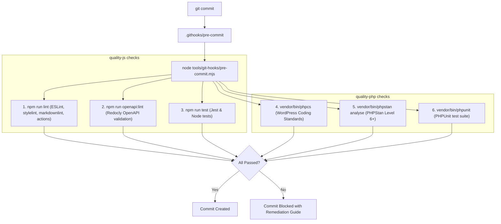

# Git Pre-Commit Hooks & Quality Gates

This guide explains the in-tree, zero-dependency Git pre-commit hook architecture and the local quality gate tooling for the **WordPress AI Plugin Development Boilerplate**.

---

## 1. Overview & Architecture

To avoid continuous integration (CI) failures, the repository enforces local pre-commit checks matching the GitHub Actions release readiness gate (`.github/workflows/_release-readiness.yml`).



### Key Design Principles

1. **Zero External npm Dependencies:** Uses native Git 2.9+ `core.hooksPath` pointing to `.githooks/`. No third-party hook managers (such as Husky) are required, reducing supply chain risks.
2. **Cross-Platform In-Tree Runner (`tools/git-hooks/pre-commit.mjs`):** Runs seamlessly across Linux, WSL, macOS, and native Windows.
3. **Automatic Lifecycle Registration:** Configured automatically upon `npm install` or `npm ci` via the `prepare` npm script.
4. **Full CI Parity:** Runs the exact 6 quality checks evaluated in GitHub Actions CI.

---

## 2. CLI Commands Reference

### 2.1 Hook Management

```bash
# Install / configure hooks (sets git config core.hooksPath .githooks)
npm run hooks:install

# Uninstall hooks (unsets core.hooksPath)
npm run hooks:uninstall
```

### 2.2 Running Quality Checks Manually

You do not need to make a git commit to run the pre-commit quality gate. You can execute it directly at any time:

```bash
# Run full CI-parity quality gate (all 6 checks)
npm run check
# or
npm run pre-commit

# Run only JavaScript and Node checks (lint, openapi, tests)
npm run check:js
# or
npm run pre-commit -- --js-only

# Run only PHP checks (phpcs, phpstan, phpunit)
npm run check:php
# or
composer check
# or
npm run pre-commit -- --php-only

# Run linters and static analysis, skipping unit test suites
npm run pre-commit -- --skip-tests
```

---

## 3. The 6 CI-Parity Quality Checks

| Step | Verification | Target | Remediation Command |
|---|---|---|---|
| 1 | **Linting** | JavaScript, CSS, Markdown, GitHub Actions | `npm run lint:js -- --fix` |
| 2 | **OpenAPI Lint** | `docs/api/openapi.yaml` (Redocly 3.1) | `npm run openapi:generate` |
| 3 | **Node & Jest Tests** | Jest component specs & Node test suites | `npm run test:unit` |
| 4 | **WordPress Coding Standards** | PHP CodeSniffer (`WordPress-Core/Extra/Docs`) | `composer lint:fix` |
| 5 | **PHPStan Static Analysis** | Level 6+ PHP static analysis | Check reported types & nullability |
| 6 | **PHPUnit Test Suite** | Pure PHP in-memory unit tests | `vendor/bin/phpunit` |

---

## 4. AI Coding Agent Self-Healing Protocol

Autonomous AI coding agents operating in this repository adhere to the mandatory `.cursor/rules/local-quality-gate.mdc` workspace rule:

1. **Mandatory Execution:** Before completing any coding task that touches repository files, the agent runs `npm run check`.
2. **Autonomous Diagnosis:** If any check fails, the agent parses the failure output without halting or requesting human intervention.
3. **Local Remediation:** The agent directly repairs formatting, missing docblocks, static typing issues, or test regressions.
4. **Iterative Verification:** The agent reruns the targeted checks until all 6 steps are 100% green.
5. **Changelog Staging:** Only after all checks pass does the agent stage unreleased changes in `CHANGELOG.md`.

---

## 5. Emergency Hook Bypass

For temporary experimental commits or emergency work-in-progress checkpoints, you can bypass the hook:

```bash
# Git native bypass flag
git commit --no-verify -m "wip: experimental checkpoint"

# Environment variable bypass
SKIP_PRE_COMMIT=1 git commit -m "wip: experimental checkpoint"
```

> ⚠️ **Note:** Pull requests to `main` and pushes to `main` still evaluate the release readiness gate in GitHub Actions. Bypassing locally does not bypass CI.
