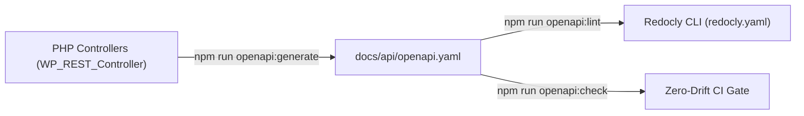

# OpenAPI 3.1 Tooling & Developer Manual

This guide documents the CLI commands, drift-checking mechanisms, and Redocly linting workflows for managing the plugin's OpenAPI 3.1 specification under **ADR-0011**.

---

## 1. Overview

In the **Code-Driven Generated OpenAPI Architecture (ADR-0011)**, developers never edit `docs/api/openapi.yaml` by hand. Instead, routes, argument schemas, descriptions, and operations are authored directly inside PHP controllers extending `WP_REST_Controller`.

The boilerplate provides three npm scripts to manage the contract:



---

## 2. CLI Commands Reference

### 2.1 Generating the Specification (`openapi:generate`)

Generates `docs/api/openapi.yaml` from registered REST routes inside the local WordPress container:

```bash
npm run openapi:generate
```

Direct WP-CLI invocation with custom parameters:

```bash
# Custom output path
wp-env run cli wp ai-ready openapi generate --output=custom-spec.yaml

# Custom REST namespace
wp-env run cli wp ai-ready openapi generate --namespace=my-plugin/v1
```

### 2.2 Drift Verification (`openapi:check`)

Compares the currently registered PHP routes against `docs/api/openapi.yaml` on disk. If any discrepancy or contract drift is detected, it exits with non-zero and displays a diff:

```bash
npm run openapi:check
```

This command runs in CI on every pull request, preventing uncommitted route changes from reaching `main`.

### 2.3 Linting Compliance (`openapi:lint`)

Validates `docs/api/openapi.yaml` against OpenAPI 3.1 standards and custom rules defined in `redocly.yaml`:

```bash
npm run openapi:lint
```

Rules enforced in `redocly.yaml`:

- `operation-operationId: error` (Every operation must have a unique ID)
- `operation-summary: error` (Every operation must have a summary)
- `no-identical-paths: error`
- `no-ambiguous-paths: error`

---

## 3. How to Author Endpoints for the Generator

Inside your `WP_REST_Controller` class:

1. **Provide an Item Schema (`get_item_schema()`):**

   ```php
   public function get_item_schema(): array {
       return array(
           '$schema'    => 'https://json-schema.org/draft/2020-12/schema',
           'title'      => 'settings',
           'type'       => 'object',
           'properties' => array(
               'greeting_message' => array(
                   'type'        => 'string',
                   'description' => 'The welcome greeting text.',
                   'maxLength'   => 255,
               ),
           ),
       );
   }
   ```

2. **Add Endpoint Args and OpenAPI Operation Metadata:**

   ```php
   register_rest_route(
       $this->namespace,
       '/' . $this->rest_base,
       array(
           array(
               'methods'             => WP_REST_Server::READABLE,
               'callback'            => array( $this, 'get_item' ),
               'permission_callback' => array( $this, 'get_item_permissions_check' ),
               'openapi'             => array(
                   'summary'     => 'Retrieve plugin settings',
                   'description' => 'Fetches the current configuration object.',
                   'operationId' => 'getSettings',
                   'tags'        => array( 'Settings' ),
               ),
           ),
       )
   );
   ```

3. **Regenerate Contract:**

   ```bash
   npm run openapi:generate
   npm run openapi:lint
   ```
