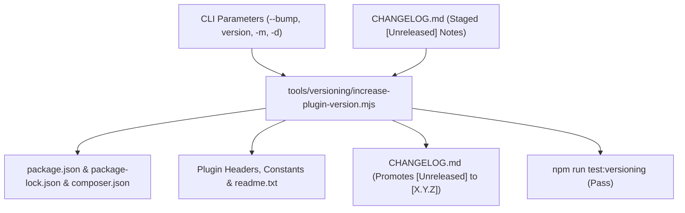

# Versioning & Release Lifecycle

In modern plugin engineering, changing a version number is **never a manual text edit**.

This guide details the automated semantic versioning, continuous unreleased changelogging, and release logging system implemented in `tools/versioning/increase-plugin-version.mjs`, tested by `tests/node/versioning/`, and governed by `.cursor/skills/versioning/` and `.cursor/skills/changelog/`.

---

## 1. Atomic Version Synchronization

Manually searching and replacing version strings across a repository leads to stale headers in `plugin.php`, broken `readme.txt` stable tags, missed constants, and fragmented changelogs.

The boilerplate treats a version bump as **one atomic, automated operation**:



---

## 2. Semantic Versioning Calculation Logic

The engineer or AI agent reads the current version from `package.json` and calculates the target version using strict SemVer (`MAJOR.MINOR.PATCH`):

1. **Minor Bump (`minor`, e.g. `1.0.0` → `1.3.3`):**
   - Finalization of a planned implementation phase.
   - Addition of substantial new features, blocks, or REST endpoints.
2. **Patch Bump (`patch`, e.g. `1.0.0` → `1.3.3`):**
   - Bug fixes, security patches, styling polish, or internal refactoring within a phase.
3. **Major Bump (`major`, e.g. `1.x.x` → `2.0.0`):**
   - Breaking architectural shift, minimum PHP/WP requirement increase, or major product baseline release.

---

## 3. Direct CLI Parameter Execution

Version synchronization does **not** modify `.env`. All target versioning parameters and release metadata are provided directly to the CLI command:

### 3.1 Convenience npm Scripts

```bash
# Automated patch bump
npm run update-version:patch

# Automated minor bump
npm run update-version:minor

# Automated major bump
npm run update-version:major
```

### 3.2 Positional & Flag-Based Commands

```bash
# Preview changes without modifying files
npm run update-version -- patch --dry-run

# Explicit target version with decision rationale
npm run update-version -- 1.3.3 -m "Release highlights" -d "Approved in phase closeout"
```

---

## 4. Continuous Changelog Recording (`CHANGELOG.md`)

Before executing a version bump, individual session changes are staged under `## [Unreleased]` in `CHANGELOG.md`.

Use the deterministic helper script:

```bash
npm run changelog:add -- -t Added "Added new Gutenberg block controls"
npm run changelog:add -- -t Fixed "Fixed permission check in RestController"
npm run changelog:add -- -t Changed "Refactored Container to support lazy loading"
```

When `npm run update-version` executes, it scoops up all items under `## [Unreleased]` and promotes them into the new version heading `## [X.Y.Z] - YYYY-MM-DD`.

---

## 5. Verification

After executing a version bump, verify integrity with:

```bash
npm run test:versioning
```
