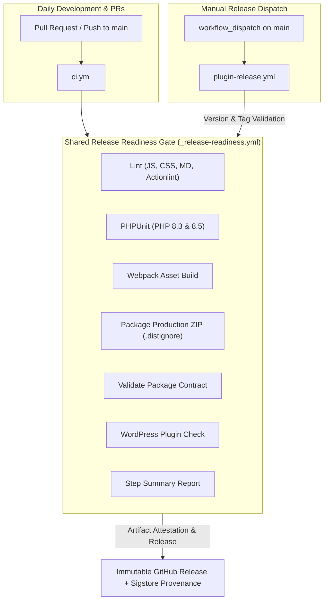

# DevOps, CI/CD & Release Architecture Hub

Welcome to the **DevOps & Release Hub** for the **WordPress AI Plugin Development Boilerplate**.

This directory documents the Two-Pipeline CI/CD architecture, automated GitHub Actions workflows, package content contracts, supply-chain security, and local release tooling.

Governed by **ADR-0010: Two-Pipeline CI/CD and Release Readiness Architecture**.

---

## 1. Core Principles & Philosophy

The DevOps architecture is founded on two non-negotiable architectural invariants:

1. **`main` is always releasable:** Every pull request and push to `main` is evaluated against an identical, deterministic release-readiness verification gate.
2. **Tested artifact == released artifact:** The release workflow never rebuilds packages from source after testing. The exact ZIP package validated and analyzed by official WordPress Plugin Check in CI is the artifact published to GitHub Releases.
3. **Decoupled versioning:** The manual release workflow never modifies or commits code back to `main`. Version bumping and changelog staging occur prior to release.
4. **Local CLI parity:** Developers and AI coding agents can run identical validation, packaging, and check commands locally using in-tree release tools in `tools/release/`.

---

## 2. Directory Contents & Guides

- [github-actions-ci-cd.md](github-actions-ci-cd.md): Detailed documentation of `.github/workflows/_release-readiness.yml`, `ci.yml`, `plugin-release.yml`, Dependabot SHA-pinning automation, and the multi-PHP testing matrix.
- [releasing-and-distribution.md](releasing-and-distribution.md): Complete release guide covering decoupled versioning, step-by-step releasing procedures, Sigstore provenance attestations, and GitHub branch protection rulesets.
- [package-contract-and-distignore.md](package-contract-and-distignore.md): Specification of the distribution package contract (mandatory production files vs forbidden development leaks) and `.distignore` matching rules.
- [local-release-tooling.md](local-release-tooling.md): Developer and agent manual for in-tree release CLI commands (`npm run release:build`, `npm run release:validate`, `npm run release:check`, `npm run release:notes`, `npm run lint:actions`).

---

## 3. Fast Cheatsheet: Release & CI Commands

| Command | Action |
|:---|:---|
| `npm run ci` | Runs full static analysis and unit/toolchain test suites locally. |
| `npm run lint:actions` | Validates GitHub Actions workflows for version tagging and permissions. |
| `npm run release:check` | Verifies version parity, branch readiness, and unreleased changelog notes. |
| `npm run release:build` | Compiles production assets and packages distribution ZIP via `.distignore`. |
| `npm run release:validate` | Asserts built ZIP satisfies the strict package content contract. |
| `npm run test:release` | Runs automated unit and integration tests for release tools. |

---

## 4. Coding Agent Guidance

When maintaining or executing DevOps and release tasks:

1. **Version Tagging Invariant:** Every third-party GitHub Action reference in `.github/workflows/` must reference an official semantic version tag (e.g. `actions/checkout@v4`). Run `npm run lint:actions` to verify.
2. **Never Edit Git History in Release Workflows:** Release workflows must never execute `git commit` or `git push` version bumps to `main`. Version bumping must always occur locally beforehand via `npm run update-version`.
3. **Verify Package Contract Locally:** When modifying build scripts, Webpack configs, or dependencies, always run `npm run release:build && npm run release:validate` locally to ensure no development files leak into distribution archives.
