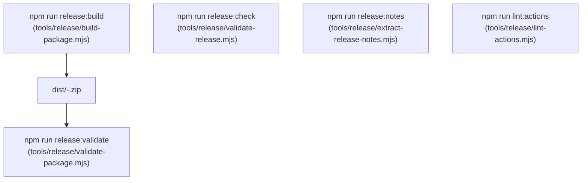

# Local Release Tooling & CLI Parity

This document details the in-tree Node.js release tooling under `tools/release/`, ensuring full local CLI parity with GitHub Actions CI/CD workflows.

Governed by **ADR-0010: Two-Pipeline CI/CD and Release Readiness Architecture**.

---

## 1. Local CLI Parity Rationale

Relying exclusively on GitHub Actions to test packaging or validate release readiness forces developers and AI agents into a slow commit-push-wait loop.

The boilerplate provides zero-external-dependency Node.js tools in `tools/release/` that mirror CI/CD operations locally:

---

## 2. In-Tree Tools Reference

### 2.1 `build-package.mjs` (`npm run release:build`)

- Compiles frontend assets (`npm run build`).
- Temporarily installs production PHP dependencies (`composer install --no-dev --optimize-autoloader`).
- Reads `.distignore` and packages files into `dist/{slug}-{version}.zip` using the built-in PKZIP writer (`tools/release/lib/zip-utils.mjs`).
- Generates a matching `.sha256` checksum file.

### 2.2 `validate-package.mjs` (`npm run release:validate`)

- Reads the built ZIP archive directly without external unzip binaries.
- Enforces the package content contract: verifies required runtime files exist and checks for forbidden development leaks.
- Prints a structured table of archive contents, uncompressed size, and verification status.

### 2.3 `validate-release.mjs` (`npm run release:check`)

- Checks that version numbers match across `package.json`, root plugin header `Version:`, `AIRWP_VERSION` constant, `readme.txt` `Stable tag:`, and `CHANGELOG.md`.
- Asserts that no uncommitted changes exist in git.
- Checks if the target git tag already exists.

### 2.4 `extract-release-notes.mjs` (`npm run release:notes`)

- Parses `CHANGELOG.md` and extracts release notes for a specified version.
- Used by the manual GitHub Actions release workflow to populate release descriptions automatically.

### 2.5 `lint-actions.mjs` (`npm run lint:actions`)

- Scans `.github/workflows/*.yml` for third-party actions.
- Asserts that all external action references use 40-character commit SHAs.
- Verifies that root permissions are restricted to `contents: read`.

---

## 3. Coding Agent Rules

1. **Test Offline First:** Before proposing a release or pushing CI workflow changes, run `npm run lint:actions`, `npm run release:check`, and `npm run release:build` locally.
2. **Never Add Heavy NPM Dependencies to `tools/release/`:** The release tools use zero external npm dependencies, utilizing Node.js built-ins (`node:fs`, `node:path`, `node:crypto`, `node:zlib`).
