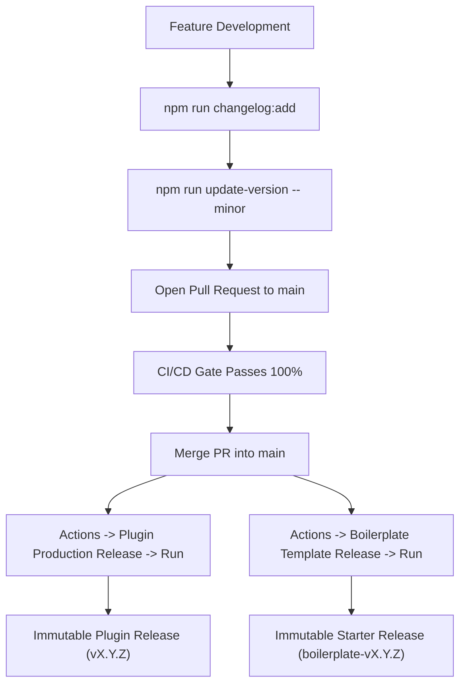

# Releasing & Release Distribution Architecture

This document describes the automated release pipeline architecture for the boilerplate, enforcing strict supply-chain security, decoupled versioning, and immutable release distribution across both production plugin packages and boilerplate starter template releases.

Governed by:

- **ADR-0010: Two-Pipeline CI/CD and Release Readiness Architecture**
- **ADR-0014: Boilerplate Starter Release Distribution Architecture**

---

## 1. Two Distinct Release Products

The repository provides two separate release pipelines tailored to different audiences:

| Dimension | Production Plugin Release | Boilerplate Starter Release |
|:---|:---|:---|
| **Workflow** | `.github/workflows/plugin-release.yml` | `.github/workflows/boilerplate-release.yml` |
| **Git Tag** | `vX.Y.Z` (e.g. `v1.3.2`) | `boilerplate-vX.Y.Z` (e.g. `boilerplate-v1.3.2`) |
| **Archive Artifact** | `ai-ready-wp-plugin-boilerplate-X.Y.Z.zip` | `ai-ready-wp-plugin-boilerplate-starter-X.Y.Z.zip` |
| **Target Audience** | Live client sites, WordPress.org Plugin Directory | Developers, Starter Template, `npx` installer tools |
| **Contents** | Pure production runtime only | Full repo source + pre-compiled assets + Composer autoloader |
| **Exclusions** | Dev tools, tests, docs, uncompiled `.ts`/`.tsx` | `node_modules/`, `.git/`, `.env*` caches, test reports |
| **Local Builder** | `npm run release:build` | `npm run boilerplate:build` |
| **Local Validator** | `npm run release:validate` | `npm run boilerplate:validate` |

---

## 2. Decoupled Versioning: Releases Never Modify `main`

A critical architectural invariant: **The manual Release workflows never commit or modify code on `main`.**

Version bumps, manifest synchronization, and changelog promotions occur *prior* to triggering the release workflow:



This prevents release workflows from bypassing branch protections, producing cascading CI builds, or introducing merge conflicts.

---

## 3. Step-by-Step Release Procedure

### Step 1: Stage Unreleased Changes

Throughout feature development, record changes under `## [Unreleased]` in `CHANGELOG.md`:

```bash
npm run changelog:add -- -t Added "Added new Gutenberg block controls"
npm run changelog:add -- -t Fixed "Fixed permission callback in REST controller"
```

### Step 2: Bump Version Locally

Decide whether the release is `patch`, `minor`, or `major`:

```bash
# Preview changes without modifying files
npm run update-version -- minor --dry-run

# Apply version increment (e.g. 1.3.2 -> 1.3.2)
npm run update-version -- minor
```

This synchronizes `package.json`, `package-lock.json`, `composer.json`, main plugin header `Version:`, `AIRWP_VERSION` constant, `readme.txt` `Stable tag:`, and converts staged `## [Unreleased]` bullets into `## [1.3.2] - YYYY-MM-DD`.

### Step 3: Run Local Release Verification

Ensure local parity before committing:

```bash
# Verify release preconditions and version matching
npm run release:check

# Verify Production Plugin package build and contract
npm run release:build
npm run release:validate

# Verify Boilerplate Starter package build and contract
npm run boilerplate:build
npm run boilerplate:validate

# Run full local CI suite
npm run ci
```

### Step 4: Open PR and Merge to `main`

Submit a pull request with the updated version and changelog. Ensure that `CI/CD — Release Readiness` passes completely on GitHub Actions. Merge the PR into `main`.

### Step 5A: Trigger Plugin Production Release Workflow

1. Navigate to your GitHub repository -> **Actions** tab.
2. Select **Plugin Production Release** in the left sidebar.
3. Click **Run workflow**:
   - Branch: `main`
   - Target version: `1.3.2` (must match `package.json` exactly)
   - Perform dry run: (check this to test all validations without tagging or releasing)
   - Mark as pre-release: (leave unchecked for standard releases)
4. Click **Run workflow**.

The workflow will:

1. Verify branch is `main` and all versions match.
2. Re-run the full release-readiness matrix on the exact commit SHA in isolated staging.
3. Execute the standalone packaged plugin PHP smoke test and WordPress Plugin Check.
4. If `dry_run` is selected, output the dry-run summary and finish cleanly.
5. If official release (`dry_run: false`), generate Sigstore-backed build provenance attestation (`actions/attest-build-provenance`), tag commit as `v1.3.2`, create draft release, upload the ZIP package, SHA256 checksum, `.files.json` inventory report, and changelog release notes, then publish it as an immutable release.

### Step 5B: Trigger Boilerplate Template Release Workflow

1. Navigate to your GitHub repository -> **Actions** tab.
2. Select **Boilerplate Template Release** in the left sidebar.
3. Click **Run workflow**:
   - Branch: `main`
   - Target version: `1.3.2` (must match `package.json` exactly)
   - Perform dry run: (check this to test all validations without tagging or releasing)
   - Mark as pre-release: (leave unchecked for standard releases)
4. Click **Run workflow**.

The workflow will:

1. Verify branch is `main` and all versions match.
2. Assemble the full template starter package in isolated staging, compile assets, and generate production Composer autoloader.
3. Validate starter package contract and execute standalone PHP smoke test.
4. If `dry_run` is selected, output the dry-run summary and finish cleanly.
5. If official release (`dry_run: false`), generate Sigstore build provenance attestation, tag commit as `boilerplate-v1.3.2`, upload `ai-ready-wp-plugin-boilerplate-starter-1.2.0.zip`, SHA256 checksum, and `.files.json` inventory, and publish the release.

---

## 4. Cryptographic Provenance & Verification

Every release artifact includes OpenSSF-compliant Sigstore build provenance attestations:

```bash
# Verify provenance of a downloaded production release ZIP
gh attestation verify ai-ready-wp-plugin-boilerplate-1.2.0.zip --repo owner/ai-ready-wp-plugin-boilerplate

# Verify provenance of a downloaded boilerplate starter ZIP
gh attestation verify ai-ready-wp-plugin-boilerplate-starter-1.2.0.zip --repo owner/ai-ready-wp-plugin-boilerplate
```

---

## 5. Recommended Branch Protection Ruleset for `main`

Configure repository branch rulesets under **Settings** -> **Rules** -> **Rulesets**:

| Rule | Setting | Purpose |
|:---|:---|:---|
| Target branch | `main` | Protects production branch. |
| Require pull request | Enabled (1+ approvals) | Prevents direct unreviewed commits. |
| Require status checks | Enabled (`Evaluate Release Readiness`) | Guarantees release gate passes before merge. |
| Require branches up to date | Enabled | Ensures testing against latest `main`. |
| Block force pushes | Enabled | Guarantees immutable history. |
| Block branch deletion | Enabled | Protects default branch. |
