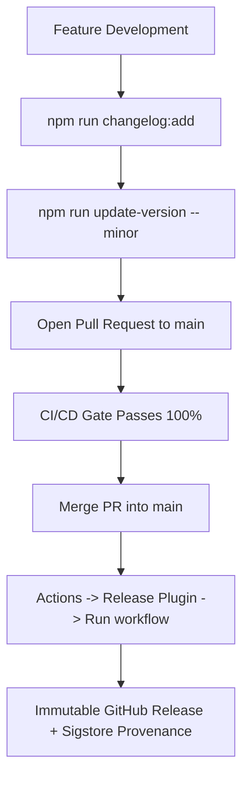

# Releasing & Release Distribution Architecture

This document describes the automated release pipeline architecture for the boilerplate, enforcing strict supply-chain security, decoupled versioning, and immutable release distribution.

Governed by **ADR-0010: Two-Pipeline CI/CD and Release Readiness Architecture**.

---

## 1. Decoupled Versioning: Releases Never Modify `main`

A critical architectural invariant: **The manual Release workflow never commits or modifies code on `main`.**

Version bumps, manifest synchronization, and changelog promotions occur *prior* to triggering the release workflow:



This prevents release workflows from bypassing branch protections, producing cascading CI builds, or introducing merge conflicts.

---

## 2. Step-by-Step Release Procedure

### Step 1: Stage Unreleased Changes

Throughout feature development, record changes under `## [Unreleased]` in `CHANGELOG.md`:

```bash
npm run changelog:add -- -t Added "Added new Gutenberg block controls"
npm run changelog:add -- -t Fixed "Fixed permission callback in REST controller"
```

### Step 2: Bump Version Locally

Decide whether the release is `patch`, `minor`, or `major`:

```bash
# Preview changes without modifying files
npm run update-version -- minor --dry-run

# Apply version increment (e.g. 1.1.2 -> 1.1.2)
npm run update-version -- minor
```

This synchronizes `package.json`, `package-lock.json`, `composer.json`, main plugin header `Version:`, `AIRWP_VERSION` constant, `readme.txt` `Stable tag:`, and converts staged `## [Unreleased]` bullets into `## [1.1.2] - YYYY-MM-DD`.

### Step 3: Run Local Release Verification

Ensure local parity before committing:

```bash
# Verify release preconditions and version matching
npm run release:check

# Build distribution ZIP and checksum
npm run release:build

# Validate package contract against the built ZIP
npm run release:validate

# Run full local CI suite
npm run ci
```

### Step 4: Open PR and Merge to `main`

Submit a pull request with the updated version and changelog. Ensure that `CI/CD — Release Readiness` passes completely on GitHub Actions. Merge the PR into `main`.

### Step 5: Trigger Manual Release Workflow

1. Navigate to your GitHub repository -> **Actions** tab.
2. Select **Release Plugin** in the left sidebar.
3. Click **Run workflow**:
   - Branch: `main`
   - Target version: `1.1.2` (must match `package.json` exactly)
   - Mark as pre-release: (leave unchecked for standard releases)
4. Click **Run workflow**.

The workflow will:

1. Verify branch is `main` and all versions match.
2. Re-run the full release-readiness matrix on the exact commit SHA.
3. Generate Sigstore-backed build provenance attestation (`actions/attest-build-provenance`).
4. Tag commit as `v1.1.2`.
5. Create a draft release, upload the ZIP package, SHA256 checksum, and changelog release notes, then publish it as an immutable release.

---

## 3. Cryptographic Provenance & Verification

Every release artifact includes OpenSSF-compliant Sigstore build provenance attestations:

```bash
# Verify provenance of a downloaded release ZIP
gh attestation verify ai-ready-wp-plugin-boilerplate-1.1.0.zip --repo owner/ai-ready-wp-plugin-boilerplate
```

---

## 4. Recommended Branch Protection Ruleset for `main`

Configure repository branch rulesets under **Settings** -> **Rules** -> **Rulesets**:

| Rule | Setting | Purpose |
|:---|:---|:---|
| Target branch | `main` | Protects production branch. |
| Require pull request | Enabled (1+ approvals) | Prevents direct unreviewed commits. |
| Require status checks | Enabled (`Evaluate Release Readiness`) | Guarantees release gate passes before merge. |
| Require branches up to date | Enabled | Ensures testing against latest `main`. |
| Block force pushes | Enabled | Guarantees immutable history. |
| Block branch deletion | Enabled | Protects default branch. |
