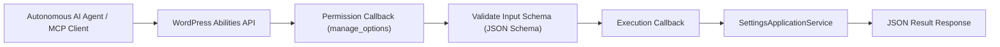

# WordPress Abilities API (AI Agent Integrations)

This guide covers exposing plugin capabilities to autonomous AI agents and language models using the **WordPress Abilities API** introduced in modern WordPress.

---

## 1. What is the WordPress Abilities API?

The WordPress Abilities API allows plugins to register discrete, machine-executable operations (called **abilities**) that external AI agents, autonomous workflows, or LLM tools can discover, understand, and invoke safely.

Each ability defines:

- **Namespace & Identifier:** Unique name (e.g., `ai-ready-wp/update-settings`).
- **Category:** Functional grouping (e.g., `ai-ready-wp`).
- **Input Schema:** JSON Schema describing accepted arguments.
- **Permission Callback:** Authorization gate verifying caller capabilities (`manage_options`).
- **Execution Callback:** Handler executing the operation and returning structured results.



---

## 2. Registering Categories and Abilities (`src/backend/Apps/Settings/Abilities/SettingsAbilities.php`)

Abilities must be registered on their dedicated WordPress action hooks:

- Categories: `wp_abilities_api_categories_init`
- Abilities: `wp_abilities_api_init`

```php
namespace AIReady\WPPluginBoilerplate\Backend\Apps\Settings\Abilities;

use AIReady\WPPluginBoilerplate\Backend\Apps\Settings\Application\Command\UpdateSettingsCommand;
use AIReady\WPPluginBoilerplate\Backend\Apps\Settings\Application\SettingsApplicationService;
use AIReady\WPPluginBoilerplate\Framework\Kernel\Plugin;
use AIReady\WPPluginBoilerplate\Framework\Support\WordPressErrorMapper;

class SettingsAbilities {
    public const CATEGORY = 'ai-ready-wp';

    public static function register(): void {
        if ( ! function_exists( 'wp_register_ability' ) ) {
            return;
        }

        // 1. Get Settings Ability
        wp_register_ability(
            'ai-ready-wp/get-settings',
            [
                'label'               => __( 'Get Settings', 'ai-ready-wp-plugin-boilerplate' ),
                'description'         => __( 'Retrieve all active configuration settings.', 'ai-ready-wp-plugin-boilerplate' ),
                'category'            => self::CATEGORY,
                'permission_callback' => [ self::class, 'check_manage_options' ],
                'execute_callback'    => [ self::class, 'execute_get_settings' ],
                'input_schema'        => [],
                'output_schema'       => [
                    'type' => 'object',
                ],
                'meta'                => [
                    'show_in_rest' => true,
                    'annotations'  => [
                        'readonly'   => true,
                        'idempotent' => true,
                    ],
                ],
            ]
        );

        // 2. Update Settings Ability with Input Schema
        wp_register_ability(
            'ai-ready-wp/update-settings',
            [
                'label'               => __( 'Update Settings', 'ai-ready-wp-plugin-boilerplate' ),
                'description'         => __( 'Modify plugin configuration settings.', 'ai-ready-wp-plugin-boilerplate' ),
                'category'            => self::CATEGORY,
                'permission_callback' => [ self::class, 'check_manage_options' ],
                'execute_callback'    => [ self::class, 'execute_update_settings' ],
                'input_schema'        => [
                    'type'       => 'object',
                    'properties' => [
                        'greeting_message' => [ 'type' => 'string' ],
                        'enable_feature'   => [ 'type' => 'boolean' ],
                        'cache_ttl'        => [ 'type' => 'integer' ],
                    ],
                ],
                'output_schema'       => [
                    'type' => 'object',
                ],
                'meta'                => [
                    'show_in_rest' => true,
                    'annotations'  => [
                        'readonly'   => false,
                        'idempotent' => true,
                    ],
                ],
            ]
        );
    }

    public static function check_manage_options(): bool {
        return current_user_can( 'manage_options' );
    }

    public static function execute_get_settings(): array {
        $service = Plugin::instance()->get_container()->get( SettingsApplicationService::class );
        return $service->get_settings()->to_array();
    }

    public static function execute_update_settings( array $input = [] ): array {
        $service = Plugin::instance()->get_container()->get( SettingsApplicationService::class );
        $command = UpdateSettingsCommand::from_array( $input );
        $dto     = $service->update_settings( $command );
        return $dto->to_array();
    }
}
```

---

## 3. Invoking Abilities Programmatically

Other plugins or AI agent adapters (such as Model Context Protocol MCP bridges) can invoke registered abilities:

```php
if ( function_exists( 'wp_get_ability' ) ) {
    $ability = wp_get_ability( 'ai-ready-wp/get-settings' );
    if ( $ability && $ability->can_execute() ) {
        $result = $ability->execute();
    }
}
```

Through this pattern, AI agents obtain full programmatic control of plugin configuration and telemetry through strongly validated contracts.
