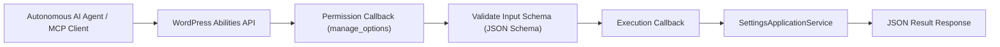

# WordPress Abilities API (AI Agent Integrations)

This guide covers exposing plugin capabilities to autonomous AI agents and language models using the **WordPress Abilities API** introduced in modern WordPress.

---

## 1. What is the WordPress Abilities API?

The WordPress Abilities API allows plugins to register discrete, machine-executable operations (called **abilities**) that external AI agents, autonomous workflows, or LLM tools can discover, understand, and invoke safely.

Each ability defines:

- **Namespace & Identifier:** Unique name (e.g., `ai-ready-wp/update-settings`).
- **Category:** Functional grouping (e.g., `ai-ready-wp`).
- **Input Schema:** JSON Schema describing accepted arguments.
- **Permission Callback:** Authorization gate verifying caller capabilities (`manage_options`).
- **Execution Callback:** Handler executing the operation and returning structured results.



---

## 2. Registering Categories and Abilities (`src/Abilities/AbilitiesServiceProvider.php`)

Abilities must be registered on their dedicated WordPress action hooks:

- Categories: `wp_abilities_api_categories_init`
- Abilities: `wp_abilities_api_init`

```php
namespace AIReady\WPPluginBoilerplate\Abilities;

use AIReady\WPPluginBoilerplate\Bootstrap\Container;
use AIReady\WPPluginBoilerplate\Bootstrap\ServiceProvider;
use AIReady\WPPluginBoilerplate\Diagnostics\Application\DiagnosticsService;
use AIReady\WPPluginBoilerplate\Settings\Application\Command\UpdateSettingsCommand;
use AIReady\WPPluginBoilerplate\Settings\Application\SettingsApplicationService;

class AbilitiesServiceProvider implements ServiceProvider {
    public function register( Container $container ): void {}

    public function boot(): void {
        add_action( 'wp_abilities_api_categories_init', [ $this, 'register_categories' ] );
        add_action( 'wp_abilities_api_init', [ $this, 'register_abilities' ] );
    }

    public function register_categories(): void {
        if ( ! function_exists( 'wp_register_ability_category' ) ) {
            return;
        }

        wp_register_ability_category(
            'ai-ready-wp',
            [
                'label'       => __( 'AI Ready WP Plugin', 'ai-ready-wp-plugin-boilerplate' ),
                'description' => __( 'Abilities provided by the AI-Ready WordPress Plugin.', 'ai-ready-wp-plugin-boilerplate' ),
            ]
        );
    }

    public function register_abilities(): void {
        if ( ! function_exists( 'wp_register_ability' ) ) {
            return;
        }

        // 1. Get Settings Ability
        wp_register_ability(
            'ai-ready-wp/get-settings',
            [
                'label'               => __( 'Get Settings', 'ai-ready-wp-plugin-boilerplate' ),
                'description'         => __( 'Retrieve all active configuration settings.', 'ai-ready-wp-plugin-boilerplate' ),
                'category'            => 'ai-ready-wp',
                'input_schema'        => [],
                'permission_callback' => fn() => current_user_can( 'manage_options' ),
                'callback'            => function () {
                    $service = Plugin::instance()->get_container()->get( SettingsApplicationService::class );
                    return $service->get_settings()->to_array();
                },
            ]
        );

        // 2. Update Settings Ability with Input Schema
        wp_register_ability(
            'ai-ready-wp/update-settings',
            [
                'label'               => __( 'Update Settings', 'ai-ready-wp-plugin-boilerplate' ),
                'description'         => __( 'Modify plugin configuration settings.', 'ai-ready-wp-plugin-boilerplate' ),
                'category'            => 'ai-ready-wp',
                'input_schema'        => [
                    'type'       => 'object',
                    'properties' => [
                        'greeting'        => [ 'type' => 'string', 'maxLength' => 255 ],
                        'feature_enabled' => [ 'type' => 'boolean' ],
                        'cache_ttl'       => [ 'type' => 'integer', 'minimum' => 60, 'maximum' => 86400 ],
                    ],
                ],
                'permission_callback' => fn() => current_user_can( 'manage_options' ),
                'callback'            => function ( array $input ) {
                    $service = Plugin::instance()->get_container()->get( SettingsApplicationService::class );
                    $command = UpdateSettingsCommand::from_array( $input );
                    $dto     = $service->update_settings( $command );
                    return [
                        'success'  => true,
                        'settings' => $dto->to_array(),
                    ];
                },
            ]
        );
    }
}
```

---

## 3. Invoking Abilities Programmatically

Other plugins or AI agent adapters (such as Model Context Protocol MCP bridges) can invoke registered abilities:

```php
if ( function_exists( 'wp_get_ability' ) ) {
    $ability = wp_get_ability( 'ai-ready-wp/get-settings' );
    if ( $ability && $ability->can_execute() ) {
        $result = $ability->execute();
    }
}
```

Through this pattern, AI agents obtain full programmatic control of plugin configuration and telemetry through strongly validated contracts.
