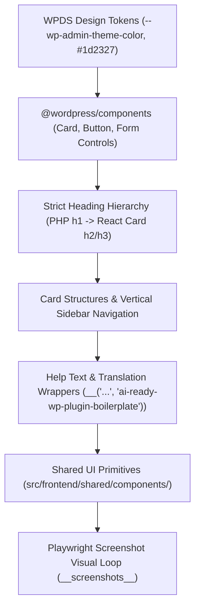

# WordPress Admin UI/UX and Visual Design Standards

Building a world-class WordPress plugin requires an admin interface that feels like an authentic, refined extension of WordPress core.

This guide details the **WordPress Design System (WPDS)** standards, layout architecture, micro-copy requirements, and visual verification loops codified in `.cursor/rules/wp-admin-ui-ux.mdc` and `.cursor/skills/wp-admin-ui-ux/`.

---

## 1. Core Visual Principles & Design Tokens



### 1.1 WordPress Native Feel

- Align with the **WordPress Design System (WPDS)** design tokens and `@wordpress/components`.
- Use standard WordPress admin colors:
  - Theme primary: `var(--wp-admin-theme-color, #2271b1)`
  - Primary text: `#1d2327`
  - Secondary text / muted help: `#646970`
  - Borders: `#dcdcde`
  - Card / Panel background: `#ffffff`
  - Admin body background: `#f0f0f1`
- Avoid arbitrary standalone custom dark modes or off-brand themes unless explicitly requested by the user.

### 1.2 Strict Heading Hierarchy

- **Single Primary `<h1>` in PHP:**
  - The PHP root template renders the one and only primary page title (`<h1 class="wp-heading-inline">Settings</h1>`).
  - **Never** render an `<h1>` inside React components.
- **React Subheadings:**
  - Inside React components, section titles must use `<h2>` or `<h3>` inside `CardHeader` to preserve semantic accessibility.

---

## 2. Shared Admin UI Primitives (`src/frontend/shared/`)

The boilerplate extracts reusable WPDS layout primitives into `src/frontend/shared/components/`:

### 2.1 `CardLayout`

Encapsulates the standard WPDS `Card`, `CardHeader`, `CardBody`, and `CardFooter` structure with dirty state indicators and action buttons:

```tsx
import { CardLayout } from '../../../shared';

<CardLayout
  title={ __( 'General Settings', 'ai-ready-wp-plugin-boilerplate' ) }
  description={ __( 'Manage core plugin behavior and greetings.', 'ai-ready-wp-plugin-boilerplate' ) }
  isDirty={ isDirty }
  isSaving={ isSaving }
  onSave={ handleSave }
  onReset={ handleReset }
>
  { /* Form fields */ }
</CardLayout>
```

### 2.2 `SectionHeader`

Standardized header with icon badge, title, subtitle, and optional header action controls.

### 2.3 Compound Components & Resilient Utilities

- **`CardLayout` Compound Components:** Supports `CardLayout.Header`, `CardLayout.Body`, and `CardLayout.Footer` for flexible layout requirements.
- **`NoticeBanner`:** Accessible alert/status announcements with standard WordPress notice styles.
- **`LoadingSkeleton`:** Structured placeholder during async bootstrap data fetching (`data-airwp-app-state="loading"`).
- **`ErrorBoundary`:** Defensive React boundary isolating view failures with friendly user fallback.

### 2.4 API Client Adapter & Form State Reducer

- **`SettingsApiClient`:** Encapsulates network communication via `@wordpress/api-fetch`, reading nonces from bootstrap globals and translating errors into strongly typed domain failures.
- **`useSettingsForm`:** State reducer managing form dirtiness, field modifications, and rollback resets.

---

## 3. Vertical Sidebar Navigation for Multi-Section Screens

When an admin interface contains multiple sections, use a dedicated vertical sidebar layout:

```tsx
import { Button, Icon } from '@wordpress/components';
import { cog, shield } from '@wordpress/icons';

const SECTIONS = [
  { id: 'general', label: __( 'General', 'ai-ready-wp-plugin-boilerplate' ), icon: cog },
  { id: 'advanced', label: __( 'Advanced', 'ai-ready-wp-plugin-boilerplate' ), icon: shield },
];
```

Navigation tabs display active indicators, focus rings, and proper keyboard navigation (`aria-selected`, `tabindex`).

---

## 4. Visual Verification with Playwright

All admin views have automated visual regression tests in `tests/e2e/playwright/`:

```typescript
test('renders settings admin shell correctly', async ({ page }) => {
  await page.goto('/wp-admin/admin.php?page=ai-ready-wp-settings');
  await page.waitForSelector('[data-airwp-app-state="ready"]');

  await expect(page.locator('#airwp-settings-app')).toHaveScreenshot('settings-app.png', {
    maxDiffPixelRatio: 0.01,
  });
});
```
