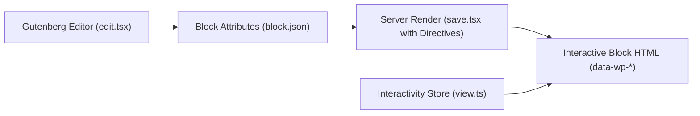

# Blocks and the WordPress Interactivity API

This guide covers building modern Gutenberg blocks conforming to **Block API v3** and leveraging the native **WordPress Interactivity API** for client-side interactivity without heavy external frontend frameworks.

---

## 1. Overview of Block API v3 & Interactivity API

WordPress 6.5+ introduced the official **Interactivity API**, a standard framework allowing blocks to add frontend interactivity (instant counters, expandable disclosures, toggles, optimistic updates) using declarative HTML directives and standard Preact signals under the hood.



---

## 2. Block Metadata (`block.json`)

Blocks live in `src/frontend/apps/<block-slug>/` with an authoritative `block.json`:

```json
{
  "$schema": "https://schemas.wp.org/trunk/block.json",
  "apiVersion": 3,
  "name": "ai-ready-wp/hello-world",
  "version": "1.0.1",
  "title": "Hello World",
  "category": "widgets",
  "icon": "smiley",
  "description": "A modern interactive starter block for AI-Ready WP Plugin Boilerplate.",
  "supports": {
    "html": false,
    "interactivity": true
  },
  "textdomain": "ai-ready-wp-plugin-boilerplate",
  "editorScript": "file:../../../../build/blocks/hello-world/index.js",
  "editorStyle": "file:./editor.css",
  "style": "file:./style.css",
  "viewScriptModule": "file:../../../../build/blocks/hello-world/view.js"
}
```

Key attributes:

- `apiVersion: 3`: Required for modern WordPress block rendering.
- `supports.interactivity: true`: Flags the block for Interactivity API runtime handling.
- `viewScriptModule`: Uses WordPress ECMAScript Module loading for the client store.

---

## 3. Editor Implementation (`edit.tsx`)

The editor component renders Gutenberg InspectorControls and a block preview:

```tsx
import { __ } from '@wordpress/i18n';
import { useBlockProps, InspectorControls } from '@wordpress/block-editor';
import { PanelBody, TextControl, ToggleControl } from '@wordpress/components';

export default function Edit({ attributes, setAttributes }) {
  const blockProps = useBlockProps();
  const { message, showLikes, initialLikes } = attributes;

  return (
    <>
      <InspectorControls>
        <PanelBody title={__('Block Settings', 'ai-ready-wp-plugin-boilerplate')}>
          <TextControl
            __next40pxDefaultSize={true}
            __nextHasNoMarginBottom={true}
            label={__('Message', 'ai-ready-wp-plugin-boilerplate')}
            value={message}
            onChange={(val) => setAttributes({ message: val })}
          />
          <ToggleControl
            __next40pxDefaultSize={true}
            __nextHasNoMarginBottom={true}
            label={__('Show Likes Counter', 'ai-ready-wp-plugin-boilerplate')}
            checked={showLikes}
            onChange={(val) => setAttributes({ showLikes: val })}
          />
        </PanelBody>
      </InspectorControls>
      <div {...blockProps}>
        <p>{message}</p>
      </div>
    </>
  );
}
```

---

## 4. Server-Side Directives (`save.tsx`)

The `save` component emits standard HTML adorned with Interactivity API directives:

```tsx
import { useBlockProps } from '@wordpress/block-editor';

export default function Save({ attributes }) {
  const { message, showLikes, initialLikes } = attributes;
  const context = { likes: initialLikes, isLiked: false, showDetails: false };

  const blockProps = useBlockProps.save({
    'data-wp-interactive': 'ai-ready-wp/hello-world',
    'data-wp-context': JSON.stringify(context),
  });

  return (
    <div {...blockProps}>
      <h3 className="ai-ready-wp-block-title">{message}</h3>
      {showLikes && (
        <div className="ai-ready-wp-like-container">
          <button
            type="button"
            className="ai-ready-wp-like-btn"
            data-wp-on--click="actions.incrementLike"
          >
            <span data-wp-text="state.likeCountText" />
          </button>
        </div>
      )}
    </div>
  );
}
```

### Core Directives

- `data-wp-interactive="<namespace>"`: Binds the DOM subtree to a specific store namespace.
- `data-wp-context='{ ... }'`: Injects localized, element-scoped state.
- `data-wp-on--click="actions.<name>"`: Binds an event listener to an action.
- `data-wp-text="state.<name>"`: Dynamically updates the inner text.
- `data-wp-bind--hidden="!context.showDetails"`: Dynamically controls DOM attributes.

---

## 5. Client Store (`view.ts`)

The interactive store runs on the frontend via `@wordpress/interactivity`:

```typescript
import { store, getContext } from '@wordpress/interactivity';

interface BlockContext {
  likes: number;
  isLiked: boolean;
  showDetails: boolean;
}

store('ai-ready-wp/hello-world', {
  state: {
    get likeCountText(): string {
      const ctx = getContext<BlockContext>();
      return `${ctx.likes} Likes`;
    },
  },
  actions: {
    incrementLike() {
      const ctx = getContext<BlockContext>();
      ctx.likes += 1;
      ctx.isLiked = true;
    },
    toggleDetails() {
      const ctx = getContext<BlockContext>();
      ctx.showDetails = !ctx.showDetails;
    },
  },
});
```

---

## 6. Block Pattern Registration (`patterns/`)

Block patterns allow users to insert pre-configured layouts of blocks:

```php
<?php
/**
 * Title: Interactive Showcase
 * Slug: ai-ready-wp/interactive-showcase
 * Categories: featured
 */
?>
<!-- wp:group {"layout":{"type":"constrained"}} -->
<div class="wp-block-group">
    <!-- wp:ai-ready-wp/hello-world {"message":"Welcome to AI Ready WordPress!","showLikes":true} /-->
</div>
<!-- /wp:group -->
```

Registered via `src/frontend/Bridge/Pattern/PatternRegistry.php` using `register_block_pattern_category` and automatic pattern discovery.
