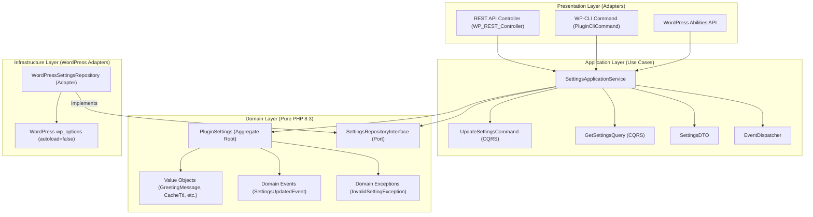

# Domain and Application Services (Clean Hexagonal DDD)

This guide documents the design patterns, class structure, and development practices for implementing pure business logic and use-case application services using **Hexagonal Architecture (Ports and Adapters)** and **Domain-Driven Design (DDD)** in PHP 8.3.

---

## 1. Architectural Separation

In Hexagonal Architecture, core business logic is strictly decoupled from WordPress framework mechanics:



---

## 2. The Domain Layer (`src/<Context>/Domain/`)

The Domain Layer encapsulates the rules and invariants of the business. It has **zero dependencies** on WordPress functions (`get_option`, `$wpdb`) or superglobals (`$_POST`, `$_GET`).

### 2.1 Immutable Value Objects

Value objects encapsulate domain primitives, guaranteeing that an invalid domain value can never exist in memory.

**Characteristics:**

- `readonly` properties or `final readonly class`.
- Self-validating in the constructor or factory methods.
- Throw typed domain exceptions upon invariant violation.
- Normalized internal state (trimmed strings, clamped numbers).

```php
namespace AIReady\WPPluginBoilerplate\Settings\Domain\ValueObject;

use AIReady\WPPluginBoilerplate\Settings\Domain\Exception\InvalidGreetingMessageException;

final class GreetingMessage {
    private const MAX_LENGTH = 255;
    private string $value;

    public function __construct( string $value ) {
        $trimmed = trim( $value );
        if ( '' === $trimmed ) {
            throw new InvalidGreetingMessageException( 'Greeting message cannot be empty.' );
        }
        if ( mb_strlen( $trimmed ) > self::MAX_LENGTH ) {
            throw new InvalidGreetingMessageException(
                sprintf( 'Greeting message exceeds %d characters.', self::MAX_LENGTH )
            );
        }
        $this->value = $trimmed;
    }

    public function value(): string {
        return $this->value;
    }
}
```

### 2.2 Backed Enums for Discrete State

Domain states or policies with a fixed set of options use PHP 8.3 backed enums:

```php
namespace AIReady\WPPluginBoilerplate\Settings\Domain\ValueObject;

enum DataRetentionPolicy: string {
    case KEEP_ALL   = 'keep_all';
    case DELETE_ALL = 'delete_all';

    public static function from_string( string $value ): self {
        $case = self::tryFrom( $value );
        if ( null === $case ) {
            throw new InvalidRetentionPolicyException( "Invalid retention policy: {$value}" );
        }
        return $case;
    }
}
```

### 2.3 Aggregate Roots

Aggregate roots maintain consistency boundaries and record domain events when state changes:

```php
namespace AIReady\WPPluginBoilerplate\Settings\Domain\Model;

final class PluginSettings {
    /** @var object[] */
    private array $recorded_events = [];

    public function __construct(
        private GreetingMessage $greeting,
        private FeatureFlag $feature_enabled,
        private Description $description,
        private RestDebug $rest_debug,
        private CacheTtl $cache_ttl,
        private DataRetentionPolicy $data_retention
    ) {}

    public function update(
        GreetingMessage $greeting,
        FeatureFlag $feature_enabled,
        Description $description,
        RestDebug $rest_debug,
        CacheTtl $cache_ttl,
        DataRetentionPolicy $data_retention
    ): self {
        $clone = clone $this;
        // Check changed fields and record domain events...
        $clone->recorded_events[] = new SettingsUpdatedEvent( $clone->to_array(), $changed_keys );
        return $clone;
    }

    public function release_events(): array {
        $events = $this->recorded_events;
        $this->recorded_events = [];
        return $events;
    }
}
```

### 2.4 Repository Interfaces (Ports)

The domain specifies how it expects data to be retrieved and persisted via pure PHP interfaces:

```php
namespace AIReady\WPPluginBoilerplate\Settings\Domain\Repository;

interface SettingsRepositoryInterface {
    public function get(): PluginSettings;
    public function save( PluginSettings $settings ): void;
}
```

---

## 3. The Application Layer (`src/<Context>/Application/`)

The Application Layer coordinates use cases, maps inputs to domain objects, invokes persistence, and dispatches domain events.

### 3.1 CQRS-Lite Commands & Queries

- **Commands:** Input structures representing an intention to mutate state.
- **Queries:** Input structures representing read requests.

```php
namespace AIReady\WPPluginBoilerplate\Settings\Application\Command;

final readonly class UpdateSettingsCommand {
    public function __construct(
        public ?string $greeting = null,
        public ?bool $feature_enabled = null,
        public ?string $description = null,
        public ?bool $rest_debug = null,
        public ?int $cache_ttl = null,
        public ?string $data_retention = null
    ) {}

    public static function from_array( array $data ): self {
        return new self(
            greeting: isset( $data['greeting'] ) ? (string) $data['greeting'] : null,
            // ...
        );
    }
}
```

### 3.2 Data Transfer Objects (DTOs)

DTOs represent clean, immutable data crossing boundaries to presentation layers:

```php
namespace AIReady\WPPluginBoilerplate\Settings\Application\DTO;

final readonly class SettingsDTO {
    public function __construct(
        public string $greeting,
        public bool $feature_enabled,
        public string $description,
        public bool $rest_debug,
        public int $cache_ttl,
        public string $data_retention
    ) {}

    public function to_array(): array {
        return [
            'greeting'        => $this->greeting,
            'feature_enabled' => $this->feature_enabled,
            'description'     => $this->description,
            'rest_debug'      => $this->rest_debug,
            'cache_ttl'       => $this->cache_ttl,
            'data_retention'  => $this->data_retention,
        ];
    }
}
```

### 3.3 Application Services

Application Services orchestrate the use case end-to-end:

```php
namespace AIReady\WPPluginBoilerplate\Settings\Application;

final class SettingsApplicationService {
    public function __construct(
        private SettingsRepositoryInterface $repository,
        private EventDispatcherInterface $dispatcher
    ) {}

    public function get_settings(): SettingsDTO {
        $settings = $this->repository->get();
        return SettingsDTO::from_domain( $settings );
    }

    public function update_settings( UpdateSettingsCommand $command ): SettingsDTO {
        $current = $this->repository->get();
        // Construct new Value Objects from command...
        $updated = $current->update( ... );
        $this->repository->save( $updated );

        foreach ( $updated->release_events() as $event ) {
            $this->dispatcher->dispatch( $event );
        }

        return SettingsDTO::from_domain( $updated );
    }
}
```

---

## 4. Event Dispatching (`src/Event/`)

Domain events capture important business occurrences. The `EventDispatcher` notifies in-memory PHP listeners and bridges the events into standard WordPress action hooks:

```php
// Dispatching:
$dispatcher->dispatch( new SettingsUpdatedEvent( $payload, $changed_keys ) );

// WordPress hook bridging:
// Automatically executes:
do_action( 'airwp_settings_updated', $payload, $changed_keys );
```

This allows other WordPress plugins, themes, or custom modules to hook into domain events without leaking infrastructure concerns into the Domain model.
