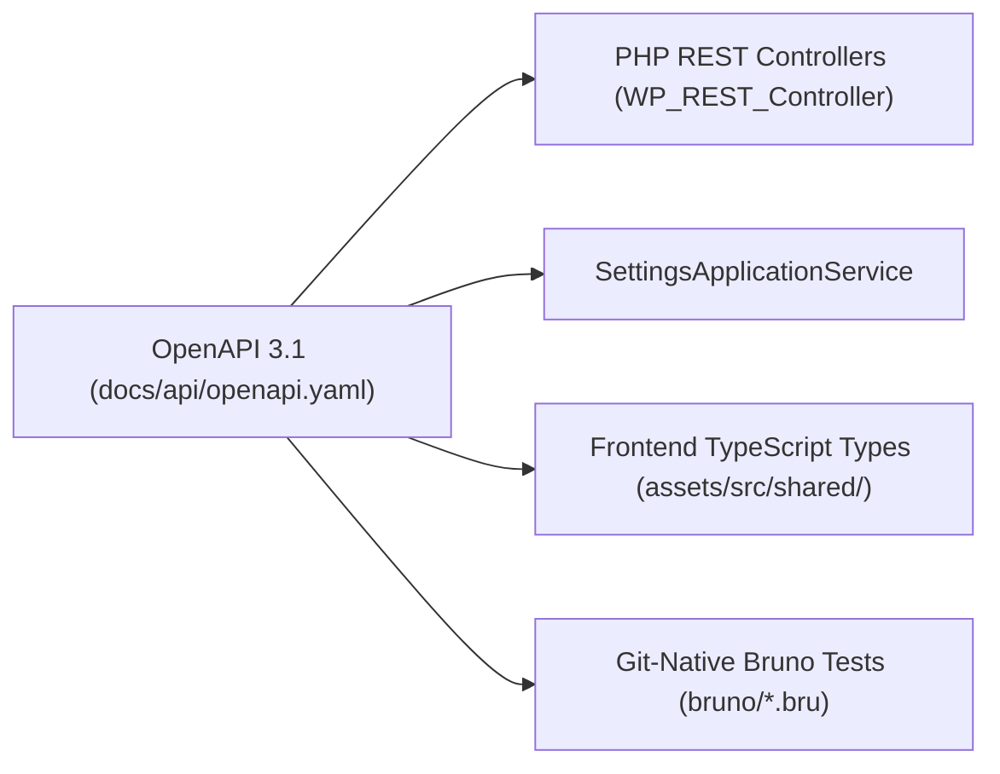

# REST API & Contracts (OpenAPI & Bruno)

This guide explains how to design contract-first REST APIs using **OpenAPI 3.1**, implement them via **WordPress REST Controllers** delegating to Application Services, and validate them with **Bruno** Git-native contract tests.

---

## 1. Contract-First REST API Design (OpenAPI 3.1)

Rather than writing PHP controllers ad-hoc, all plugin endpoints are declared in an authoritative OpenAPI contract: `docs/api/openapi.yaml`.



### 1.1 Why Contract-First?

1. **Single Source of Truth:** Prevents drift between PHP REST controller schemas, TypeScript frontend types, and test assertions.
2. **Deterministic Agent Context:** AI coding agents inspect `openapi.yaml` to understand endpoint parameters, request bodies, permissions, and error models before authoring code.
3. **Automated Test Scaffolding:** Bruno tests are generated directly from the specification.

---

## 2. Implementing REST Controllers (`src/Rest/Controller/`)

Controllers extend `WP_REST_Controller` and act as presentation adapters. They should contain **no domain logic**. Instead, they parse requests, validate capabilities, invoke Application Services, and format responses.

### 2.1 Route Registration

Routes are registered on `rest_api_init`:

```php
namespace AIReady\WPPluginBoilerplate\Rest\Controller;

use WP_REST_Controller;
use WP_REST_Server;
use WP_REST_Request;
use WP_REST_Response;
use WP_Error;

class SettingsController extends WP_REST_Controller {
    protected $namespace = 'ai-ready-wp/v1';
    protected $rest_base = 'settings';

    public function register_routes(): void {
        register_rest_route(
            $this->namespace,
            '/' . $this->rest_base,
            [
                [
                    'methods'             => WP_REST_Server::READABLE,
                    'callback'            => [ $this, 'get_item' ],
                    'permission_callback' => [ $this, 'get_item_permissions_check' ],
                ],
                [
                    'methods'             => WP_REST_Server::CREATABLE,
                    'callback'            => [ $this, 'update_item' ],
                    'permission_callback' => [ $this, 'update_item_permissions_check' ],
                    'args'                => $this->get_endpoint_args_for_item_schema( WP_REST_Server::CREATABLE ),
                ],
                'schema' => [ $this, 'get_item_schema' ],
            ]
        );
    }
}
```

### 2.2 Delegating to Application Services & Error Mapping

```php
public function update_item( $request ): WP_REST_Response|WP_Error {
    $body = $request->get_json_params();

    try {
        $command = UpdateSettingsCommand::from_array( $body );
        $dto     = $this->settings_service->update_settings( $command );
        return new WP_REST_Response( $dto->to_array(), 200 );
    } catch ( InvalidSettingException $e ) {
        return WordPressErrorMapper::to_wp_error( $e, 400 );
    } catch ( \Throwable $e ) {
        return WordPressErrorMapper::to_wp_error( $e, 500 );
    }
}
```

---

## 3. Bruno Contract Testing (`bruno/`)

Bruno tests treat the running WordPress container as an external HTTP server and validate API contracts without PHP dependencies.

### 3.1 Directory Structure

```text
bruno/
├── 00 Smoke/               # Health check & REST index discovery
│   └── 01 REST Discovery.bru
├── 03 Settings/            # Settings read and update contract tests
│   ├── 01 Get Settings.bru
│   └── 02 Update Settings.bru
├── environments/
│   └── Local.bru          # Base URL, credentials template
└── bruno.json
```

### 3.2 Executing Bruno Tests

The boilerplate provides a cross-platform runner script `scripts/run-rest-tests.mjs` that loads `.env` variables and runs Bruno CLI:

```bash
# Execute Bruno REST test suite
npm run test:rest

# Execute and generate HTML test report
npm run test:rest:html
```
