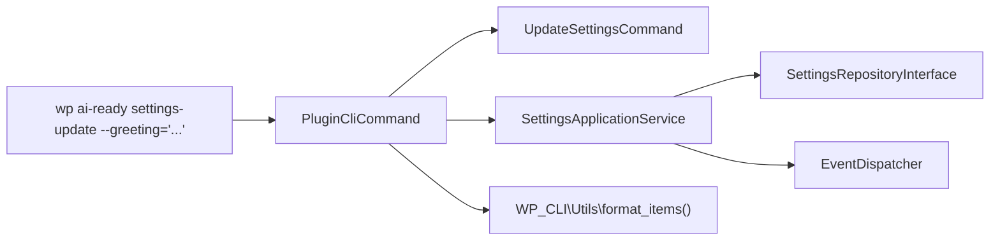

# WP-CLI Commands and Operations

This guide covers registering and implementing custom WP-CLI commands that delegate to Application Services for headless administration, automation scripts, and server-side diagnostics.

---

## 1. Architectural Philosophy: CLI as a Presentation Adapter

In Hexagonal Architecture, WP-CLI commands are thin presentation adapters. Like REST controllers, CLI commands:

- Do **not** contain business logic.
- Do **not** interact directly with the database or `$wpdb`.
- Parse arguments and flags.
- Delegate use-case execution to **Application Services** (`SettingsApplicationService`, `DiagnosticsService`).
- Format and render output using standard WP-CLI formatters.



---

## 2. Command Class Implementation (`src/Cli/PluginCliCommand.php`)

Commands extend `WP_CLI_Command` or are registered as invokable classes:

```php
namespace AIReady\WPPluginBoilerplate\Cli;

use AIReady\WPPluginBoilerplate\Diagnostics\Application\DiagnosticsService;
use AIReady\WPPluginBoilerplate\Settings\Application\Command\UpdateSettingsCommand;
use AIReady\WPPluginBoilerplate\Settings\Application\SettingsApplicationService;
use WP_CLI;
use WP_CLI\Utils;

class PluginCliCommand {
    public function __construct(
        private SettingsApplicationService $settings_service,
        private DiagnosticsService $diagnostics_service
    ) {}

    /**
     * Get current plugin settings.
     *
     * ## OPTIONS
     *
     * [--format=<format>]
     * : Output format (table, json, yaml).
     * ---
     * default: table
     * options:
     *   - table
     *   - json
     *   - yaml
     * ---
     *
     * ## EXAMPLES
     *
     *     wp ai-ready settings-get
     *     wp ai-ready settings-get --format=json
     *
     * @subcommand settings-get
     */
    public function settings_get( array $args, array $assoc_args ): void {
        $dto    = $this->settings_service->get_settings();
        $format = $assoc_args['format'] ?? 'table';

        $items = [];
        foreach ( $dto->to_array() as $key => $value ) {
            $items[] = [
                'setting' => $key,
                'value'   => is_bool( $value ) ? ( $value ? 'true' : 'false' ) : (string) $value,
            ];
        }

        Utils\format_items( $format, $items, [ 'setting', 'value' ] );
    }

    /**
     * Update plugin settings.
     *
     * ## OPTIONS
     *
     * [--greeting=<greeting>]
     * : Custom greeting message.
     *
     * [--cache_ttl=<cache_ttl>]
     * : Cache TTL in seconds.
     *
     * ## EXAMPLES
     *
     *     wp ai-ready settings-update --greeting="Hello WP-CLI"
     *
     * @subcommand settings-update
     */
    public function settings_update( array $args, array $assoc_args ): void {
        try {
            $command = UpdateSettingsCommand::from_array( $assoc_args );
            $dto     = $this->settings_service->update_settings( $command );
            WP_CLI::success( 'Settings updated successfully.' );
        } catch ( \Exception $e ) {
            WP_CLI::error( $e->getMessage() );
        }
    }

    /**
     * Run plugin diagnostics.
     *
     * ## EXAMPLES
     *
     *     wp ai-ready doctor
     *
     * @subcommand doctor
     */
    public function doctor( array $args, array $assoc_args ): void {
        $diagnostics = $this->diagnostics_service->get_diagnostics();
        // Format and render telemetry items...
    }
}
```

---

## 3. Service Provider Registration (`src/Cli/CliServiceProvider.php`)

Commands are only registered when `WP_CLI` is defined:

```php
namespace AIReady\WPPluginBoilerplate\Cli;

use AIReady\WPPluginBoilerplate\Bootstrap\Container;
use AIReady\WPPluginBoilerplate\Bootstrap\ServiceProvider;
use AIReady\WPPluginBoilerplate\Diagnostics\Application\DiagnosticsService;
use AIReady\WPPluginBoilerplate\Settings\Application\SettingsApplicationService;
use WP_CLI;

class CliServiceProvider implements ServiceProvider {
    public function register( Container $container ): void {
        if ( ! defined( 'WP_CLI' ) || ! WP_CLI ) {
            return;
        }

        $container->bind(
            PluginCliCommand::class,
            fn( Container $c ) => new PluginCliCommand(
                $c->get( SettingsApplicationService::class ),
                $c->get( DiagnosticsService::class )
            )
        );
    }

    public function boot(): void {
        if ( ! defined( 'WP_CLI' ) || ! WP_CLI ) {
            return;
        }

        $command = Plugin::instance()->get_container()->get( PluginCliCommand::class );
        WP_CLI::add_command( 'ai-ready', $command );
    }
}
```

---

## 4. Verification in Container

Execute custom WP-CLI commands inside `wp-env`:

```bash
# Read settings as JSON
npx wp-env run cli wp ai-ready settings-get --format=json

# Update settings
npx wp-env run cli wp ai-ready settings-update --greeting="Updated via CLI"

# Run doctor check
npx wp-env run cli wp ai-ready doctor
```
