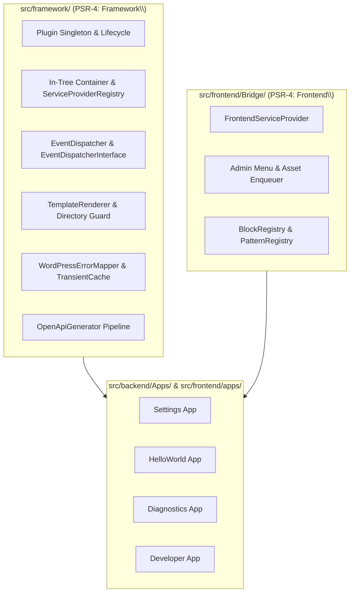

# Framework Kernel and Architecture Documentation Hub

Welcome to the **Framework Kernel** documentation for the **WordPress AI Plugin Development Boilerplate**.

This directory documents the core domain-agnostic plumbing, architectural foundation, dependency injection container, lifecycle orchestrator, event bus, template engine, frontend presentation bridge, and OpenAPI generation engine that power the plugin.

---

## 1. Architectural Role & Boundary

The framework resides in `src/framework/` and `src/frontend/Bridge/`, governed by **ADR-0002**, **ADR-0007**, **ADR-0009**, and **ADR-0011**.

### Core Invariants

1. **Domain-Agnostic Purity:** `src/framework/` contains zero business rules, zero feature flags, and zero hardcoded database option names. It is purely reusable infrastructure.
2. **Zero Heavy Third-Party Bloat:** The framework provides an ultra-lightweight in-tree micro-container and event dispatcher rather than pulling in external frameworks like Symfony or Laravel.
3. **Symmetric Autoloading:** Autoloaded cleanly via Composer PSR-4 prefixes:
   - `AIReady\WPPluginBoilerplate\Framework\` -> `src/framework/`
   - `AIReady\WPPluginBoilerplate\Frontend\` -> `src/frontend/Bridge/`

---

## 2. Directory Contents & Specifications

- [product-charter.md](product-charter.md): The authoritative single source of truth for plugin identity, architectural invariants, and governance.
- [architecture-and-layers.md](architecture-and-layers.md): Complete Hexagonal architecture specification under the Tripartite App-Centric Architecture (ADR-0009).
- [container-and-service-providers.md](container-and-service-providers.md): In-tree micro-DI container (`Container`), `ServiceProviderInterface`, and `ServiceProviderRegistry`.
- [kernel-and-lifecycle.md](kernel-and-lifecycle.md): Plugin orchestrator singleton (`Plugin`), activation (`Activation`), deactivation (`Deactivation`), and runtime compatibility checks (`Compatibility`).
- [event-dispatcher.md](event-dispatcher.md): Domain Event Dispatcher (`EventDispatcher`, `EventDispatcherInterface`), dispatching domain events, and bridging to WordPress `do_action()` hooks.
- [template-renderer.md](template-renderer.md): Safe PHP template evaluation (`TemplateRenderer`), directory traversal defense, and scoped variables.
- [domain-and-application-services.md](domain-and-application-services.md): Clean Hexagonal domain modeling (Aggregates, Value Objects, Domain Events, Repositories, Commands, Queries, Application Services, DTOs).
- [frontend-bridge.md](frontend-bridge.md): Consolidated presentation bridge (`src/frontend/Bridge/`): `FrontendServiceProvider`, `BlockRegistry`, `PatternRegistry`, asset enqueueing, and bootstrap data.
- [error-handling-and-cache.md](error-handling-and-cache.md): `WordPressErrorMapper` (domain exceptions to `WP_Error`) and `TransientCache` with TTL clamping.
- [openapi-generator-engine.md](openapi-generator-engine.md): Deep dive into `src/framework/Rest/OpenApi/`: `OpenApiGenerator` facade, `WordPressRouteInspector`, `OpenApiDocumentFactory`, `OpenApiPathNormalizer`, `OpenApiYamlWriter`, and deterministic serialization.

---

## 3. Class Manifest

| Class / Interface | Namespace | Purpose |
|:---|:---|:---|
| `Plugin` | `AIReady\WPPluginBoilerplate\Framework\Kernel` | Singleton orchestrator managing DI container boot and lifecycle. |
| `Compatibility` | `AIReady\WPPluginBoilerplate\Framework\Kernel` | Pre-flight runtime check for PHP 8.3+ and WordPress 7.0+. |
| `Activation` | `AIReady\WPPluginBoilerplate\Framework\Kernel` | Activation routine, default settings seeding, and rewrite flush. |
| `Deactivation` | `AIReady\WPPluginBoilerplate\Framework\Kernel` | Deactivation routine, transient flushing, and rewrite flush. |
| `Container` | `AIReady\WPPluginBoilerplate\Framework\Container` | Micro in-tree dependency injection container with singleton caching. |
| `ServiceProviderInterface` | `AIReady\WPPluginBoilerplate\Framework\Container` | Interface contract for all modular service providers. |
| `ServiceProviderRegistry` | `AIReady\WPPluginBoilerplate\Framework\Container` | Registry managing two-pass provider registration and boot lifecycle. |
| `EventDispatcherInterface` | `AIReady\WPPluginBoilerplate\Framework\Event` | Domain event publishing contract. |
| `EventDispatcher` | `AIReady\WPPluginBoilerplate\Framework\Event` | In-memory subscriber registry and WordPress `do_action` event bridge. |
| `TemplateRendererInterface` | `AIReady\WPPluginBoilerplate\Framework\View` | Template evaluation contract. |
| `TemplateRenderer` | `AIReady\WPPluginBoilerplate\Framework\View` | Template engine enforcing strict directory traversal guards. |
| `WordPressErrorMapper` | `AIReady\WPPluginBoilerplate\Framework\Support` | Maps typed domain exceptions to standard `WP_Error` objects. |
| `TransientCache` | `AIReady\WPPluginBoilerplate\Framework\Support\Cache` | Transient caching wrapper with automatic hashing and TTL clamping. |
| `OpenApiGenerator` | `AIReady\WPPluginBoilerplate\Framework\Rest\OpenApi` | Master facade generating deterministic OpenAPI 3.1 contracts. |
| `WordPressRouteInspector` | `AIReady\WPPluginBoilerplate\Framework\Rest\OpenApi` | Introspects registered WordPress REST routes from `WP_REST_Server`. |
| `OpenApiDocumentFactory` | `AIReady\WPPluginBoilerplate\Framework\Rest\OpenApi` | Assembles paths, operations, components, and schemas. |
| `OpenApiPathNormalizer` | `AIReady\WPPluginBoilerplate\Framework\Rest\OpenApi` | Normalizes WordPress regex route patterns to OpenAPI templates. |
| `OpenApiYamlWriter` | `AIReady\WPPluginBoilerplate\Framework\Rest\OpenApi` | Deterministic, byte-identical YAML serialization via Symfony YAML. |
| `OpenApiMetadataValidator` | `AIReady\WPPluginBoilerplate\Framework\Rest\OpenApi` | Validates schema integrity and required operation attributes. |
| `FrontendServiceProvider` | `AIReady\WPPluginBoilerplate\Frontend` | Master presentation provider registering UI bridge services. |
| `SettingsAdminMenu` | `AIReady\WPPluginBoilerplate\Frontend\Settings` | Registers top-level admin menu and settings submenu. |
| `SettingsAssets` | `AIReady\WPPluginBoilerplate\Frontend\Settings` | Enqueues React scripts, styles, and localized bootstrap JSON. |
| `SettingsRoute` | `AIReady\WPPluginBoilerplate\Frontend\Settings` | Screen IDs, page slugs, and screen-matching helpers. |
| `SettingsBootstrapData` | `AIReady\WPPluginBoilerplate\Frontend\Settings` | Builds sanitized bootstrap data object for the React container. |
| `BlockRegistry` | `AIReady\WPPluginBoilerplate\Frontend\Block` | Discovers and registers blocks from `src/frontend/apps/*/block.json`. |
| `PatternRegistry` | `AIReady\WPPluginBoilerplate\Frontend\Pattern` | Registers block patterns discovered in `src/frontend/patterns/*.php`. |

---

## 4. Coding Agent Guidance

When working on files in `src/framework/` or `src/frontend/Bridge/`:

### When to Consult This Folder

- Consult `docs/framework/` whenever modifying core container logic, plugin lifecycle, event dispatching, template rendering, or the OpenAPI generator engine.
- Consult before introducing new cross-cutting utilities or altering PSR-4 autoloader structures.

### Non-Negotiable Invariants

1. **No Business Rules in Framework:** Never add aggregate roots, settings keys, or domain models to `src/framework/`. Those belong strictly in `src/backend/Apps/<AppName>/`.
2. **No Presentation in Framework:** Framework classes must never call `wp_enqueue_script`, `add_menu_page`, or output HTML directly.
3. **Presentation Bridge Isolation:** All WordPress presentation hooks and PHP classes belong in `src/frontend/Bridge/` and declare the `AIReady\WPPluginBoilerplate\Frontend` namespace.
4. **Deterministic Generation:** Changes to `src/framework/Rest/OpenApi/` must maintain 100% deterministic, byte-for-byte identical output for `docs/api/openapi.yaml`.
5. **Sub-millisecond Tests:** All framework classes must be thoroughly covered by pure in-memory unit tests under `tests/phpunit/unit/Framework/`.
