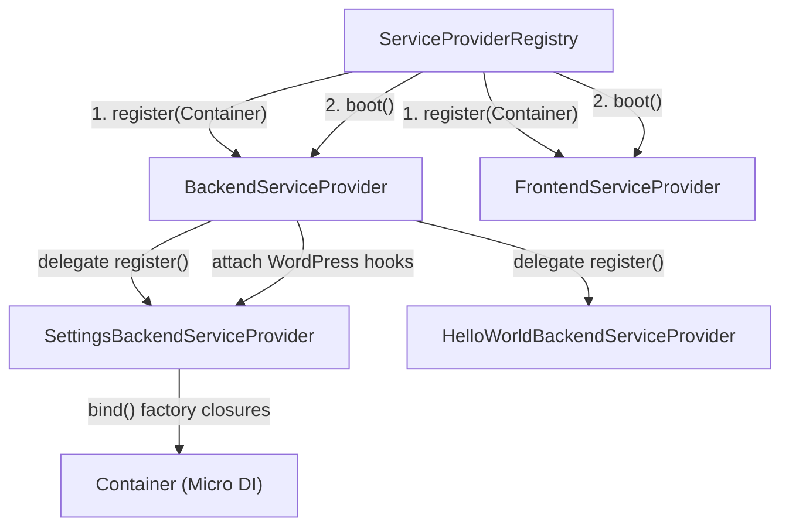

# Dependency Injection Container & Service Providers

This document details the in-tree lightweight Dependency Injection (DI) container and Service Provider architecture used throughout the **WordPress AI Plugin Development Boilerplate**, governed by **ADR-0002**.

---

## 1. Architectural Philosophy

Standard WordPress plugins frequently struggle with object creation, relying on static singletons or global variables that make code untestable. However, pulling large external DI frameworks (such as Symfony DependencyInjection or PHP-DI) introduces heavy dependency overhead, autoloader bloat, and potential namespace conflicts with other plugins.

The boilerplate provides a **zero-dependency, in-tree micro-container** under `src/framework/Container/`:

- Sub-millisecond execution with zero reflection overhead.
- Explicit service binding via lazy factory closures.
- Shared singleton resolution caching.
- Two-pass registration and boot lifecycle across modular service providers.



---

## 2. The `Container` Class (`src/framework/Container/Container.php`)

### 2.1 Service Binding (`bind`)

Binds an interface or class name to a factory closure. By default, factories are evaluated lazily upon first retrieval and cached as singletons:

```php
use AIReady\WPPluginBoilerplate\Framework\Container\Container;
use AIReady\WPPluginBoilerplate\Backend\Apps\Settings\Domain\Repository\SettingsRepositoryInterface;
use AIReady\WPPluginBoilerplate\Backend\Apps\Settings\Infrastructure\WordPressSettingsRepository;

$container->bind(
    SettingsRepositoryInterface::class,
    fn( Container $c ) => new WordPressSettingsRepository()
);
```

### 2.2 Instance Binding (`instance`)

Directly binds an already-instantiated object to a service identifier (ideal for testing mocks or pre-existing singletons like the event dispatcher):

```php
$container->instance( EventDispatcherInterface::class, $mock_dispatcher );
```

### 2.3 Service Resolution (`get`)

Resolves a service from the container. Throws `RuntimeException` if the service ID is unregistered:

```php
$repository = $container->get( SettingsRepositoryInterface::class );
```

### 2.4 Inspection (`has`)

Checks whether a service identifier has been registered:

```php
if ( $container->has( TemplateRendererInterface::class ) ) {
    // Service exists.
}
```

---

## 3. The `ServiceProviderInterface` (`src/framework/Container/ServiceProviderInterface.php`)

All modular providers implement the two-pass lifecycle contract:

```php
namespace AIReady\WPPluginBoilerplate\Framework\Container;

interface ServiceProviderInterface {
    /**
     * Bind services, repositories, and factories into DI container.
     * MUST NOT attach WordPress action or filter hooks.
     */
    public function register( Container $container ): void;

    /**
     * Boot service provider and attach WordPress action/filter hooks.
     * Container bindings are guaranteed to be registered across all providers.
     */
    public function boot(): void;
}
```

### Why the Two-Pass Lifecycle Matters

In a single-pass lifecycle, Provider A might attempt to resolve a dependency provided by Provider B during initialization before Provider B has even registered it.

The two-pass lifecycle guarantees order of operations:

1. **Pass 1 (`register`):** Every provider registers its factories and interfaces in the container. No WordPress hooks (`add_action`, `add_filter`) are attached here.
2. **Pass 2 (`boot`):** Every provider attaches its WordPress hooks and resolves dependencies, knowing all services across the entire application are already bound in the container.

---

## 4. `ServiceProviderRegistry` (`src/framework/Container/ServiceProviderRegistry.php`)

The `ServiceProviderRegistry` manages registration and execution of all providers:

```php
use AIReady\WPPluginBoilerplate\Framework\Container\Container;
use AIReady\WPPluginBoilerplate\Framework\Container\ServiceProviderRegistry;

$container = new Container();
$registry  = new ServiceProviderRegistry( $container );

$registry->register( new BackendServiceProvider() );
$registry->register( new FrontendServiceProvider() );

// Pass 1: Run register() across all providers.
$registry->register_all();

// Pass 2: Run boot() across all providers.
$registry->boot_all();
```

---

## 5. Coding Agent Rules

1. **Lazy Resolution:** Always resolve dependencies lazily inside factory closures (`fn( Container $c ) => ...`). Never instantiate heavy objects in the constructor of a service provider.
2. **Interface Binding:** Bind domain interfaces (`SettingsRepositoryInterface::class`) to concrete infrastructure implementations (`WordPressSettingsRepository::class`) so unit tests can swap implementations seamlessly.
3. **No Direct Singleton Access:** Never introduce static `getInstance()` methods on application services or domain models. Rely entirely on container resolution.
