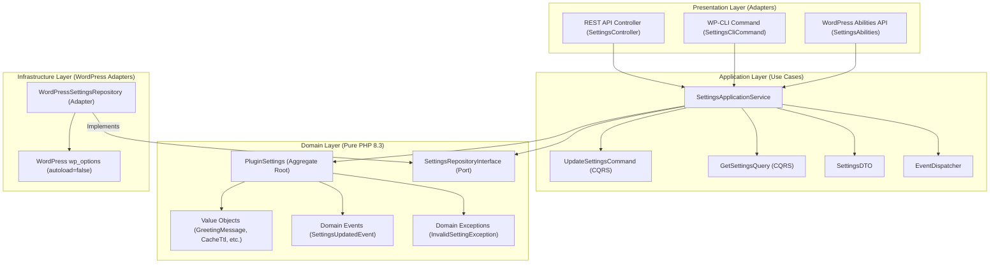

# Domain & Application Services (Clean Hexagonal DDD)

This guide documents the design patterns, class structure, and development practices for implementing pure business logic and use-case application services using **Hexagonal Architecture (Ports and Adapters)** and **Domain-Driven Design (DDD)** in PHP 8.3.

Governed by **ADR-0007** and **ADR-0009**.

---

## 1. Architectural Separation

In Hexagonal Architecture, core business logic is strictly decoupled from WordPress framework mechanics:



---

## 2. The Domain Layer (`src/backend/Apps/<App>/Domain/`)

The Domain Layer encapsulates the rules and invariants of the business. It has **zero dependencies** on WordPress functions (`get_option`, `$wpdb`) or superglobals (`$_POST`, `$_GET`).

### 2.1 Immutable Value Objects

Value objects encapsulate domain primitives, guaranteeing that an invalid domain value can never exist in memory.

**Characteristics:**

- `readonly` properties or `final readonly class`.
- Self-validating in the constructor or factory methods.
- Throw typed domain exceptions upon invariant violation.
- Normalized internal state (trimmed strings, clamped numbers).

```php
namespace AIReady\WPPluginBoilerplate\Backend\Apps\Settings\Domain\ValueObject;

use AIReady\WPPluginBoilerplate\Backend\Apps\Settings\Domain\Exception\InvalidGreetingMessageException;

final class GreetingMessage {
    private const MAX_LENGTH = 255;
    private string $value;

    public function __construct( string $value ) {
        $trimmed = trim( $value );
        if ( '' === $trimmed ) {
            throw new InvalidGreetingMessageException( 'Greeting message cannot be empty.' );
        }
        if ( mb_strlen( $trimmed ) > self::MAX_LENGTH ) {
            throw new InvalidGreetingMessageException(
                sprintf( 'Greeting message exceeds %d characters.', self::MAX_LENGTH )
            );
        }
        $this->value = $trimmed;
    }

    public function value(): string {
        return $this->value;
    }
}
```

### 2.2 Backed Enums for Discrete State

Domain states or policies with a fixed set of options use PHP 8.3 backed enums:

```php
namespace AIReady\WPPluginBoilerplate\Backend\Apps\Settings\Domain\ValueObject;

use AIReady\WPPluginBoilerplate\Backend\Apps\Settings\Domain\Exception\InvalidRetentionPolicyException;

enum DataRetentionPolicy: string {
    case KEEP_ALL   = 'keep_all';
    case DELETE_ALL = 'delete_all';

    public static function from_string( string $value ): self {
        $case = self::tryFrom( $value );
        if ( null === $case ) {
            throw new InvalidRetentionPolicyException( "Invalid retention policy: {$value}" );
        }
        return $case;
    }
}
```

### 2.3 Aggregate Roots

Aggregate roots encapsulate a cluster of entities and value objects, enforcing transactional consistency and recording domain events:

```php
namespace AIReady\WPPluginBoilerplate\Backend\Apps\Settings\Domain\Model;

class PluginSettings {
    private GreetingMessage $greeting_message;
    private FeatureFlag $enable_feature;
    private Description $description;
    private RestDebug $rest_debug;
    private CacheTtl $cache_ttl;
    private DataRetentionPolicy $retention_policy;

    /** @var object[] */
    private array $recorded_events = array();

    public function update( array $new_values ): void {
        // Enforce state transitions and record domain events
        $this->recorded_events[] = new SettingsUpdatedEvent( $new_values, array_keys( $new_values ) );
    }

    public function release_events(): array {
        $events = $this->recorded_events;
        $this->recorded_events = array();
        return $events;
    }
}
```

### 2.4 Domain Ports (Repository Interfaces)

The domain defines persistence interfaces without knowing how or where data is stored:

```php
namespace AIReady\WPPluginBoilerplate\Backend\Apps\Settings\Domain\Repository;

use AIReady\WPPluginBoilerplate\Backend\Apps\Settings\Domain\Model\PluginSettings;

interface SettingsRepositoryInterface {
    public function get(): PluginSettings;
    public function save( PluginSettings $settings ): void;
}
```

---

## 3. The Application Layer (`src/backend/Apps/<App>/Application/`)

The Application Layer coordinates use cases, dispatches commands, and maps domain entities to Data Transfer Objects (DTOs).

### 3.1 CQRS-Lite Commands & Queries

- **Commands:** Mutating intentions (`UpdateSettingsCommand`).
- **Queries:** Read-only requests (`GetSettingsQuery`).
- **DTOs:** Plain, immutable data carriers passed across layer boundaries.

### 3.2 Application Services

```php
namespace AIReady\WPPluginBoilerplate\Backend\Apps\Settings\Application;

class SettingsApplicationService {
    public function __construct(
        private SettingsRepositoryInterface $repository,
        private EventDispatcherInterface $dispatcher
    ) {}

    public function get_settings( GetSettingsQuery $query ): SettingsDTO {
        $settings = $this->repository->get();
        return SettingsDTO::from_entity( $settings );
    }

    public function update_settings( UpdateSettingsCommand $command ): SettingsDTO {
        $settings = $this->repository->get();
        $settings->update( $command->to_array() );
        $this->repository->save( $settings );

        foreach ( $settings->release_events() as $event ) {
            $this->dispatcher->dispatch( $event );
        }

        return SettingsDTO::from_entity( $settings );
    }
}
```

---

## 4. Coding Agent Rules

1. **Domain Isolation:** Never write WordPress function calls (`get_option`, `update_option`, `is_admin`) in `src/backend/Apps/*/Domain/`.
2. **Exceptions Over Booleans:** Domain models and Value Objects must throw typed exceptions rather than returning `false` or `null` on validation errors.
3. **Sub-millisecond Tests:** Domain units must be testable without bootstrapping WordPress or Docker using PHPUnit in `tests/phpunit/unit/`.
