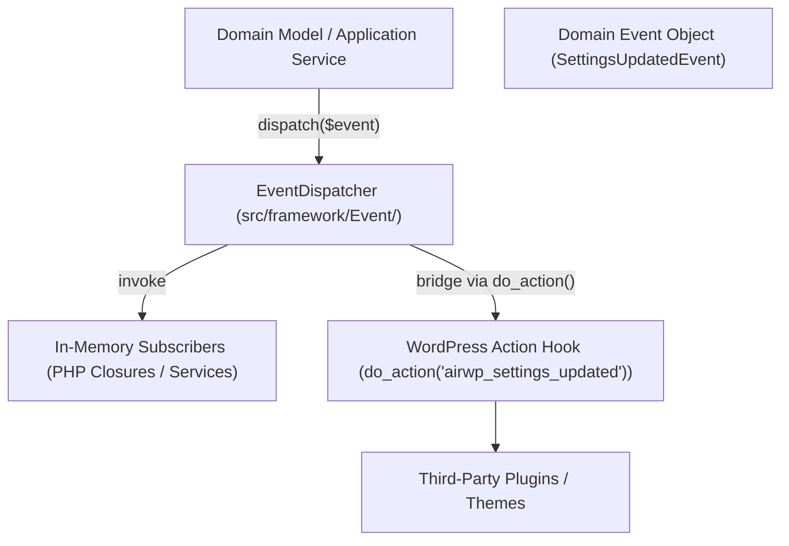

# Domain Event Dispatcher & WordPress Action Bridge

This document details the Domain Event Dispatcher architecture under `src/framework/Event/`, explaining how pure domain events are dispatched in-memory and bridged to WordPress action hooks.

---

## 1. Architectural Purpose

In a Clean Hexagonal / DDD application, domain models and application services fire domain events when important state transitions occur (e.g., `SettingsUpdatedEvent`, `RetentionPolicyChangedEvent`).

However, standard WordPress plugins also need to expose extensibility points to third-party developers, themes, and other plugins using WordPress action hooks (`do_action`).

The `EventDispatcher` solves both problems simultaneously:



---

## 2. Contracts and Classes

### 2.1 `EventDispatcherInterface` (`src/framework/Event/EventDispatcherInterface.php`)

Defines the contract for subscribing and dispatching events:

```php
namespace AIReady\WPPluginBoilerplate\Framework\Event;

interface EventDispatcherInterface {
    /**
     * Subscribe a callback listener to a specific event class.
     *
     * @param string   $event_class Fully qualified class name of the event.
     * @param callable $listener    Callback receiving the event object.
     */
    public function subscribe( string $event_class, callable $listener ): void;

    /**
     * Dispatch a domain event to all subscribers and WordPress action hooks.
     *
     * @param object $event Domain event instance.
     */
    public function dispatch( object $event ): void;
}
```

### 2.2 `EventDispatcher` (`src/framework/Event/EventDispatcher.php`)

- **In-Memory Subscribers:** Listeners are registered by fully qualified class name.
- **Fast Execution:** Dispatches synchronously in-memory with sub-millisecond execution.
- **WordPress Hook Bridging:** Automatically checks `function_exists( 'do_action' )` and fires namespaced WordPress hooks (e.g., `airwp_settings_updated`, `airwp_retention_policy_changed`).

---

## 3. Example Usage

### Publishing a Domain Event

Inside an application service:

```php
use AIReady\WPPluginBoilerplate\Backend\Apps\Settings\Domain\Event\SettingsUpdatedEvent;
use AIReady\WPPluginBoilerplate\Framework\Event\EventDispatcherInterface;

class SettingsApplicationService {
    public function __construct(
        private EventDispatcherInterface $dispatcher
    ) {}

    public function update_settings( array $data ): void {
        // ... persist settings ...
        $event = new SettingsUpdatedEvent( $data, array_keys( $data ) );
        $this->dispatcher->dispatch( $event );
    }
}
```

### Listening to Internal Events (In-Memory)

Inside another service provider or boot sequence:

```php
$dispatcher->subscribe(
    SettingsUpdatedEvent::class,
    function( SettingsUpdatedEvent $event ) {
        // Run cache invalidation or telemetry logging
    }
);
```

### Listening via WordPress Action Hooks

Third-party plugins can hook into the standard WordPress action:

```php
add_action( 'airwp_settings_updated', function( array $payload, array $changed_keys ) {
    error_log( 'Settings were modified for keys: ' . implode( ', ', $changed_keys ) );
}, 10, 2 );
```

---

## 4. Coding Agent Rules

1. **Domain Events are Immutable:** Domain events must be PHP classes with `readonly` properties or getters. They must never mutate state.
2. **Never Call `do_action` Directly in Domain:** Domain classes and Application services must never call `do_action()` directly. They must always use `$dispatcher->dispatch( $event )`.
3. **Document Action Hooks:** When bridging a new domain event to WordPress, document the hook name, parameter types, and descriptions in the `EventDispatcher` docblock so developers and IDEs can discover them.
