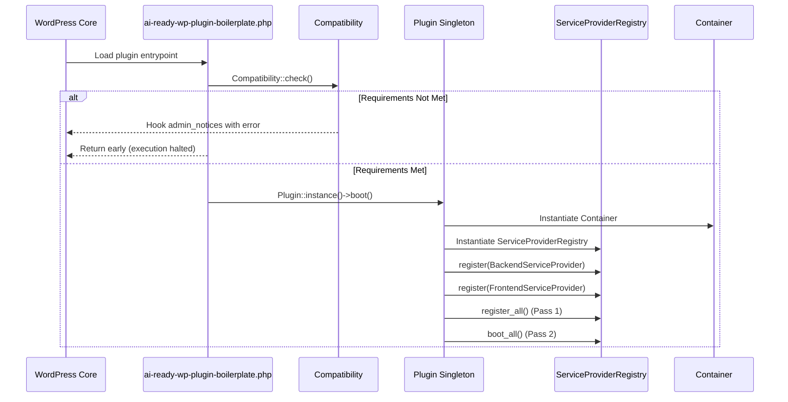

# Plugin Kernel & Lifecycle Management

This document details the plugin's central orchestrator (`Plugin`), environment compatibility verification (`Compatibility`), activation procedures (`Activation`), and deactivation cleanup (`Deactivation`) under `src/framework/Kernel/`.

---

## 1. Lifecycle Architecture

The plugin lifecycle follows a strict sequence from initial PHP file loading to complete runtime execution:



---

## 2. Core Kernel Classes

### 2.1 `Plugin` Singleton (`src/framework/Kernel/Plugin.php`)

The `Plugin` class is the central orchestrator of the entire plugin:

- **Idempotent Boot:** Guaranteed to boot only once via internal `$booted` flag.
- **Service Container:** Owns the root `Container` instance.
- **Provider Registration:** Instantiates and coordinates `BackendServiceProvider` and `FrontendServiceProvider`.
- **Testing Reset:** Exposes `Plugin::reset()` allowing unit tests to reset the singleton state and run multiple isolation tests in a single process.

```php
use AIReady\WPPluginBoilerplate\Framework\Kernel\Plugin;

// Access the singleton
$plugin = Plugin::instance();

// Boot the plugin
$plugin->boot();

// Retrieve the DI container
$container = $plugin->container();
```

### 2.2 `Compatibility` Checker (`src/framework/Kernel/Compatibility.php`)

Guards the plugin against running on incompatible hosting environments:

- **Constants:** `MIN_PHP_VERSION = '8.3'`, `MIN_WP_VERSION = '7.1'`.
- **Graceful Failure:** If either requirement fails, it hooks into WordPress `admin_notices` to render a styled, localized notice without crashing the site.
- **Activation Block:** Called during activation to block activation via `wp_die` if system requirements are unmet.

### 2.3 `Activation` Handler (`src/framework/Kernel/Activation.php`)

Executes only when the plugin is activated via the WordPress admin or WP-CLI:

- **Requirement Verification:** Re-checks `Compatibility::check()`.
- **Default Seed Data:** Seeds default options (`airwp_settings`) if not already present, with explicit fallback values for greeting message, feature flags, cache TTL, and data retention policy.
- **Rewrite Flush:** Flushes rewrite rules if custom post types or rewrite endpoints are declared.

### 2.4 `Deactivation` Handler (`src/framework/Kernel/Deactivation.php`)

Executes only when the plugin is deactivated:

- **Transient Cleanup:** Flushes temporary plugin transients to prevent stale data.
- **Rewrite Flush:** Cleans up rewrite rules.
- **Data Preservation:** Deactivation **never** deletes user data or drops database tables. Full data deletion is reserved exclusively for `uninstall.php` respecting the user's data retention policy.

---

## 3. Coding Agent Guidance

1. **Keep Root File Thin:** Never place procedural hooks, business logic, or REST route registrations in `ai-ready-wp-plugin-boilerplate.php`. The root file only defines constants and delegates to `Plugin::instance()->boot()`.
2. **Never Delete Data on Deactivation:** Deactivation must be 100% reversible. Only `uninstall.php` may purge options or user settings.
3. **Use `Plugin::reset()` in Tests:** When authoring PHPUnit tests that boot the plugin or inspect container bindings, always invoke `Plugin::reset()` in `setUp()` or `tearDown()` to avoid test pollution.
