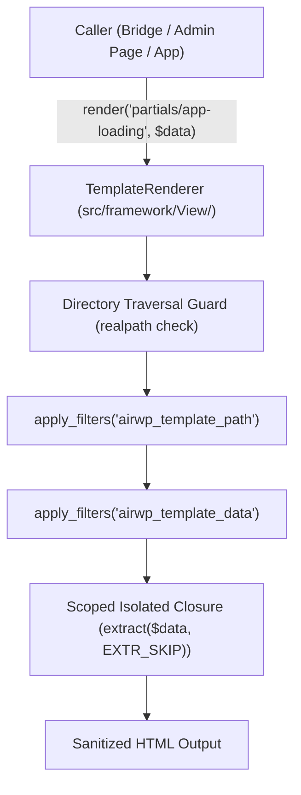

# Safe Template Renderer

This document details the template rendering engine (`TemplateRenderer`) under `src/framework/View/`, explaining how PHP template files are safely loaded with directory traversal guards, scoped variables, and theme-overridable filter hooks.

---

## 1. Architectural Philosophy

Standard WordPress plugins often render HTML templates via raw `include` or `require` calls with global variables. This introduces severe security vulnerabilities:

- **Path Traversal / LFI:** Unsanitized template paths could expose arbitrary system files.
- **Variable Leakage:** Templates might accidentally overwrite global WordPress variables like `$post` or `$wpdb`.
- **Untestable Views:** Hard to capture and assert template output in unit tests.

`TemplateRenderer` provides an isolated, secure template evaluation mechanism:



---

## 2. Contracts and Core Methods

### 2.1 `TemplateRendererInterface` (`src/framework/View/TemplateRendererInterface.php`)

```php
namespace AIReady\WPPluginBoilerplate\Framework\View;

interface TemplateRendererInterface {
    /**
     * Render a template and return its output as a string.
     *
     * @param string               $template Template relative path (without .php).
     * @param array<string, mixed> $data     Variables to inject into the template.
     * @return string Evaluated HTML markup.
     */
    public function render( string $template, array $data = array() ): string;

    /**
     * Locate full path to template file with security validation.
     *
     * @param string $template Template relative path.
     * @return string Absolute file path.
     */
    public function locate_template( string $template ): string;
}
```

### 2.2 Security and Traversal Guards

The renderer checks path resolution before attempting to evaluate any template:

1. Appends `.php` to the relative template slug.
2. Resolves real canonical filesystem path via `realpath()`.
3. Verifies that the resolved path starts with the configured `$base_dir` (`src/frontend/templates/` or app template directory).
4. Throws typed `InvalidArgumentException` if directory traversal (`../`) is detected or if the file does not exist.

### 2.3 Variable Isolation

Variables passed in the `$data` array are extracted using `extract( $data, EXTR_SKIP )` inside an isolated closure:

- No leakage into the surrounding scope.
- `EXTR_SKIP` prevents variables from overwriting the renderer's internal variables.

---

## 3. Extensibility & Theme Overrides

WordPress themes and add-on plugins can customize template paths and injected data via filter hooks:

- `airwp_template_path`: Overrides the resolved filesystem path (allowing themes to provide custom overrides in `my-theme/ai-ready-wp/`).
- `airwp_template_data`: Modifies the injected associative data array before evaluation.

---

## 4. Coding Agent Rules

1. **Always Use `TemplateRenderer`:** Never use bare `include`, `require`, or `include_once` in frontend bridges or controllers.
2. **Do Not Include File Extension:** Pass template names without `.php` extension (e.g., `$renderer->render( 'partials/app-loading', $data )`).
3. **Keep Templates Dumb:** Templates should only echo sanitized variables (`esc_html`, `esc_attr`). Business logic, database queries, and REST calls must never reside inside template files.
