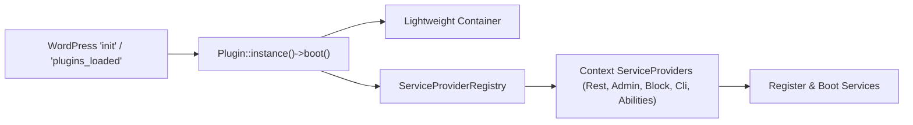

# Architecture and Layer Boundaries

This document defines the complete repository structure and software architecture for the **WordPress AI Plugin Development Boilerplate**.

It follows **Domain-Driven Design (DDD)** and **Hexagonal (Ports & Adapters)** principles for PHP backend code, combined with modern **React 18** and the **WordPress Design System (WPDS)** for the frontend admin experience, and modern **Block API v3 with the Interactivity API** for Gutenberg blocks.

---

## 1. Complete Directory Layout

```text
ai-ready-wp-plugin-boilerplate/
├── .cursor/                                 # Cursor IDE configuration & AI instructions
│   ├── rules/                               # Workspace-applied rules (*.mdc)
│   └── skills/                              # Active agent skills (WordPress, engineering, custom)
├── assets/                                  # Frontend source and compiled assets
│   ├── css/                                 # Static or legacy stylesheets
│   ├── images/                              # Plugin icons, SVGs, static graphics
│   └── src/                                 # Modern TypeScript/React source code
│       ├── apps/                            # Independent React admin applications
│       │   └── settings/                    # Plugin settings & diagnostics app
│       │       ├── components/
│       │       ├── App.tsx
│       │       └── index.tsx                # Webpack entrypoint
│       └── shared/                          # Reusable UI primitives, hooks, API client, types
│           ├── components/                  # WPDS UI primitives (CardLayout, SectionHeader)
│           ├── hooks/                       # Custom hooks (useSettingsApi)
│           └── types/                       # Shared TypeScript definitions
├── blocks/                                  # Gutenberg blocks (Block API v3)
│   └── hello-world/                         # Hello World interactive block
│       ├── block.json                       # Metadata with supports.interactivity: true
│       ├── edit.tsx                         # Gutenberg editor inspector controls & preview
│       ├── save.tsx                         # Server-side HTML directives (data-wp-interactive)
│       ├── view.ts                          # Interactivity API client store
│       └── style.css                        # Scoped block frontend styles
├── bruno/                                   # Git-native Bruno REST API test collection
│   ├── 00 Smoke/                            # Health check & REST index
│   ├── 03 Settings/                         # Settings schema endpoints
│   ├── environments/Local.bru               # Environment variables (Base URL, App Password)
│   └── bruno.json                           # Bruno collection root metadata
├── build/                                   # Compiled Webpack output (JS/CSS/asset-manifests)
├── docs/                                    # Authoritative documentation hub
│   ├── general/                             # Product charter, architecture, ADR guide
│   ├── boilerplate-development/             # Toolchain, testing, versioning, devops
│   ├── feature-development/                 # Guides for authoring domain services, blocks, UI, CLI
│   ├── adr/                                 # Architectural Decision Records (0001-*.md & README.md)
│   ├── api/                                 # OpenAPI specifications (openapi.yaml)
│   └── plans/                               # Phased implementation plans (XX-<name>/)
├── patterns/                                # Block patterns registered with WordPress
│   └── interactive-showcase.php             # Reusable interactive layout pattern
├── scripts/                                 # Operational automation scripts
│   ├── check-environment.mjs                # Pre-flight environment verifier CLI
│   ├── increase-plugin-version.mjs          # Automated SemVer synchronization CLI
│   ├── record-unreleased-change.mjs         # CLI helper to stage unreleased changelog notes
│   ├── run-rest-tests.mjs                   # Cross-platform Bruno test runner
│   ├── scaffold-plugin.mjs                  # Interactive plugin rebranding & scaffolding CLI
│   ├── sync-agent-skills.mjs                # Downloader & updater for external agent skills
│   └── lib/                                 # Helper libraries for versioning and scaffolding
├── src/                                     # Clean DDD PHP Backend (PSR-4 autoloaded)
│   ├── Abilities/                           # WordPress Abilities API registration for AI agents
│   ├── Admin/                               # Admin menu, asset enqueueing, bootstrap data
│   ├── Block/                               # Block API v3 & Interactivity API registration
│   ├── Bootstrap/                           # Container, ServiceProvider, Plugin singleton
│   ├── Cli/                                 # WP-CLI commands (settings-get, settings-update, doctor)
│   ├── Diagnostics/                         # System health, telemetry, diagnostics services
│   │   ├── Domain/                          # DiagnosticsProviderInterface
│   │   ├── Application/                     # DiagnosticsService & DiagnosticsDTO
│   │   └── Infrastructure/                  # WordPressDiagnosticsProvider
│   ├── Event/                               # Domain event dispatcher & WordPress action bridging
│   ├── Rest/                                # REST controllers & centralized error mappers
│   ├── Settings/                            # Settings Bounded Context
│   │   ├── Domain/                          # Value Objects, Aggregate Root, Domain Events, Exceptions
│   │   ├── Application/                     # CQRS Commands, Queries, DTOs, SettingsApplicationService
│   │   └── Infrastructure/                  # WordPressSettingsRepository (autoload=false)
│   ├── Support/                             # Shared utilities, TransientCache, WordPressErrorMapper
│   └── Upgrade/                             # dbDelta migrations & version upgrade runner
├── templates/                               # PHP root mounting templates for React apps
├── tests/                                   # Automated testing pyramid
│   ├── e2e/playwright/                      # Playwright E2E and visual regression suites
│   ├── js/                                  # Jest + RTL unit tests for TypeScript & React
│   ├── node/environment/                   # Environment checker unit tests
│   ├── node/scaffolding/                    # Scaffolding integration tests
│   ├── node/versioning/                     # Automated version sync integration tests
│   └── phpunit/                             # PHPUnit unit and integration suites
├── tools/                                   # Development scripts and CLI helpers
│   └── wp-env/after-start.mjs               # wp-env post-start automated setup script
├── .editorconfig                            # Shared formatting rules across editors
├── .env.example                             # Environment variable template
├── .markdownlint-cli2.jsonc                 # Markdown quality linter config
├── .wp-env.json                             # WordPress container environment definition
├── AGENTS.md                                # Root instructions for coding agents
├── blueprint.json                           # Declarative WordPress Playground blueprint
├── composer.json                            # PHP dependencies, PSR-4 autoload, WPCS scripts
├── jest.config.js                           # Frontend unit test configuration
├── package.json                             # Node dependencies, scripts, engines constraint
├── phpcs.xml.dist                           # WordPress Coding Standards ruleset
├── phpstan.neon.dist                        # PHPStan Level 6+ static analysis ruleset
├── phpunit.xml.dist                         # PHPUnit testsuites definition
├── playwright.config.ts                     # Playwright runner and visual regression config
├── ai-ready-wp-plugin-boilerplate.php       # Main WordPress plugin bootstrap file
├── tsconfig.json                            # TypeScript compilation configuration
├── uninstall.php                            # Safe de-provisioning & retention policy handler
├── webpack.config.js                        # Multi-entrypoint Webpack configuration
└── wp-cli.yml                               # Apache & WP-CLI runner configuration
```

---

## 2. Clean DDD PHP Backend Architecture

All PHP source code lives under `src/` and maps to the PSR-4 namespace `AIReady\WPPluginBoilerplate\`.

### 2.1 The Bootstrap Context (`src/Bootstrap/`)

Rather than dumping procedural hooks into the root plugin file, the plugin uses an object-oriented kernel with a zero-dependency Dependency Injection container:



- **`Plugin.php`:**
  - Implemented as a singleton.
  - Hooks `boot()` to WordPress `plugins_loaded` (runs compatibility checks).
  - Hooks `on_init()` to WordPress `init` to instantiate the container and boot service providers.
- **`Container.php`:**
  - A lightweight, PSR-11-style DI container.
  - Supports binding singletons (`bind()`), factory callbacks, and dependency resolution (`get()`, `has()`).
  - Completely avoids heavy external Composer dependencies (e.g. Laravel Container or PHP-DI) that cause version conflicts in WordPress.
- **`ServiceProvider.php` (Interface) & `ServiceProviderRegistry.php`:**
  - Standard provider lifecycle:

    ```php
    interface ServiceProvider {
        public function register( Container $container ): void;
        public function boot(): void;
    }
    ```

  - Providers isolate functional boundaries: `RestServiceProvider`, `AdminServiceProvider`, `BlockServiceProvider`, `CliServiceProvider`, `AbilitiesServiceProvider`.

### 2.2 Bounded Contexts: Domain Layer (`src/<Context>/Domain/`)

The domain layer encapsulates business rules, entity models, and domain invariants. **It must never depend on WordPress database functions (`wpdb`), global functions, or HTTP superglobals.**

- **Immutable Value Objects:**
  - Domain primitives are represented by typed value objects rather than raw strings or ints (`GreetingMessage`, `FeatureFlag`, `Description`, `RestDebug`, `CacheTtl`, and backed enum `DataRetentionPolicy`).
  - Constructors validate invariants, normalize inputs (e.g. trimming whitespace, checking length bounds), and throw typed Domain Exceptions (`InvalidGreetingMessageException`, `InvalidCacheTtlException`).
- **Domain Aggregates:**
  - Aggregate roots (`PluginSettings.php`) maintain internal state consistency, enforce transition rules, and record domain events.
- **Domain Events:**
  - Explicit event objects (`SettingsUpdatedEvent`, `RetentionPolicyChangedEvent`) record state transitions and timestamps.
- **Repository Interfaces:**
  - The domain defines the storage contract as a pure PHP interface (`SettingsRepositoryInterface.php`), describing methods like `get(): PluginSettings` and `save( PluginSettings $settings ): void`.

### 2.3 Application Layer (`src/<Context>/Application/`)

The application layer orchestrates use cases. It coordinates domain objects, infrastructure services, and event dispatching:

- **CQRS-Lite (Command / Query Separation):**
  - **Commands:** Represent state-mutating requests (`UpdateSettingsCommand`).
  - **Queries:** Represent read-only data requests (`GetSettingsQuery`).
- **Data Transfer Objects (DTOs):**
  - Strictly typed, immutable DTOs format data crossing application boundaries (`SettingsDTO`, `DiagnosticsDTO`).
- **Application Services:**
  - `SettingsApplicationService` and `DiagnosticsService` execute commands and queries, validating user capabilities, enforcing domain rules, coordinating persistence, and releasing domain events.
- **Event Dispatcher (`src/Event/`):**
  - `EventDispatcher` receives domain events from aggregates, notifies internal in-memory subscribers, and bridges them to standard WordPress action hooks (`airwp_settings_updated`, `airwp_retention_policy_changed`).

### 2.4 Infrastructure Layer (`src/<Context>/Infrastructure/`, `src/Support/`)

The infrastructure layer implements interfaces defined by the domain using WordPress-specific APIs:

- **WordPress Repositories:**
  - `WordPressSettingsRepository.php`: Implements `SettingsRepositoryInterface`. Serializes Domain Aggregates to `wp_options` under `airwp_settings` with an explicit `autoload => false` performance policy.
- **Diagnostics Provider:**
  - `WordPressDiagnosticsProvider.php`: Implements `DiagnosticsProviderInterface`, querying runtime telemetry (PHP version, WP version, DB connectivity, environment type).
- **Performance & Cache Utilities (`src/Support/Cache/`):**
  - `TransientCache.php`: Wraps the WordPress Transients API with strict key length hashing, prefixing, and TTL clamping.
- **Centralized Error Mapping (`src/Support/`):**
  - `WordPressErrorMapper.php`: Intercepts Domain and Application exceptions (`InvalidSettingException` → `400`, `InvalidArgumentException` → `400`, `RuntimeException` → `500`) and converts them into standardized `WP_Error` objects.

### 2.5 Multi-Channel Presentation Adapters (Shared Core Pattern)

All presentation layers remain thin and delegate directly to shared Application Services:

- **REST API Layer (`src/Rest/`):**
  - `SettingsController` extends `WP_REST_Controller`, validating JSON payloads and delegating to `SettingsApplicationService`.
- **WP-CLI Layer (`src/Cli/`):**
  - `PluginCliCommand` registers commands (`wp ai-ready settings-get`, `wp ai-ready settings-update`, `wp ai-ready doctor`), formatting output into `table`, `json`, or `yaml`.
- **WordPress Abilities API (`src/Abilities/`):**
  - `AbilitiesServiceProvider` registers capabilities under category `ai-ready-wp` (`get-settings`, `update-settings`, `get-diagnostics`) for autonomous AI coding and management agents.

---

## 3. Frontend & Block Architecture

### 3.1 Gutenberg Block API v3 & Interactivity API (`blocks/`)

Gutenberg blocks adhere to modern Block API v3 standards:

- **Metadata (`block.json`):**
  - Declares `apiVersion: 3` and `supports.interactivity: true`.
  - Maps `editorScript`, `viewScriptModule` (`view.js`), and styles.
- **Client-Side Store (`view.ts`):**
  - Declares state getters and interactive actions via `@wordpress/interactivity`.
- **Server Directives (`save.tsx`):**
  - Declares directives (`data-wp-interactive`, `data-wp-context`, `data-wp-on--click`, `data-wp-bind`, `data-wp-text`).

### 3.2 WordPress Design System (WPDS) React 18 Admin (`assets/src/`)

Adheres to proven design patterns (ADR-0005, ADR-0008):

- **Repository / Adapter Pattern (`assets/src/shared/api/SettingsApiClient.ts`):**
  - Encapsulates network operations using `@wordpress/api-fetch`, reading nonces and root URLs securely, normalizing payloads, and mapping errors to typed failure contracts.
- **State Reducer Hook (`assets/src/shared/hooks/useSettingsForm.ts`):**
  - Custom hook managing form state, dirty tracking, immutability, optimistic updates, and reset routines.
- **Container / Presenter Pattern:**
  - `App.tsx` acts as the orchestrating container.
  - Presentational components (`SettingsShell`, `GeneralSection`, `AdvancedSection`, `DiagnosticsSection`) receive typed props and emit event callbacks with zero direct network coupling.
- **Compound WPDS UI Primitives (`assets/src/shared/components/`):**
  - `CardLayout` (`CardLayout.Header`, `CardLayout.Body`, `CardLayout.Footer`).
  - `SectionHeader` with badge icons, subtitles, and actions.
  - `NoticeBanner`, `LoadingSkeleton`, and `ErrorBoundary`.
- **PHP Mount Templates & View Strategy (`templates/` & `TemplateRenderer`):**
  - Renders the primary `<h1>` and mount container via `TemplateRenderer` with path traversal protection and filterable paths.
  - Enqueues scripts with localized bootstrap data (`window.airwpAdminBootstrap`).
