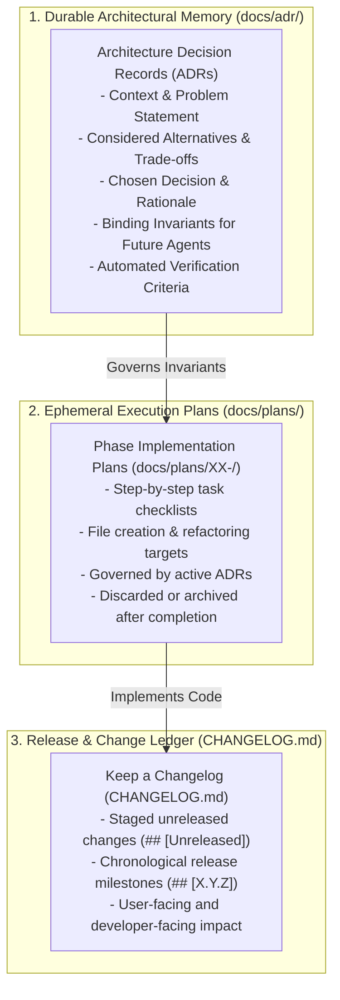
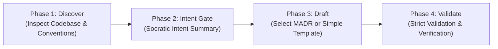

# Architecture Decision Records (ADRs) & Agentic Governance

Architecture Decision Records (ADRs) serve as the **durable architectural memory** of this plugin boilerplate. They provide autonomous AI coding agents and human engineers with explicit, machine-verifiable constraints, preventing context drift, tribal knowledge fragmentation, and accidental architectural regression.

---

## 1. Core Philosophy: Durable Memory vs. Ephemeral Execution

A common failure mode in AI-assisted development is confusing **architectural invariants** (*why* something was decided and *what boundaries exist*) with **implementation plans** (*how* to write the code today).

To eliminate duplication, ambiguity, and dual-source drift, this boilerplate enforces a strict three-tier division of responsibility:



### Why `docs/decision-log.md` Was Retired

Previously, `docs/decision-log.md` tracked a mix of release notes (`REL-X.Y.Z`) and brief decision summaries. This introduced two overlapping sources of truth:

1. Release history was split between `CHANGELOG.md` and `decision-log.md`.
2. Decisions were split between brief markdown bullets and formal architectural records.

**The boilerplate resolves this cleanly:**

- `docs/adr/` owns all architectural decisions, invariants, and trade-offs.
- `CHANGELOG.md` owns all incremental changes and release milestones.
- `docs/decision-log.md` is retired and removed.

---

## 2. The ADR-Worthiness Gate & Classification States

Before authoring an ADR or beginning a feature plan, agents and developers must evaluate whether a decision is **architecturally significant**. Every technical choice is classified into one of five discrete states:

| Classification State | Criteria | Required Action |
| --- | --- | --- |
| `ADR_REQUIRED` | High reversal cost, schema/table additions, external dependencies, or security architecture. | **Halt planning/coding; draft and accept the ADR in `docs/adr/` first.** |
| `ADR_RECOMMENDED` | Multiple competing architectural alternatives with non-obvious trade-offs. | Propose the ADR to the developer before committing to a pattern. |
| `ADR_NOT_NEEDED` | Routine code, standard WordPress API calls, bug fixes, or minor styling. | Proceed directly to implementation. |
| `EXISTING_ADR_GOVERNS` | A prior accepted ADR already dictates this exact pattern. | Obey its constraints; cite the ADR; do not create duplicate records. |
| `EXISTING_ADR_MAY_REQUIRE_SUPERSESSION` | The proposed change directly contradicts an accepted ADR. | Draft a new ADR that explicitly supersedes the prior one. |

### 2.1 Positive Criteria: When an ADR is REQUIRED or RECOMMENDED

A decision warrants an ADR if it meets **at least one** condition:

1. **High Reversal Cost:** Reversing the decision in 6 months would require major database migration, architectural refactoring, or downtime (e.g. custom tables vs. post meta).
2. **Cross-Cutting Architectural Impact:** Dictates patterns that multiple modules must follow (e.g. dependency injection, error-handling conventions, public hooks).
3. **Data Model Architecture:** Introducing custom SQL tables, schema migrations, options serialization, or multisite data isolation models.
4. **Significant Dependencies:** Adding a third-party Composer package, npm library, or external cloud SDK.
5. **Security Boundaries:** Custom capability hierarchies, external token/credential storage, webhook authentication schemes, or customer data isolation.
6. **Integration Contracts:** Public REST API route namespaces, webhook payloads, or breaking API deprecations.
7. **Ecosystem & Host Compatibility:** WooCommerce High-Performance Order Storage (HPOS), Action Scheduler vs. WP-Cron, or Gutenberg block rendering paradigms.

### 2.2 Negative Anti-Spam Criteria: When an ADR is NOT Needed

To prevent "ADR spam" and repository noise, never author an ADR for:

- Routine bug fixes, edge-case null checks, or edge-case input guards.
- Cosmetic CSS styling or layout adjustments adhering to WPDS tokens.
- Typo fixes in documentation or gettext translation strings.
- Standard WordPress API calls (`add_action()`, `register_post_type()`, `wp_verify_nonce()`, `sanitize_text_field()`).
- Patch dependency bumps within established version constraints.
- Changes already captured under `## [Unreleased]` in `CHANGELOG.md`.

---

## 3. In-Session Proactive Triggers for Coding Agents

When an AI coding agent is implementing a task and hits any of the following triggers, it **MUST PAUSE** rather than silently committing an architectural change:

```text
[CODING SESSION IN PROGRESS]
             │
             ▼
1. About to add a new Composer or npm package?
2. About to create a custom SQL table or run dbDelta()?
3. About to switch from WP-Cron to Action Scheduler?
4. About to alter a public REST API route schema?
5. About to introduce a pattern that contradicts docs/adr/?
             │
             ├──────────────────────────┐
            YES                         NO
             │                          │
             ▼                          ▼
     [PAUSE SESSION]            [PROCEED WITH TDD]
1. State the architectural fork.   Continue implementation
2. Summarize trade-offs.           and stage unreleased notes
3. Draft ADR via `npm run adr:new`. in `CHANGELOG.md`.
4. Validate via `npm run adr:validate`.
```

---

## 4. The Four-Phase ADR Lifecycle

Every ADR in this repository moves through four deterministic phases:



### Phase 1: Codebase Discovery (Context First)

Always inspect the project characteristics and established numbering style before drafting:

```bash
# Detect project traits (WP/PHP constraints, tables, cron, blocks)
npm run adr:detect

# Detect existing ADR conventions (numbering style, next sequence ID, index)
node .cursor/skills/wp-architecture-decision-records/scripts/detect-adr-conventions.mjs --json
```

### Phase 2: Intent Capture & Intent Summary Gate

Before writing the record, formulate the **Intent Summary**:

- **Title:** Action-oriented title (e.g. *Use Action Scheduler for Webhook Deliveries*).
- **Trigger:** Why are we making this decision now?
- **Decision & Rationale:** Chosen option and trade-off justification.
- **Alternatives Rejected:** Competing patterns evaluated and why they were rejected.
- **Architectural Constraints:** Binding invariants future coding agents must preserve.
- **Verification:** Concrete, executable test or assertion.
- **Reconsider When:** Measurable metric or event that triggers revisiting this choice.

### Phase 3: Template Selection & Authoring

Use the scaffolding CLI to create the file:

```bash
# Lean, straightforward decisions
npm run adr:new -- -t "Use Action Scheduler for Webhook Deliveries" --template simple --update-index

# Complex decisions with multiple competing options and drivers
npm run adr:new -- -t "Adopt Custom Tables for Analytics Aggregation" --template madr --update-index
```

### Phase 4: Validation & Agent Readiness

Validate that the ADR is complete, contains no lingering template placeholders, and complies with schema requirements:

```bash
npm run adr:validate -- --strict
```

---

## 5. Developer & Agent CLI Commands

The repository provides first-class npm scripts wrapping the ADR skill tooling:

| Command | Purpose | Example |
| --- | --- | --- |
| `npm run adr:new` | Scaffolds a new ADR with sequential numbering and auto-updates `docs/adr/README.md`. | `npm run adr:new -- -t "Cache REST Responses" --template simple` |
| `npm run adr:validate` | Validates markdown schema, YAML frontmatter, and cross-references. | `npm run adr:validate -- --strict` |
| `npm run adr:status` | Updates the status of an existing ADR (`accepted`, `deprecated`, `superseded`). | `npm run adr:status -- --file docs/adr/0002-xyz.md --status superseded --by 0005` |
| `npm run adr:detect` | Detects WordPress project architecture, dependencies, and ADR conventions. | `npm run adr:detect` |

---

## 6. Closed-Loop Agentic Cycle: From ADR to Release

Here is how all governance pieces operate in harmony during the development lifecycle:

1. **Governance & Boundaries ([docs/general/product-charter.md](docs/general/product-charter.md) & `docs/adr/`):**
   - The charter defines non-negotiable architectural boundaries (PHP 8.3+, WP 7.0+, Hexagonal DI).
   - ADRs record specific architectural forks and binding invariants.
2. **Phase Planning (`docs/plans/`):**
   - Phase plans break features into vertical slices.
   - Every phase technical specification cites the active governing ADRs.
3. **TDD Implementation & Testing Pyramid:**
   - Invariant-first development with unit tests (`tests/phpunit/unit/`), REST contract tests (`tests/bruno/`), and visual tests (`tests/e2e/playwright/`).
   - If an architectural surprise occurs, pause and trigger an ADR.
4. **Staging Unreleased Changes (`CHANGELOG.md`):**
   - Each completed task appends bullet points under `## [Unreleased]` via `npm run changelog:add`.
5. **Automated SemVer Release (`npm run update-version`):**
   - Atomically updates package versions and promotes staged `## [Unreleased]` items into the formal release header (`## [X.Y.Z] - YYYY-MM-DD`).
