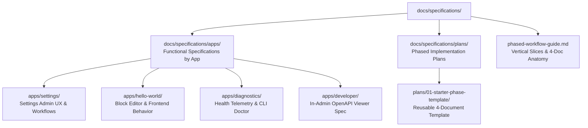

# Specifications & Phased Implementation Hub

Welcome to the **Specifications Hub** for the **WordPress AI Plugin Development Boilerplate**.

This directory houses the functional specifications for the plugin's applications (`apps/`) as well as phased implementation plans (`plans/`).

---

## 1. Directory Structure

---

## 2. Contents & Guides

- [phased-workflow-guide.md](phased-workflow-guide.md): The vertical slice decomposition methodology, 4-document phase anatomy, pre/post-implementation logging, and acceptance verification gates.
- [apps/](apps/README.md): Functional specifications for each app:
  - [apps/settings/](apps/settings/README.md): Functional specification for the Settings application.
  - [apps/hello-world/](apps/hello-world/README.md): Functional specification for the Hello World Gutenberg block.
  - [apps/diagnostics/](apps/diagnostics/README.md): Functional specification for the Diagnostics subsystem.
  - [apps/developer/](apps/developer/README.md): Functional specification for Developer Tools & API Reference viewer.
- [plans/](plans/README.md): Directory of phased sprint blueprints and starter templates:
  - [plans/01-starter-phase-template/](plans/01-starter-phase-template/README.md): Canonical template consisting of `README.md`, `technical-spec.md`, `tests-and-acceptance.md`, and `master-prompt.md`.

---

## 3. Backward Compatibility Notice (`docs/plans/`)

The legacy `docs/plans/` directory is preserved as a pointer to `docs/specifications/plans/` to ensure full backward compatibility with existing agent skills, prompt templates, and workspace rules (`.cursor/rules/adr-evaluation.mdc`, `post-phase-documentation.mdc`).

---

## 4. Coding Agent Guidance

1. **Functional vs. Technical Specifications:** Functional specs in `docs/specifications/apps/` define *what* the user experiences (user stories, UI states, validation rules, error feedback). Technical specs in `docs/apps/` define *how* it is implemented in PHP and TypeScript.
2. **Phase Slicing Invariant:** When creating new implementation phases, follow the 4-document anatomy in `phased-workflow-guide.md`.
3. **Pre-Implementation Logging:** Before writing code in an implementation phase, create a pre-implementation log in `docs/implementation-logs/YYYY-MM-DD-phase-XX-*.md`.
