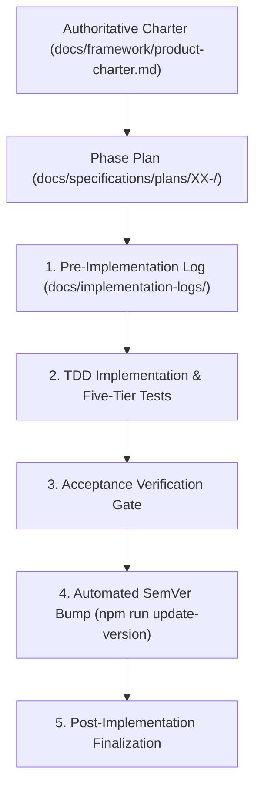

# Phased Execution and Agent Workflow Guide

AI coding agents are most effective when guided by tight constraints, clear boundaries, and deterministic verification gates.

This guide outlines the **Phased Implementation Methodology**, the **4-Document Phase Anatomy**, and the **Implementation Logging Lifecycle** defined in `AGENTS.md` and `.cursor/rules/post-phase-documentation.mdc`.

---

## 1. Why Phased Execution?

When given large, ambiguous prompts, AI agents frequently:

- Attempt to generate hundreds of files at once, exceeding context limits.
- Invent inconsistent architecture patterns between frontend and backend.
- Omit test harnesses, documentation, or security capabilities.
- Silently break existing code.

The **Phased Execution Model** solves this by decomposing plugin development into sequential, vertical slices:



---

## 2. The 4-Document Phase Anatomy (`docs/specifications/plans/XX-<name>/`)

Every implementation phase lives in its own directory under `docs/specifications/plans/` and consists of exactly **four structured documents**:

```text
docs/specifications/plans/02-rest-api-settings-and-contracts/
├── README.md               # Scope, dependencies, deliverables, exclusions
├── technical-spec.md       # Implementation boundaries, schemas, classes, DTOs
├── tests-and-acceptance.md # Unit/integration/Bruno/Playwright acceptance criteria
└── master-prompt.md        # Standalone prompt for the executing AI agent
```

### 2.1 `README.md`

- **Functional Scope:** Exactly what features are in scope for this phase.
- **Dependencies:** Which prior phases must be finalized before this phase begins.
- **Explicit Exclusions:** What is NOT to be implemented yet.

### 2.2 `technical-spec.md`

- Concrete technical blueprint: namespaces, class names, file paths, database schemas, REST endpoints, and DTO contracts.
- Boundaries between domain logic, persistence, and presentation.

### 2.3 `tests-and-acceptance.md`

- Explicit test matrices across the testing pyramid (PHPUnit, Jest, Bruno, Playwright).
- Verification commands and acceptance checkboxes.

### 2.4 `master-prompt.md`

- Standalone self-contained prompt to execute the phase with an AI agent.

---

## 3. Phase Lifecycle & Implementation Logging

For every plan phase, manage implementation logs in `docs/implementation-logs/`:

1. **Pre-Implementation:**
   - Create `docs/implementation-logs/YYYY-MM-DD-phase-XX-<short-name>.md`.
   - Include a pre-implementation checklist extracted from `technical-spec.md` and `tests-and-acceptance.md`.

2. **Post-Implementation:**
   - Check off all items.
   - Record version transition details.
   - Record files created, modified, and verification results.
