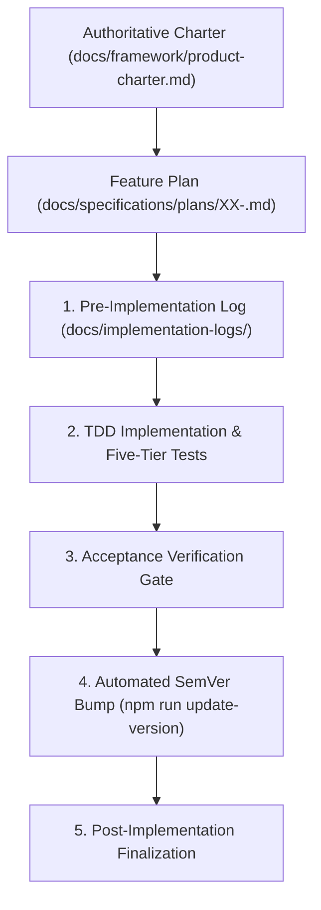

# Phased Execution and Agent Workflow Guide

AI coding agents are most effective when guided by tight constraints, clear boundaries, and deterministic verification gates.

This guide outlines the **Phased Implementation Methodology**, the **Unified Feature Plan Anatomy**, and the **Implementation Logging Lifecycle** defined in `AGENTS.md` and `.cursor/rules/post-phase-documentation.mdc`.

---

## 1. Why Phased Execution?

When given large, ambiguous prompts, AI agents frequently:

- Attempt to generate hundreds of files at once, exceeding context limits.
- Invent inconsistent architecture patterns between frontend and backend.
- Omit test harnesses, documentation, or security capabilities.
- Silently break existing code.

The **Phased Execution Model** solves this by decomposing plugin development into sequential, vertical slices:



---

## 2. The Unified Feature Plan Anatomy (`docs/specifications/plans/XX-<name>.md`)

Instead of fragmenting plans across multiple disconnected files, each implementation phase is captured in a **single, cohesive feature plan document** based on `docs/specifications/plans/feature-plan-template.md`:

```text
docs/specifications/plans/
├── README.md                  # Directory overview and plan index
├── feature-plan-template.md   # Canonical single-document template
└── 02-rest-api-settings.md    # Concrete feature implementation plan
```

A complete feature plan integrates five essential sections:

### 2.1 Architectural Governance & ADR Gate

- Evaluates the proposed scope against `.cursor/rules/adr-evaluation.mdc` and active ADRs in `docs/adr/`.
- Determines whether a new ADR must be authored via `npm run adr:new` before writing code.
- Prevents duplication by linking directly to accepted ADRs rather than copying architectural rationale.

### 2.2 Functional Specification (User & Business Outcomes)

- **Problem & JTBD:** Clear statement of user pain points and the Jobs-to-Be-Done.
- **User Workflows & UI States:** Discovery, primary workflow, and empty/loading/success/error states.
- **Permissions & Security:** Required WordPress capabilities (`manage_options`, custom caps), nonce verification, sanitization, and output escaping.
- **Scope Boundaries:** Concrete in-scope deliverables vs explicitly deferred out-of-scope items.

### 2.3 Technical Specification (Hexagonal & WordPress Architecture)

- **Domain Model:** Pure PHP entities, value objects, and domain exceptions (zero WordPress dependencies).
- **Infrastructure & Storage:** WordPress database adapters (`options`, `wpdb`, `dbDelta`, post meta) and repository implementations.
- **Service Providers:** In-tree DI container bindings (`src/framework/Container/`) and hook registrations.
- **REST API & OpenAPI (ADR-0011):** Route declarations, permissions callbacks, argument schemas defined in `WP_REST_Controller` subclasses, synchronized via `npm run openapi:generate`.
- **Frontend UI (ADR-0005, ADR-0008):** WPDS `Card`, `NoticeBanner`, `@wordpress/components`, vertical navigation tabs, and `@wordpress/i18n` localization.

### 2.4 Five-Tier Testing Pyramid & Acceptance Criteria

- Explicit acceptance criteria checklist (`AC-01`, `AC-02`, etc.) covering happy path, validation errors, capability checks, and UI states.
- Multi-tier test matrices: Tier 1 (Static analysis/lint), Tier 2 (PHPUnit domain unit tests), Tier 3 (Jest UI tests), Tier 4 (Bruno REST contracts), and Tier 5 (Playwright E2E/visuals).

### 2.5 Execution Roadmap & Agent Instructions

- Sequenced implementation steps (Domain TDD &rarr; Infrastructure & DI &rarr; REST & OpenAPI &rarr; Frontend WPDS &rarr; E2E validation).
- Mandatory post-phase closeout checklist: staging unreleased changes in `CHANGELOG.md` via `npm run changelog:add`, prompt-aware version bump checks, and implementation logging.

---

## 3. Phase Lifecycle & Implementation Logging

For every plan phase, manage implementation logs in `docs/implementation-logs/`:

1. **Pre-Implementation:**
   - Create `docs/implementation-logs/YYYY-MM-DD-phase-XX-<short-name>.md`.
   - Include a pre-implementation checklist extracted from the feature plan's technical specification and acceptance criteria.

2. **Post-Implementation:**
   - Check off all items.
   - Record version transition details (or confirm unreleased staging).
   - Record files created, modified, and verification results.
