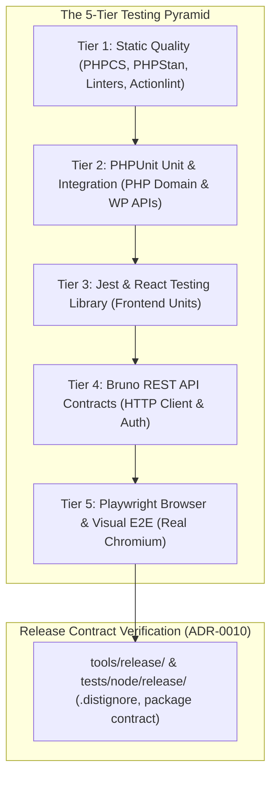

# Testing Hub & Quality Assurance Guide

Welcome to the **Testing Hub** for the **WordPress AI Plugin Development Boilerplate**.

Testing is an immutable architectural invariant (**Charter Invariant 3**). Tests serve as executable contracts, preventing regressions and giving coding agents immediate feedback.

---

## 1. The 5-Tier Testing Pyramid & Release Testing

---

## 2. Directory Contents & Guides

- [testing-strategy.md](testing-strategy.md): The overarching philosophy, test tiers, and complete quality gate command pipeline.
- [tier1-static-quality.md](tier1-static-quality.md): Static analysis: PHPCS (WPCS rulesets), PHPStan Level 6+, ESLint, Stylelint, Markdownlint, and GitHub Actions workflow linting (`lint:actions`).
- [tier2-phpunit-testing.md](tier2-phpunit-testing.md): PHPUnit 11 setup, fast in-memory unit tests (`tests/phpunit/unit/`) with sub-millisecond execution, and container integration testing (`tests/phpunit/integration/`).
- [tier3-frontend-unit-testing.md](tier3-frontend-unit-testing.md): Frontend unit testing with Jest and React Testing Library (`tests/js/`), testing state reducers, UI components, and Gutenberg block edit/save.
- [tier4-bruno-rest-testing.md](tier4-bruno-rest-testing.md): Black-box REST API contract testing with Bruno (`tests/bruno/`), `.bru` syntax, Chai assertions, and CLI test runner (`tools/rest-tests/run-rest-tests.mjs`).
- [tier5-playwright-e2e-testing.md](tier5-playwright-e2e-testing.md): Playwright E2E browser automation, Page Object Model, authentication fixture, visual regression snapshots, and WSL2 / Cursor Playwright MCP integration.
- [release-contract-testing.md](release-contract-testing.md): Distribution package verification tests in `tests/node/release/` enforcing `.distignore` and production package contracts.
- [wordpress-compatibility-testing.md](wordpress-compatibility-testing.md): WordPress 7.1 minimum baseline, dual-target testing strategy, and `.asset.php` externalization verification.

---

## 3. Fast Cheatsheet: Commands by Tier

| Tier / Category | Primary Command | Alternative / Sub-commands |
|:---|:---|:---|
| **Tier 1: Static Quality** | `npm run lint && composer lint && composer analyse` | `npm run lint:js`, `npm run lint:css`, `npm run lint:md`, `npm run lint:actions`, `composer lint:fix` |
| **Tier 2: PHP Unit** | `composer test` | `vendor/bin/phpunit --testsuite Unit` |
| **Tier 3: Frontend Unit** | `npm run test:unit` | `npm run test:unit -- --watch` |
| **Tier 4: REST Contracts** | `npm run test:rest` | `npm run test:rest:html` |
| **Tier 5: Browser & Visual** | `npm run test:e2e` | `npm run test:e2e:ui`, `npm run test:e2e:update` |
| **Release Contract** | `npm run test:release` | `npm run release:validate`, `npm run release:check` |
| **Full Toolchain Suite** | `npm test` | Runs unit, scaffolding, versioning, environment, and release test suites |

---

## 4. Coding Agent Guidance

When debugging test failures or writing new features:

### Invariant Rules

1. **Write Tests Alongside Code (TDD Invariant-First):** Every new domain class, value object, or application service must have an in-memory unit test in `tests/phpunit/unit/`. Every new React UI component must have a Jest test in `tests/js/`.
2. **Never Mock What You Don't Own in Tier 2:** Unit tests in `tests/phpunit/unit/` run purely in-memory. Never mock WordPress globals; instead, design Domain and Application classes to receive explicit interfaces and DTOs.
3. **Use Deterministic Markers for Tier 5:** Never use arbitrary timeouts (`page.waitForTimeout()`). Always wait for explicit DOM attributes such as `data-airwp-app-state="ready"`.
4. **Reproduce CI Locally:** When diagnosing CI failures on PRs, run `npm run ci` or individual tier commands locally before pushing changes.
