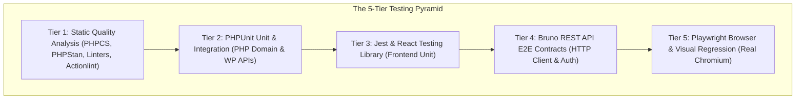

# Testing Strategy & Quality Gate Pipeline

A robust plugin demands a multi-layered testing pyramid. Tests serve as executable contracts, preventing regressions and giving coding agents immediate feedback.

This guide details the **5-Tier Testing Pyramid** implemented in the **WordPress AI Plugin Development Boilerplate**, alongside the release verification gate governed by **ADR-0010**.

---

## 1. The 5-Tier Testing Pyramid



| Tier | Category | Focus Area | Runtime / Runner |
|:---|:---|:---|:---|
| **Tier 1** | Static Quality | Code formatting, type safety, Markdown syntax, workflow SHA pinning | PHPCS (WPCS), PHPStan Level 6, ESLint, Stylelint, Markdownlint, `lint:actions` |
| **Tier 2** | PHP Unit & Integration | Domain invariants, Value Objects, Aggregates, Event Dispatcher, WP APIs | PHPUnit 11 inside WSL / wp-env container |
| **Tier 3** | Frontend Unit | React components, API hooks, Gutenberg block directives | Jest + `@testing-library/react` via `@wordpress/scripts` |
| **Tier 4** | REST Contract E2E | Black-box HTTP validation, error codes, auth | Bruno CLI (`@usebruno/cli`) with Application Passwords |
| **Tier 5** | Browser & Visual E2E | User journeys, admin settings, keyboard accessibility, snapshots | Playwright Test with Chromium & visual diffing |

---

## 2. Tier 1: Static Quality Analysis

Static quality gates run before any code is executed or built:

```bash
# PHP Coding Standards (WordPress-Core, Extra, Docs)
composer lint
composer lint:fix    # auto-fixes formatting

# PHPStan Static Analysis (Level 6+)
composer analyse

# JavaScript, CSS, Markdown, and GitHub Actions linting
npm run lint:js      # wp-scripts lint-js src/frontend
npm run lint:css     # wp-scripts lint-style 'src/frontend/**/*.css'
npm run lint:md      # markdownlint-cli2
npm run lint:actions # tools/release/lint-actions.mjs
```

---

## 3. Tier 2: PHPUnit Unit and Integration Testing

Test suites are separated in `phpunit.xml.dist` into two distinct directories:

### 3.1 PHPUnit Unit Tests (`tests/phpunit/unit/`)

- **Characteristics:** Fast, in-memory, pure PHP execution.
- **Scope:** Value objects, aggregate roots, domain events, application services, event dispatching, and caching utilities.
- **Rule:** **Zero** WordPress functions or database access. Must run in sub-milliseconds without `wp-env`.

Execution:

```bash
vendor/bin/phpunit
# or
composer test
```

### 3.2 PHPUnit Integration Tests (`tests/phpunit/integration/`)

- **Characteristics:** Runs with WordPress core loaded (`WP_UnitTestCase`).
- **Scope:** Custom post types, options API persistence, transient caching, capability checks.
- **Execution:** Run inside the container using `wp-env`:

  ```bash
  npx wp-env run cli --env-cwd=wp-content/plugins/ai-ready-wp-plugin-boilerplate vendor/bin/phpunit
  ```

---

## 4. Tier 3: JavaScript and React Unit Testing

Frontend unit tests verify isolated UI components, custom hooks, and Gutenberg block `save` directives using **Jest** and **React Testing Library**:

- **Configuration:** `jest.config.js` extends `@wordpress/scripts/config/jest-unit.config`.
- **Environment:** Node with JSDOM and `@testing-library/jest-dom`.
- **Execution:**

  ```bash
  npm run test:unit
  ```

---

## 5. Tier 4: Bruno REST API E2E Testing

Black-box contract testing treats the running WordPress instance as an external API server:

- **Runner:** `tools/rest-tests/run-rest-tests.mjs` executing Git-native `.bru` requests in `tests/bruno/`.
- **Authentication:** Automated WordPress Application Passwords auto-provisioned by `tools/wp-env/after-start.mjs`.
- **Execution:**

  ```bash
  npm run test:rest
  ```

---

## 6. Tier 5: Playwright Browser & Visual Regression Testing

Playwright tests the complete user journey inside headless Chromium:

```bash
# Run headless browser test suite
npm run test:e2e

# Run with interactive Playwright UI for debugging
npm run test:e2e:ui

# Update visual baseline snapshots after intentional UI changes
npm run test:e2e:update
```

---

## 7. The Full Quality Gate Pipeline

Before merging code or closing an implementation phase, execute the full pipeline:

```bash
# 1. Static Checks
composer lint && composer analyse && npm run lint

# 2. Unit Suites
npm run test:unit && composer test

# 3. Integration & Contract Suites
npm run test:rest

# 4. End-to-End & Visual Suites
npm run test:e2e

# 5. Versioning, Scaffolding & Release Verification Suites
npm test
```
