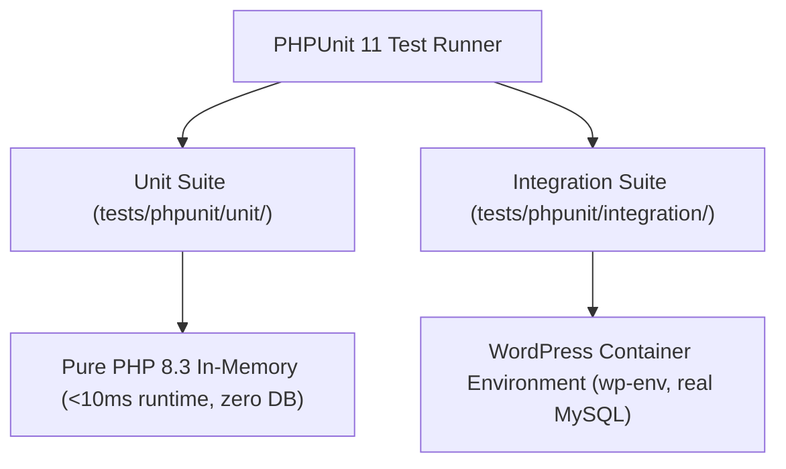

# Tier 2: PHPUnit Unit & Integration Testing

This document details the configuration, authoring standards, and execution methods for PHPUnit 11 testing across both pure in-memory unit tests and WordPress container integration tests.

---

## 1. Test Suite Architecture

PHPUnit suites are configured in `phpunit.xml.dist` and cleanly separated:



---

## 2. Unit Testing Suite (`tests/phpunit/unit/`)

### 2.1 Core Rules

- **Execution Speed:** Fast, in-memory, pure PHP execution. The entire unit suite executes in milliseconds.
- **Zero WordPress Global Dependencies:** Tests must not call `get_option()`, `wp_set_current_user()`, or query `$wpdb`.
- **Target Layers:** Value objects, aggregate roots, domain exceptions, application services with in-memory repositories, event dispatcher, and template renderer.

### 2.2 Authoring an In-Memory Unit Test

```php
namespace AIReady\WPPluginBoilerplate\Tests\Unit\Backend\Apps\Settings\Domain;

use PHPUnit\Framework\TestCase;
use AIReady\WPPluginBoilerplate\Backend\Apps\Settings\Domain\ValueObject\GreetingMessage;
use AIReady\WPPluginBoilerplate\Backend\Apps\Settings\Domain\Exception\InvalidGreetingMessageException;

final class GreetingMessageTest extends TestCase {

    public function test_accepts_valid_greeting_message(): void {
        $message = new GreetingMessage( '  Welcome to AI-Ready Plugin  ' );
        $this->assertSame( 'Welcome to AI-Ready Plugin', $message->value() );
    }

    public function test_throws_exception_when_message_is_empty(): void {
        $this->expectException( InvalidGreetingMessageException::class );
        new GreetingMessage( '   ' );
    }
}
```

### 2.3 Execution Command

```bash
# Run unit test suite
composer test

# Direct runner execution with filter
vendor/bin/phpunit --filter GreetingMessageTest
```

---

## 3. Integration Testing Suite (`tests/phpunit/integration/`)

### 3.1 Core Rules

- Extends `WP_UnitTestCase`.
- Tests concrete infrastructure adapters against real WordPress core functions, options storage, rewrite endpoints, and user roles.

### 3.2 Execution Inside Container

Run via `wp-env`:

```bash
npx wp-env run cli --env-cwd=wp-content/plugins/ai-ready-wp-plugin-boilerplate vendor/bin/phpunit --testsuite Integration
```

---

## 4. Coding Agent Rules

1. **Prioritize Unit Tests (Tier 2):** When developing new domain logic or application services, always author Tier 2 unit tests first.
2. **Reset Global State:** If testing singleton classes like `Plugin`, always call `Plugin::reset()` in `setUp()` and `tearDown()`:

   ```php
   protected function tearDown(): void {
       Plugin::reset();
       parent::tearDown();
   }
   ```

3. **Assert Typing & Immutability:** Assert return types, exception classes, and immutable value representations.
