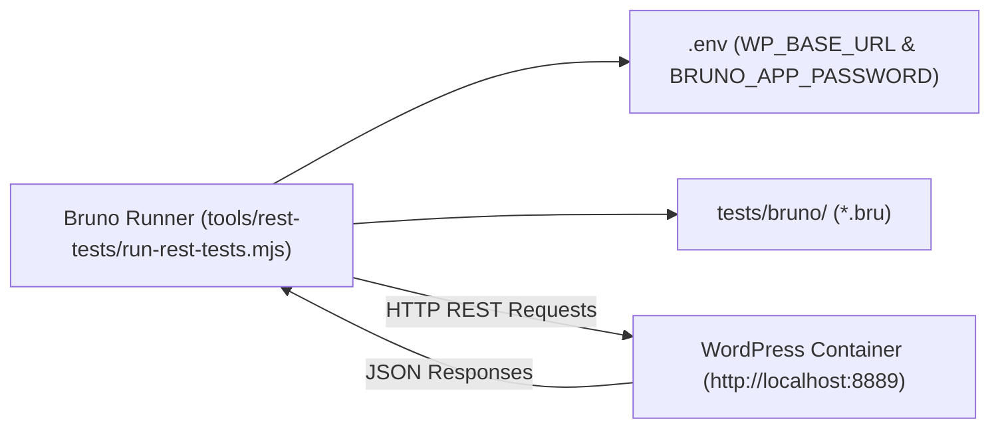

# Tier 4: Bruno REST API Contract Testing

This document details black-box REST API contract testing using **Bruno CLI** (`@usebruno/cli`) against local containerized WordPress endpoints under `tests/bruno/`.

---

## 1. Architectural Concept

Unit tests assert class internals in memory; Tier 4 Bruno tests treat the running WordPress container as a black-box HTTP server. They verify:

- Actual HTTP status codes (`200 OK`, `400 Bad Request`, `401 Unauthorized`, `403 Forbidden`).
- JSON response schema shapes and typing.
- Authentication enforcement via WordPress Application Passwords.
- Real WordPress REST routing, sanitization, and permission callbacks.



---

## 2. Directory Layout (`tests/bruno/`)

```text
tests/bruno/
├── bruno.json                       # Bruno collection root manifest
├── collection.bru                   # Root collection configuration (Basic Auth, variables)
├── environments/
│   └── Local.bru                    # Environment file with baseUrl
├── 00 Smoke/
│   ├── rest-index.bru               # Verifies core /wp-json/ discovery
│   └── hello-world.bru              # Public GET /ai-ready-wp/v1/hello
├── 03 Settings/
│   ├── get-settings.bru             # Authenticated GET /ai-ready-wp/v1/settings
│   ├── update-settings.bru          # Authenticated POST /ai-ready-wp/v1/settings
│   └── invalid-settings.bru         # Bad request POST returning 400 Bad Request
└── 04 Diagnostics/
    └── get-diagnostics.bru          # Authenticated GET /ai-ready-wp/v1/diagnostics
```

---

## 3. The `.bru` File Format

Requests are defined in Git-native `.bru` plain-text files:

```text
meta {
  name: Get Settings
  type: http
  seq: 1
}

get {
  url: {{baseUrl}}/wp-json/ai-ready-wp/v1/settings
  body: none
  auth: inherit
}

assert {
  res.status: eq 200
  res.body.general.greeting_message: isString
  res.body.advanced.cache_ttl: isNumber
}
```

---

## 4. Execution Commands

The cross-platform runner `tools/rest-tests/run-rest-tests.mjs` automatically loads credentials from `.env` and executes `@usebruno/cli`:

```bash
# Run REST contract tests
npm run test:rest

# Run with HTML report output
npm run test:rest:html
```

---

## 5. Coding Agent Rules

1. **Keep `.bru` Files Git-Native:** Never embed real passwords, tokens, or personal secrets in `.bru` files. Always reference `{{baseUrl}}` and inherit Basic Authentication.
2. **Assert Status Codes and Types:** Every request file must assert `res.status` and verify top-level payload keys.
3. **Cover Error Paths:** Always test negative authorization cases (e.g., omitting auth headers expecting `401`/`403`) and malformed payloads (expecting `400 Bad Request`).
