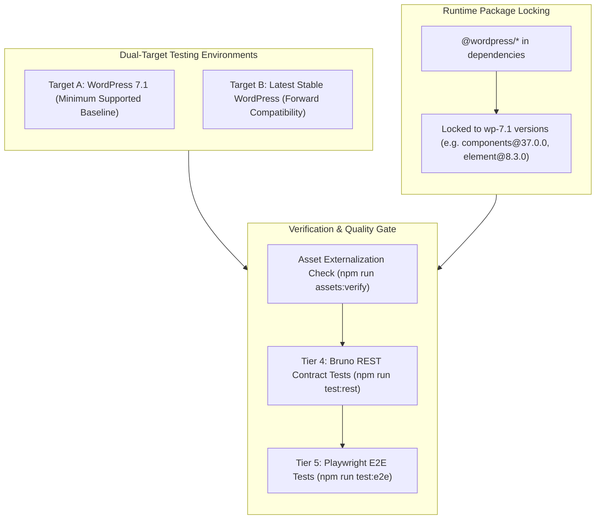

# WordPress Compatibility & Dual-Target Testing Strategy

This document defines the compatibility policy and dual-target testing strategy for the **AI-Ready WP Plugin Boilerplate**, establishing **WordPress 7.1** as the mandatory minimum baseline and **Latest Stable WordPress** as the forward-compatibility target.

---

## 1. Architectural Policy & Invariants



### Policy Invariants

1. **Mandatory Compatibility Baseline (WordPress 7.1):**
   - The plugin's declared minimum supported WordPress version is **WordPress 7.1**.
   - All plugin PHP, REST endpoints, block registrations, and React admin screens must run without deprecation notices, fatal errors, or missing symbol errors on WordPress 7.1.

2. **Runtime Package Locking (`wp-7.1`):**
   - Production `@wordpress/*` packages under `dependencies` in `package.json` are locked to the exact versions associated with the WordPress 7.1 release line (`wp/7.1` Gutenberg branch).
   - Never use `latest` for runtime packages expected to be provided by host WordPress.

3. **Decoupling of Development Tooling:**
   - Development dependencies (`@wordpress/scripts`, `@wordpress/env`, `playwright`, `typescript`, `@redocly/cli`, `@usebruno/cli`, etc.) reside in `devDependencies` and use the newest stable versions compatible with the project toolchain.

4. **Immutable Baseline across Minor WP Core Releases:**
   - When a newer WordPress version such as 7.2 or 7.3 is released, runtime packages are **not** automatically updated to the newer version.
   - The `@wordpress/*` runtime package baseline changes only when the plugin's declared minimum supported WordPress version is intentionally bumped.

5. **API Availability Gate:**
   - Never use an API from an `@wordpress/*` package unless that API is available in WordPress 7.1.

6. **Asset Externalization Contract:**
   - Every production build must generate `.asset.php` files for all entrypoints.
   - WordPress-provided dependencies (`wp-element`, `wp-components`, `wp-i18n`, `wp-api-fetch`, `wp-block-editor`, etc.) must remain externalized and never bundled into JavaScript distribution files.

---

## 2. Environment Execution Commands

Use `wp-env` to switch and run tests against both target environments:

### 2.1 Minimum Supported Baseline (WordPress 7.1)

```bash
# Start containerized WordPress 7.1 baseline
npm run env:start:min

# Run post-start setup and credentials synchronization
npm run wp:setup

# Run REST API contract tests (Tier 4)
npm run test:rest

# Run Playwright browser and visual regression tests (Tier 5)
npm run test:e2e
```

### 2.2 Forward-Compatibility Target (Latest Stable WordPress)

```bash
# Start containerized latest stable WordPress
npm run env:start:latest

# Run post-start setup and credentials synchronization
npm run wp:setup

# Run REST API contract tests (Tier 4)
npm run test:rest

# Run Playwright browser and visual regression tests (Tier 5)
npm run test:e2e
```

---

## 3. Asset Externalization Verification

After every production build, verify that `.asset.php` files are correctly generated and runtime packages are externalized:

```bash
# Production build (automatically runs asset verification)
npm run build

# Standalone asset verification check
npm run assets:verify
```

The verification tool (`tools/assets/verify-assets.mjs`):

- Verifies that `.asset.php` files exist for all webpack entrypoints (`admin/settings`, `admin/developer`, `blocks/hello-world`).
- Asserts that required `wp-*` external handles are declared in `dependencies`.
- Scans compiled JavaScript bundles to ensure no internal `@wordpress/*` module sources are bundled into the distribution files.
